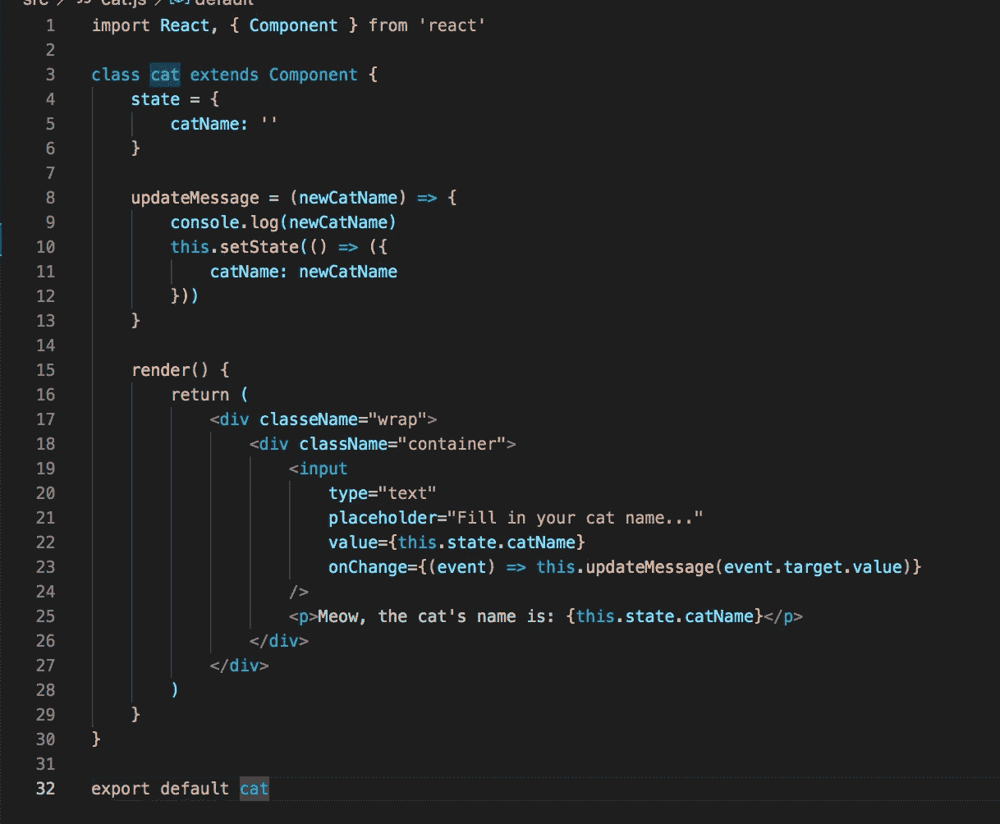

# React 中受控组件和非受控组件有什么区别？

> 原文：<https://javascript.plainenglish.io/controlled-vs-uncontrolled-components-in-react-whats-the-diff-61d7053adbb?source=collection_archive---------3----------------------->

## *React 受控/非受控组件的介绍性演练。*

让我们看一看 React 并讨论一下组件。如果您以前使用过 React，您应该对组件很熟悉。React 的一个主要特点就是组件，React 支持两种:**受控**和**非受控**。让我们来揭示受控组件和非受控组件之间的主要区别。

Photo by [Marvin Meyer](https://unsplash.com/@marvelous?utm_source=medium&utm_medium=referral) on [Unsplash](https://unsplash.com?utm_source=medium&utm_medium=referral)

# **受控组件**

React 文档建议使用受控组件而非非受控组件。*受控组件用于实现表单。* **在受控组件中，表单数据由 React 组件处理。**该组件内的状态充当由该组件呈现的任何输入的“真实的单一来源”。

本质上，如果您在项目中需要一个表单，并且没有使用 HTML `*<form></form>*` *标签*，那么您知道您正在使用一个受控组件*。在一个受控组件中，你依赖于一个 `**<input />**` **标签中的一个**状态捕获，然后是一个** `**onChange()**` **事件处理程序**。当对输入(保存状态值的地方)进行任何更改时，它将触发其`onChange()`事件处理程序。***

受控组件中的数据流是单向的，组件的状态充当唯一的真实来源。

参见以下受控组件的示例:

Controlled Component: note the input tag and onChange event and state being captured with the value set to the catName state.

当您有大量输入时，受控组件可能会变得有点乏味。这是因为对于每个输入，您需要一个 onChange 事件来触发状态的改变，这可能会增加相当多的 onChange 事件，并且管理起来很麻烦。

# 不受控制的组件

谈到不受控制的组件，你会发现它们的行为更像传统的 HTML 表单元素。*输入中捕获的所有数据都存储在 DOM 中。这意味着你不需要 onChange，而是需要使用代码“ref”来从 DOM 中检索值。*

*   *注意，不能在函数组件中使用“ref”，必须使用类组件。这是因为在功能组件中没有已创建的实例。

查看我们之前的受控组件调整为受控组件的变更示例:

For the Uncontrolled Component, on line 4 a constructor(props) was added to capture the event handler and state change. On line 7 this.input = React.createRef() allows us to take the retrieved ref value(currently living in the DOM) and set it as our input value(now accessible across all of the component).

# 概观

总的来说，受控组件是指 React 组件处理所有表单数据的时候。

## **为了有一个受控组件，它需要:**

*   输入标签和值
*   处理触发/状态变化的事件处理程序

对于不受控制的组件，表单输入的值保存在 DOM 中，必须使用“ref”进行检索。

## **非受控部件需要:**

*   类组件(不能在功能组件中使用*引用*，因为那里没有创建实例)
*   使用构造函数(props)来保存我们的事件处理程序，并捕获存放在 DOM 中的输入。

# 结论

好的，正如 React 医生告诉我们的，要使用可控组件。注意到了！我希望这篇对受控和非受控组件的深入研究对您学习编码有所帮助，稍后我会与您联系。

*更多内容尽在*[***plain English . io***](http://plainenglish.io)