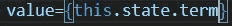
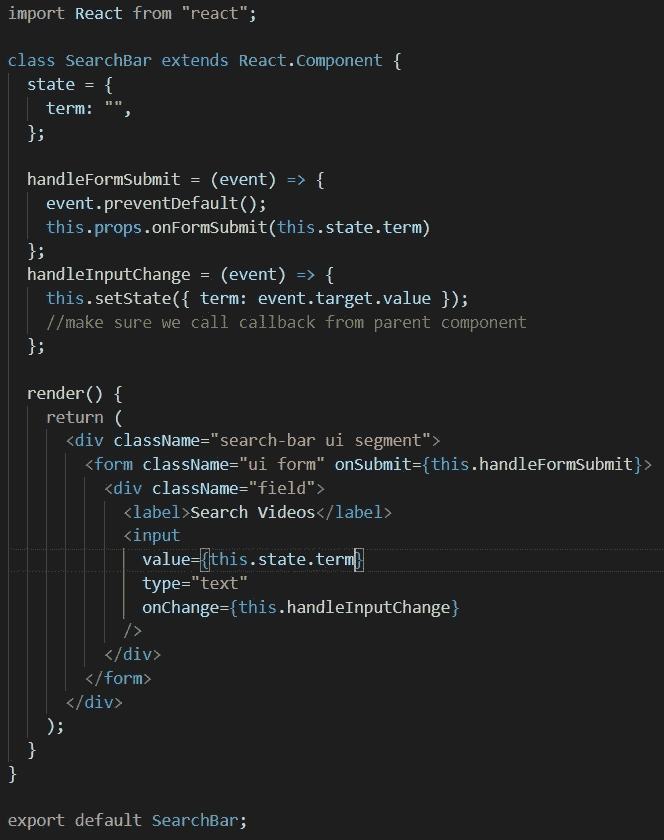

# 反应:受控与非受控形式

> 原文：<https://javascript.plainenglish.io/controlled-vs-uncontrolled-forms-react-184a8b6d33c6?source=collection_archive---------15----------------------->

在某些时候，你会发现很多网页设计都是由表单组成的。你可以使用搜索栏、登录、注册等形式。通过学习 React，您可能会被告知在表单的输入标记中编写一行看似多余的代码。

那句台词是:

(“term” being inside your state)

让我们从一个完整的组件开始:

受控组件的整个思想是保持数据存储在哪里以及如何获取数据的唯一来源。如果你知道*事件监听器*和*状态*是如何工作的，那么你很可能已经构建了大部分被认为是受控组件的东西。使用 React 时，您希望将内容存储在 React 中。总是避免将信息存储在 HTML 元素中，更确切地说是 DOM 中。这也是使用 React 状态系统的目的之一。它不仅处理用户交互，还确保所有信息都存储在 React 中。否则，您将不得不进入 DOM 并在那里操作。

最令人困惑的部分来自这样一行:

首先，input 标记已经知道您正在键入的文本的值。存储这些信息是其工作的一部分。然而，正如我前面说过的，我们希望将所有信息存储在 React 中，而不是 DOM 中。`value={this.state.term}`的目的是默认状态总是输入的值。您实际上是用您所在州的信息覆盖了 DOM 信息，但是两者都存储了您键入的完全相同的信息。

为什么要这么做？你可以说“最佳实践”是一回事。这可能是你听过很多却没有解释的事情。你可能会认为这只是一个无意义的额外步骤，但这是有原因的…

这种做法还允许您更轻松地对组件进行操作。因为最终结果总是以值等于状态结束，所以您可以在将数据推入值之前对其进行更改。您需要的只是简单的 JavaScript 方法。而在一个不受控制的组件中，你必须不断地接触 DOM，这可能会有点棘手。

这方面的例子有:

1.  也许你想用单词而不是空字符串初始化`this.state.term`。
2.  也许你希望输入字段总是大写或小写，所以你把方法放在`event.target.value`的末尾。
3.  你可以做很多事情。试试看！

*更多内容请看*[***plain English . io***](http://plainenglish.io/)