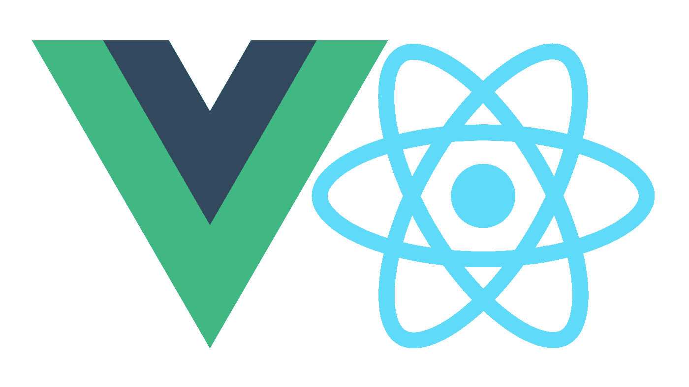
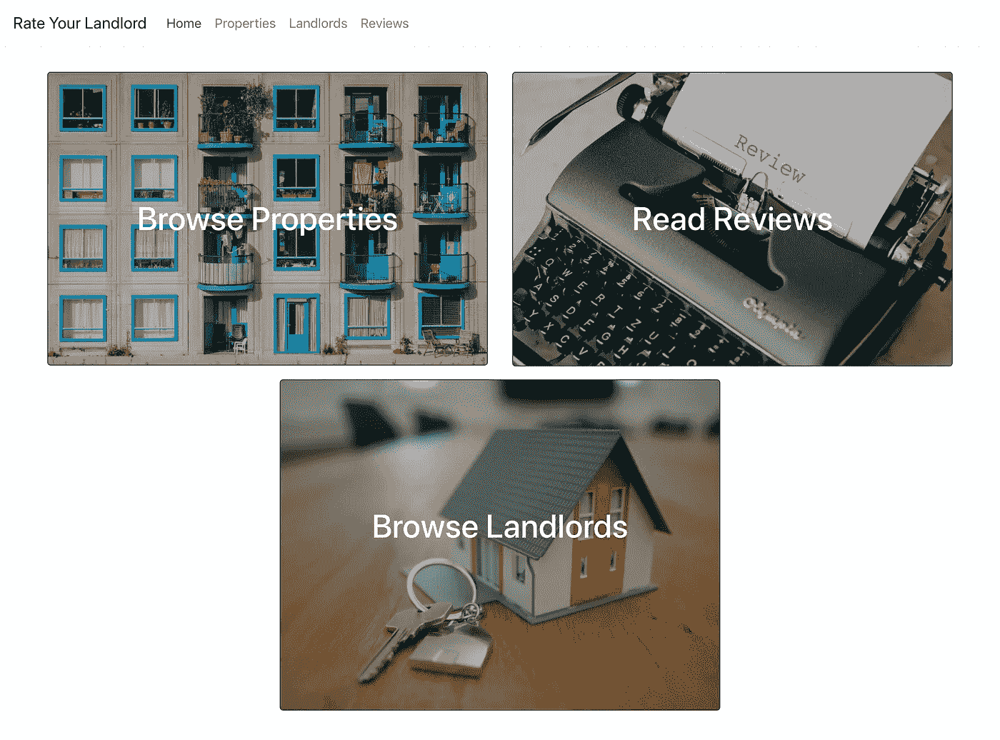
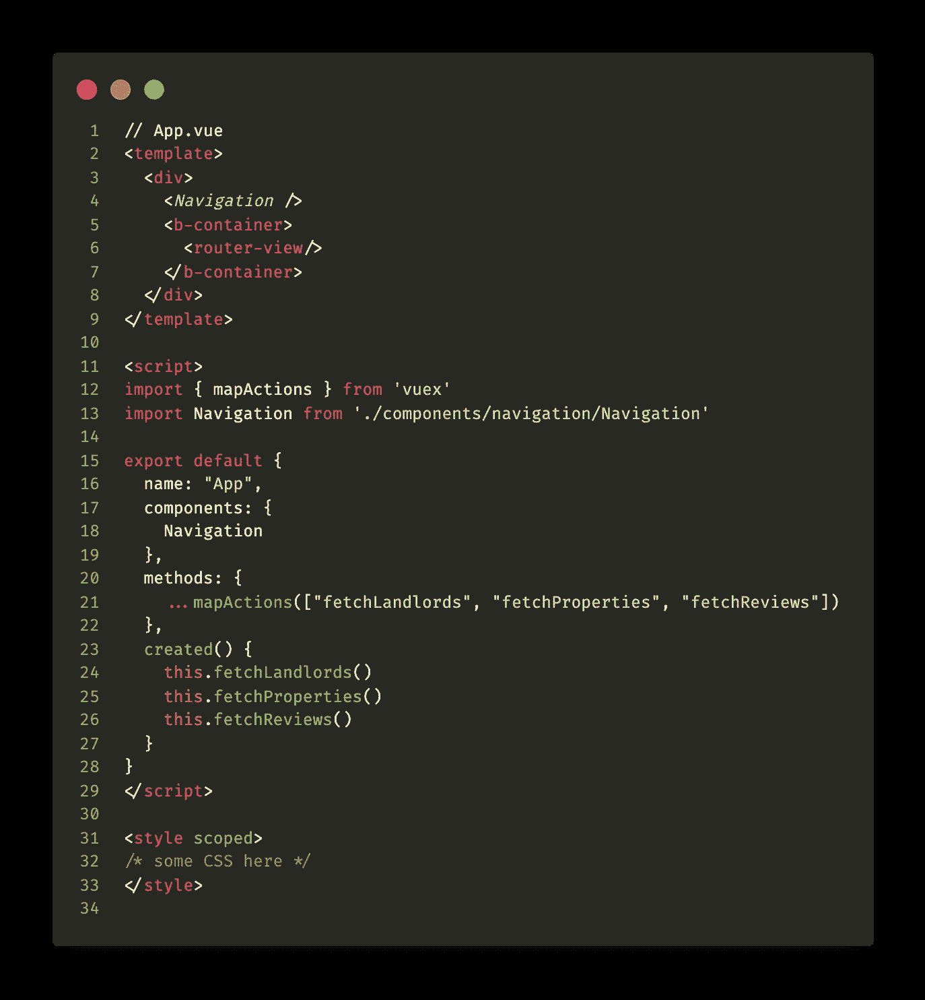

# 如何将 React 应用转换为 Vue.js

> 原文：<https://javascript.plainenglish.io/convert-a-react-app-to-vue-js-4b69ea503fed?source=collection_archive---------9----------------------->

## 第 1 部分:概述

Vue & React logos NOT fighting each other

1.  介绍
2.  基本概述
3.  单列组件

# 介绍

我最近参加了一家公司的面试，这家公司几乎完全用 VueJS 构建他们的前端应用程序。来自一个主要是普通的 JavaScript 和 React 背景，自然我非常好奇。让我未来的老板建议:

> “你应该调查 Vue——这不是一项任务或任何事情。”
> 
> —也许是未来的老板

这是一个很好的借口去深入[文档](https://vuejs.org/v2/guide/)，查看一些我[最喜欢的教程制作人](https://youtu.be/Wy9q22isx3U?t=39)，并构建我自己的[前端 Vue 应用](https://github.com/d-otis/rate-your-landlord-vue)。与其尝试重新发明轮子，陷入全新领域和后端 API 的困境，我决定采用我为你的房东( *RYL* ) app 之前用 React 表达的 **Rate 创建的现有 Ruby on Rails API。**

Screencap of React front end hosted on Heroku

通过这种方式，我可以真正专注于前端，并使用我为 React 前端制作的现有解决方案，让这些解决方案为我的 Vue 实施之旅增添色彩。也就是说，我不会谈论我的 API 实现的细节，但你可以在下面的链接中搜索我的源代码。

这是目前正在进行的工作，但这里有一些链接:

*   [GitHub 上的 Ruby on Rails API](https://www.github.com/d-otis/rate-your-landlord-backend)
*   [在 GitHub 上反应前端](https://github.com/d-otis/rate-your-landlord-react-frontend)
*   [GitHub 上的 Vue 前端](https://github.com/d-otis/rate-your-landlord-vue)
*   React 实现的 Heroku 上的现场演示(警告:服务器需要一两分钟才能唤醒)

# 基本概述

## Vue 是什么？

> Vue(读作/vjuː/，类似视图)是一个用于构建用户界面的渐进式框架。与其他整体框架不同，Vue 从一开始就被设计成可增量采用的。核心库只关注视图层，很容易获取并与其他库或现有项目集成。另一方面，当与[现代工具](https://vuejs.org/v2/guide/single-file-components.html)和[支持库](https://github.com/vuejs/awesome-vue#components--libraries)结合使用时，Vue 也完全能够支持复杂的单页面应用程序。—来自马嘴，又名 Vue docs

在一些短视频中，Vue 网站上的人们通过将脚本嵌入到 HTML 页面中来快速制作示例，并且您在 HTML 文档中的脚本标签中构建所有内容，但是我发现这通常过于简单，并且最终会令人困惑，因为我希望鸟瞰组件文件的模块化，而不是从一个生态系统“增量过渡”到下一个生态系统。

## Vue vs React

显然语法是一个很大的区别，但大部分的反应性和渲染概念是相同的。(这个不要@我！)这两个生态系统中都使用了虚拟 DOM。两者都有可选的客户端路由——对于 Vue，你可以选择使用 [Vue 路由器](https://router.vuejs.org/)。并且两者都允许创建模块化的、可重用的组件，这些组件位于它们自己的目录中，从而便于组织和阅读。单页应用程序(SPA)就是由这两者创建的！

## Vue CLI

Vue 有一个方便的应用程序生成工具，名为 [Vue CLI](https://cli.vuejs.org/) ，你可以通过`npm`或`yarn`在全球范围内安装，还有一个别致的项目管理类型的 UI，你可以在那里管理依赖关系、插件和查看有用的指标，如加载时间等。

## Vue 路由器

有了 Vue Router，我可以将我的路线放入不同的目录和文件中，而只需在主 App.vue 文件中放置一个`<router-view />`标签，类似于 Ruby on Rails 在`layout.erb`等 ERB 文件中的`<%= yield %>`标签。

## Vuex

Vue 的状态管理库， [Vuex](https://vuex.vuejs.org/) ，在我看来比 Redux 更容易理解，它们采用了一些惯例，防止你在目录间跳跃，跟踪 getters、actions、mutations 的序列，并看到你的初始状态。React 中一个流行的惯例是为一个资源的 reducers 和 dispatch actions 创建两个单独的文件。对于 Vue，它们的约定是所有东西都在一个文件中:状态、getters、动作和突变。因为这些元素之间有很多相互作用，所以当所有这些概念都“在同一个房间里”时，就容易多了，至少对我的大脑来说是这样

## Nuxt.js

像在 React 中使用 Next.js 一样，Vue 也有自己的配套框架，名为 [Nuxt.js](https://nuxtjs.org/) ，让你的工作更轻松，并为新员工提供更多入职内容💁‍♂️

我最近在使用 [BootstrapVue](https://bootstrap-vue.org/) 时发现的最后一个金块，一种利用引导 CSS 库易用性的方法。与 [ReactBootstrap](https://react-bootstrap.github.io/) 不同，我不必将单独的引导组件导入到每个使用它们的组件中。你只需要导入根 JS 文件，通常是`main.js`然后是`Vue.use()`除了导入引导发行版 CSS 之外的库。

# 单文件组件—例如:App.vue

好了，废话少说——让我们看看组件文件实际上是什么样子的！万岁，[单列组件](https://vuejs.org/v2/guide/single-file-components.html)！！

请注意，这个 App.vue 文件分为 3 个部分:

1.  模板
2.  脚本
3.  半铸钢ˌ钢性铸铁(Cast Semi-Steel)

My App.vue root component for the front end of RYL app.

## 模板

位于`<template></template>`标签之间的内容与使用 JSX 的 React 组件的`render()`或`return`非常相似。像 React 一样，这里出现的必须是单个返回的组件或 HTML 元素，或者如果呈现了许多项，它们必须包含在父元素中，在本例中是一个`div`。

注意，我已经在模板视图中挂载了一个`<Navigation />`组件，它包含了来自另一个文件“Navigation.vue”的导航栏。`<b-container></b-container>`其实就是前面提到的 BootstrapVue 组件。第 6 行中最重要的`<router-view/>`是门户，通过它，我所有的动态内容将根据我在路由器文件中设置的配置呈现出来。

## 脚本

这一部分是这些组件文件中最具 JavaScript 特色的部分。在这里，我们导入必要的组件、我们定制的外部帮助器，或者由 Vuex 提供的帮助器。你可以看到这是我通过一个`import`语句引入我的`Navigation`组件的地方，类似于你在 React 中可能做的事情。

`export default`部分导出你的**模板**部分需要做的所有事情的对象。在这里，在我的`export`语句的`methods`属性下，我使用一个`spread`操作符，通过来自 Vuex 和我的商店的`mapActions`助手函数来填充这个部分。`[“fetchLandlords”, “fetchProperties”, “fetchReviews”]`都是在`landlords`存储模块中定义的，我们将在本系列的后面看到。

请注意，除了从项目中导入外部组件模块，您还必须在`components`属性中声明它们以及组件名称的字符串表示形式，在本例中`“App.”`这有助于调试错误消息，并且它们确实依赖于 Vue 中的*硬*。

您还可以在我们的`export`部分中指定`props`和 propTypes，并通过函数计算属性。如果您正在构建一个表单，或者需要跟踪 UI 切换状态，您还可以定义一个将返回本地状态的`data()`函数。

## 半铸钢ˌ钢性铸铁(Cast Semi-Steel)

最后，我们来到 Vue 组件中最简单、最容易理解的部分。在这里，我们可以指定样式，并通过第 31 行的`scoped`布尔值选择将它们限定在当前组件的范围内。

# 接下来是什么

到目前为止，我们已经对 Vue 进行了鸟瞰。这是一个很好的选择，包括 Urban Outfitters、阿里巴巴、埃森哲、Trivago、GitLab 等等。接下来，我将详细介绍应用架构、路由、商店和 Vue 指令！

在 [Twitter](http://twitter.com/_dan_foley_) 和 [GitHub](https://github.com/d-otis) 上关注我！