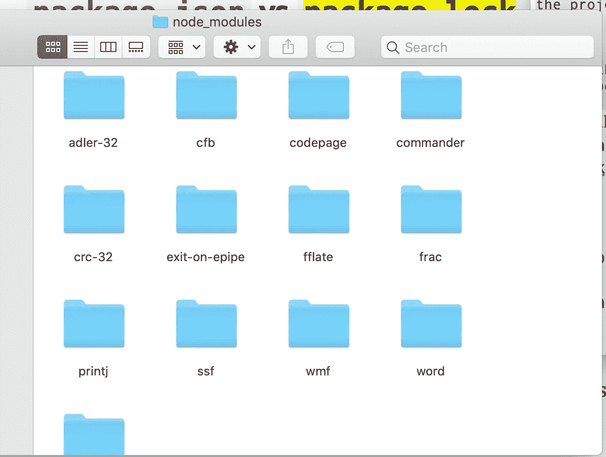

# 在 Node 中将 Excel 文件转换为 JSON:Node . js+NPM 初学者友好介绍

> 原文：<https://javascript.plainenglish.io/converting-an-excel-file-to-json-in-node-beginner-friendly-introduction-to-node-js-npm-2b994b7bca1e?source=collection_archive---------1----------------------->

## 通过解析 excel 文件开始使用 Node.js，并在此过程中了解 NPM 和 XLSX。


Photo by [Lukas Blazek](https://unsplash.com/@goumbik?utm_source=medium&utm_medium=referral) on [Unsplash](https://unsplash.com?utm_source=medium&utm_medium=referral)

# Node.js 是什么？

当我们想到 JavaScript 时，我们会想到浏览器、网站、网页、交互性、事件监听器、onclick 等。这些都和浏览器有关。

事实上，浏览器曾经是 JavaScript 唯一的运行时环境。因此，每当我们编写 javascript 时，只有在浏览器上打开网页时，我们才能真正看到它的运行。

这限制了 JavaScript 在浏览器之外的使用。但是现在，我们几乎可以在任何地方运行 JavaScript 代码…怎么做？通过安装他们称之为**的节点**。Node 是 JavaScript 的新环境。

现在有**两种方式运行 JavaScript:**

1.  在浏览器环境中
2.  在 Node.js 环境中

所以总结一下 Node.js 是什么:

*   Node 是一个新的 JavaScript 运行时环境。
*   Node 可以安装在任何服务器上，它是开源和免费的
*   Node 允许我们在浏览器之外运行 JavaScript，比如在服务器上
*   Node 允许我们用 javascript 编写后端或服务器代码！以前这是不可能的，例如你必须使用 Java 或 PHP。

# 现在您已经听说了伟大的全能节点，是时候在您的本地计算机上安装 Node.js 了

请按照官网上的说明:【https://nodejs.org/en/download/ 

要检查节点是否正确安装，请在终端中运行以下命令:

```
node --version
```

# NPM 怎么样？Node 同样酷的最好的朋友！

node 还有一个很酷的功能，叫做 **NPM** 。不需要单独安装，安装完 node 就有了。

它代表:**节点包管理器。**

因为 node 是开源的，而且开发人员都是很好的人(通常)，开发人员可以公开他们的项目供其他开发人员使用。通过这种方式，其他开发人员可以受益，并且他们不需要从头开始编写代码。

所有这些优秀的开发人员需要做的就是将他们的代码转换成一个模块，然后他们可以将它作为一个**包**发布在 npm 上。

NPM 是一个软件包的在线市场，任何人都可以免费使用来帮助他们完成项目。

例如，为了在我们的项目中进行复杂的 excel 处理，我们可以安装第三方 npm 包并使用它，而不是从头开始构建逻辑。这样我们可以减少开发时间，专注于我们自己的特色。

要使用 npm，只需在 npm 网站上寻找你想要的包(如果有的话)。在本文中，我们将使用我发现的一个名为 **XLSX** 的包

*   [https://www.npmjs.com/package/xlsx](https://www.npmjs.com/package/xlsx)

要从做同样事情的几个其他包中选择正确的包，您需要考虑以下关键因素:

*   查看每周下载量=更受欢迎=更好的软件包
*   确保最近更新=良好的支持
*   阅读并确保它有好的文档=易于使用

要安装软件包，您需要使用 npm 命令。您需要在项目文件夹中运行以下命令:

```
npm install package_name
```

当您在项目中安装第三方包时，您就创建了一个依赖项。这意味着您的项目依赖于另一个项目。这会变得很混乱，对吧？幸运的是，npm 将为您管理项目中的依赖项..稍后将详细介绍这一点！(提示:package.json)

因此，任何时候有人想运行你的应用程序，npm 都会寻找依赖关系，从 npm 获取依赖代码，并将其下载到你的本地项目中。

# 以身作则！让我们从头开始一个节点项目！

让我们创建一个应用程序来解析文件系统中的 excel 文件，并将其转换为 json 文件。请注意我们将如何使用 javascript 来做到这一点，我们甚至不需要浏览器做任何事情。

好的，那么开始吧，为你的项目做一个文件夹。创建一个 **index.js 文件**，这将是我们的代码所在的地方。

然后运行命令 npm init 创建一个正式的节点项目:

```
npm init
```

*   对所有默认选项说“是”

很有趣，你会看到一个新的文件 **package.json** ，我们去看看吧。似乎它有一些关于我们项目的数据，好酷！我们稍后将回到这个问题..

好了，有了这个文件，我们可以在我们选择的包中进行 npm 安装了。让我们安装之前的 excel 软件包， **xslx。这个包将允许我们解析我们的 excel 并将其转换成 JSON！**

```
npm install xlsx
```

好了，现在让我们回到我们的 **package.json** 中，看看发生了什么！

我们可以在文件中看到一个新的**依赖对象** { }。在这里，有“xlsx”和版本号。每当我们进行 npm 安装时，NPM 会自动将我们的软件包添加到这里。npm 跟踪我们安装的所有依赖项，这样当人们第一次运行这个项目时，NPM 就知道我们需要安装什么依赖项来使这个项目完全运行！

啊，其他东西也变了，出现的这个 package-lock.json 是什么？！

NPM 还会自动生成一个**包——lock . JSON**，你根本不需要管理或编辑它。这就像 package.json 的快照。所以不要太担心它。你也不应该把这个推或者发布到你的 git repo 上。它只是由 npm 在本地使用。

我们看到的最后一个被创建的是 **node_modules** 文件夹。



等等…这些文件夹是从哪里来的，我只认得 XLSX，我安装的那个。好了，让我们打开 XLSX 文件夹，我们将看到这个包的所有代码，我们可以在我们的应用程序中使用，这很好。看起来像是一个不错的开发者为我们做好了一切准备。酷酷酷！

就像任何其他节点项目一样，XLSX 项目也有自己的 package.json 和自己的依赖项。让我们打开 package.json，看看依赖项。

```
"dependencies": {
"adler-32": "~1.2.0",
"cfb": "¹.1.4",
"codepage": "~1.14.0",
"commander": "~2.17.1",
"crc-32": "~1.2.0",
"exit-on-epipe": "~1.0.1",
"fflate": "⁰.3.8",
"ssf": "~0.11.2",
"wmf": "~1.0.1",
"word": "~0.3.0"
},
```

啊哈，这就是我们 **node_modules** 中所有其他文件夹的来源。XLSX 有自己的依赖项。

如您所见，npm 非常有用，因为它允许我们只需安装 npm 就可以运行任何有依赖项的项目，它会知道为我们安装所有这些依赖项，并将它们放在节点模块文件夹中。**它还会安装依赖项，的依赖项！:-)**

所以 node_modules 拥有我们依赖的所有代码。因此，它的尺寸可以很大。

事实上，因为我们有 package.json 文件，它确切地告诉我们需要下载和安装什么，所以我们不需要发布整个 node_modules 文件夹，因为可以随时使用 package.json 下载代码。^_^

因此，无论何时你下载一个节点项目，你做的第一件事就是运行 npm 安装，它会查看所有的 package.json 并从 NPM 下载所有的代码，并把它放在**节点模块中。**

```
npm install
```

## **最佳实践:**为了不推送这个大文件夹，我们通常会将它添加到**中。gitignore** 文件

```
node_modules/
```

这不会将 node_modules/文件夹发布到您的 repo。节省您的时间和空间！:)

## 使用 npm 包

好了，有趣的部分，现在是时候实际编码了，哈哈，最后，让我们回到 index.js 文件。这是一个 javascript 文件！Node 中的编码实际上就像 javascript 一样，所以如果你懂 javascript 就没问题了！您只需要知道 node 提供给您的额外功能，例如访问服务器的文件系统！

我们需要做的第一件事是引入我们作为依赖项安装的包，所以这是用 **require** 语法**完成的。**这将在该包的 node_modules 文件夹中查找，如果在那里，它将为您提供对该功能的访问。

```
const xlsx = **require**(‘xlsx’);
```

这是语法。您可以随意命名变量，但需要正确的语法(“包名”)；

因此，我们今天要构建的应用程序将从 excel 文件中获取数据，并将其转换为 JSON，然后在您的服务器上保存为 JSON 文件。

正如我所说，我们将需要一个名为 **xlsx 的第三方开源包。**

我们还需要访问文件系统。这是 node 内置的，所以您不需要 npm 安装它。但是你确实需要它。

```
var **fs** = **require**(‘fs’);
```

好了，让我们把一个 excel 文件放入根目录下的这个项目中。请记下该文件的名称。对于本文，我创建了一个名为 Data.xlsx 的 Excel 文件，并将其添加到我的项目文件夹中。

因此，让我们编写将 excel 文件转换为 JSON 的函数。我们将利用 **xlsx.readFile()和 xlsx.utils.sheet_to_json()。**如果没有这些函数，我们将不得不自己创建这些函数。

*   xlsx.readFile(文件路径)-接受文件名/路径
*   xlsx . utils . sheet _ to _ json(sheet)-将单个工作表转换为 JSON

```
function convertExcelFileToJsonUsingXlsx() { // Read the file using pathname
    const file = xlsx.readFile('./Data.xlsx'); // Grab the sheet info from the file
    const sheetNames = file.SheetNames;
    const totalSheets = sheetNames.length; // Variable to store our data 
    let parsedData = []; // Loop through sheets
    for (let i = 0; i < totalSheets; i++) { // Convert to json using xlsx
        const tempData = xlsx.utils.sheet_to_json(file.Sheets[sheetNames[i]]); // Skip header row which is the colum names
        tempData.shift(); // Add the sheet's json to our data array
        parsedData.push(...tempData);
    } // call a function to save the data in a json file generateJSONFile(parsedData);
}
```

现在让我们编写另一个函数，将 excel 数据存储在服务器上的 JSON 文件中。让我们创建一个新的函数来分离我们的逻辑。

正如你在下面看到的，我们使用了内置的节点 **fs.writeFileSync** 方法，该方法接受文件路径/文件名和我们正在写入该文件的数据。我们把它包在一个试捕器里以防失败。

*   **writeFileSync() —**

```
function generateJSONFile(data) {
    try {
        fs.writeFileSync('data.json', JSON.stringify(data))
    } catch (err) {
        console.error(err)
    }
}
```

让我们在文件的顶部调用我们的函数。

```
convertExcelFileToJsonUsingXlsx();
```

这是我们执行这个文件后运行的第一个函数。它会将 excel 文件转换为 JSON，然后调用第二个函数将数据保存到 JSON 文件中。

# 说到运行它…我们如何运行这个节点项目？

所以我们不再需要在浏览器上运行我们的代码了！我们只是用 node 运行它。我们可以在任何有节点环境的地方运行它。也就是说，运行我们代码的最简单方法就是使用下面的命令:

```
node index.js
```

在我们运行这个命令后，node 将运行 index.js 的所有内容，就像任何其他 javascript 文件一样，它将逐行执行代码。您可以看到输出确实是我们所有数据的 JSON 文件！这意味着我们的代码起作用了！耶！

运行我们代码的另一种方式是使用 **npm start。**要完成这项工作，您必须转到 package.json 文件并更新**脚本**对象。我们添加了一个新的启动脚本，这样我们就能够调用 npm **start** 。注意它是如何被设置为**节点 index.js** 的，这是一个等效的命令。注意:在脚本对象中，您可以定义其他命令，如 npm test 来运行您的测试。

```
“scripts”: { “test”: “echo \”Error: no test specified\” && exit 1", “start”: “node index.js”},
```

所以现在我们可以使用命令 **npm start** 而不是 node index.js 来启动我们的应用程序。这是更正常的，也是人们在运行项目时所习惯的。

哒哒！祝贺您试用了您的第一个 NPM 包并运行了您的第一个节点项目。

*更多内容请看*[***plain English . io***](http://plainenglish.io/)