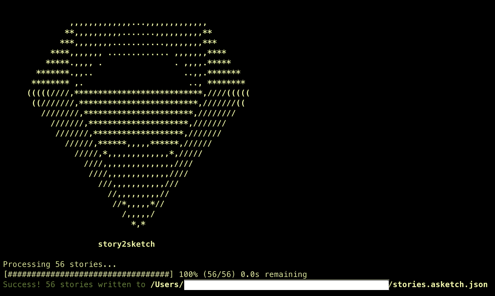
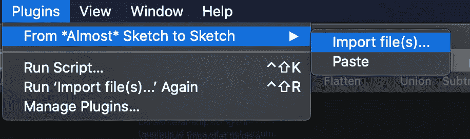

# 将故事书故事转换成草图文件

> 原文：<https://javascript.plainenglish.io/converting-storybook-components-to-sketch-file-54fe1774809d?source=collection_archive---------20----------------------->


Photo by [Jeremy Bishop](https://unsplash.com/photos/KFIjzXYg1RM) on [Unsplash](https://unsplash.com/)

Storybook 为开发者和设计者提供了一个卓有成效的平台。设计师可以随时查看基本组件的设计，并分享反馈。此外，对于开发人员来说，这是一个统一的平台，可以存储应用程序的所有构建模块。草图是设计师创建实体模型时广泛使用的应用程序。本文是将故事书故事转换成草图文件的分步指南。

第一步是安装[草图插件](https://storybook.js.org/addons/storybook-addon-sketch):

```
yarn add -D storybook-addon-sketch
# or
npm i --save storybook-addon-sketch
```

一旦你安装了插件，你需要在你的 storybook webpack 配置文件中注册它:

```
module.exports = {
   addons: ['storybook-addon-sketch/register']
}
```

现在我们已经在 storybook 中注册了这个插件，但是这个插件不会进行实际的转换。现在，我们需要做两件事:

1.  **素描 App** :为你的素描 App 安装`[asketch2sketch.sketchplugin](https://github.com/html-sketchapp/html-sketchapp/releases/download/v4.4.1/asketch2sketch-4-4-1.sketchplugin.zip)`。打开 zip 文件，你需要将这个插件添加到你的草图应用中。为此，请转到插件→管理插件→将下载的文件拖放到那里。
2.  **安装**[**story 2 sketch**](https://github.com/chrisvxd/story2sketch)**:**这个插件将把故事书组件实际转换成一个草图文件。

```
npm i story2sketch -g
```

您还需要在 package.json 文件中添加以下配置

```
"story2sketch": {
  "stories": "all",
  "input": "storybook-static/iframe.html",
  "output": "dist/great-ui.asketch.json"
}
```

> stories:在这里我们可以声明我们想要转换成一个草图文件的所有故事。在上面的例子中，我们给出了“all”，意思是我们希望所有的故事都被转换。
> 
> 输入:所有故事的输入源。
> 
> output:声明输出文件的路径，故事将在该文件中被转换为草图文件。

现在，我们都设置好了，唯一剩下的就是运行以下命令:

a)确保运行`npm run build-storybook`，获得 storybook-static 中的输出

b)一旦获得“storybook-static”文件夹中的输出，运行以下命令:

```
story2sketch --url https://localhost:6006/\?path\=/story/ --output stories.asketch.json
```

一旦命令成功，您将在终端上看到这个消息。



Terminal after converting stories into sketch

这个`stories.asketch.json`文件会被创建在根文件夹下。现在转到 Sketch 应用程序，在“插件”选项下，选择“从*几乎*草图到草图”，点击它，它会向您显示导入文件的选项，选择该选项并从您的项目导入新创建的`stories.asketch.json`到它。



Sketch app showing the plugins options

一旦导入完成，您将看到所有的故事都被转换成草图格式。这个帖子到此为止。如果你觉得这个帖子有用，请留下掌声。

*更多内容尽在*[*plain English . io*](http://plainenglish.io/)