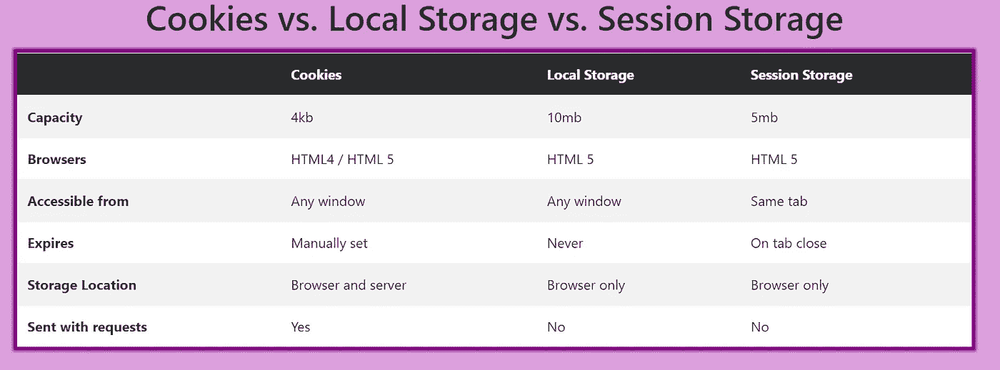

# Cookie vs .会话 vs .本地存储:为什么 Cookie 通常不是最佳选择

> 原文：<https://javascript.plainenglish.io/cookie-vs-session-vs-local-storage-why-cookies-are-usually-not-the-best-option-4b09de8fb0f3?source=collection_archive---------6----------------------->

Photo by [Fatos Bytyqi](https://unsplash.com/@fatosi?utm_source=medium&utm_medium=referral) on [Unsplash](https://unsplash.com?utm_source=medium&utm_medium=referral)

在这篇文章中，我将讨论这些存储工具之间的区别，并让您知道为什么 cookies 通常是您在 web 开发需求中最不想选择的选项。

**到期**

这三者之间最重要的区别是它们何时到期。当在代码中设置 cookie 时，开发人员可以指定 cookie 过期的时间段。另一方面，当使用浏览器的用户关闭特定选项卡时，会话将终止。最后，本地存储永远不会过期。

*赢家:*也许是饼干？

**存储限制**

这些存储元件的下一个最重要的方面是它们的容量。虽然我不记得有哪种情况要求我在其中一个元素中存储接近最大数量的用户数据，但毫无疑问，这是许多开发人员的常见用例。

在这三者中，cookies 保存的数据量最少，最大分配量为 4kb。本地存储保存的数据量最大，总容量为 10mb。会话存储紧随其后，最大容量为 4mb。

*获胜者:*本地存储

**存放在哪里**

最后，cookies 是这三种请求中唯一被发送到服务器的。这是因为 cookies 存储在浏览器和服务器上，而会话存储和本地存储只存储在浏览器上。

虽然您可能有访问服务器上的 cookie 的合理需求，但在大多数情况下，cookie 的这一方面使它们成为次于本地和会话存储的选项。这是因为在服务器上发送 cookies 会产生性能问题。

*失败者:*饼干

**总结**

我希望这次讨论能让你有所收获。关于这些元素，你有什么独特的用例或观点是这篇文章没有涉及到的吗？

*更多内容看* [***说白了. io***](http://plainenglish.io/)