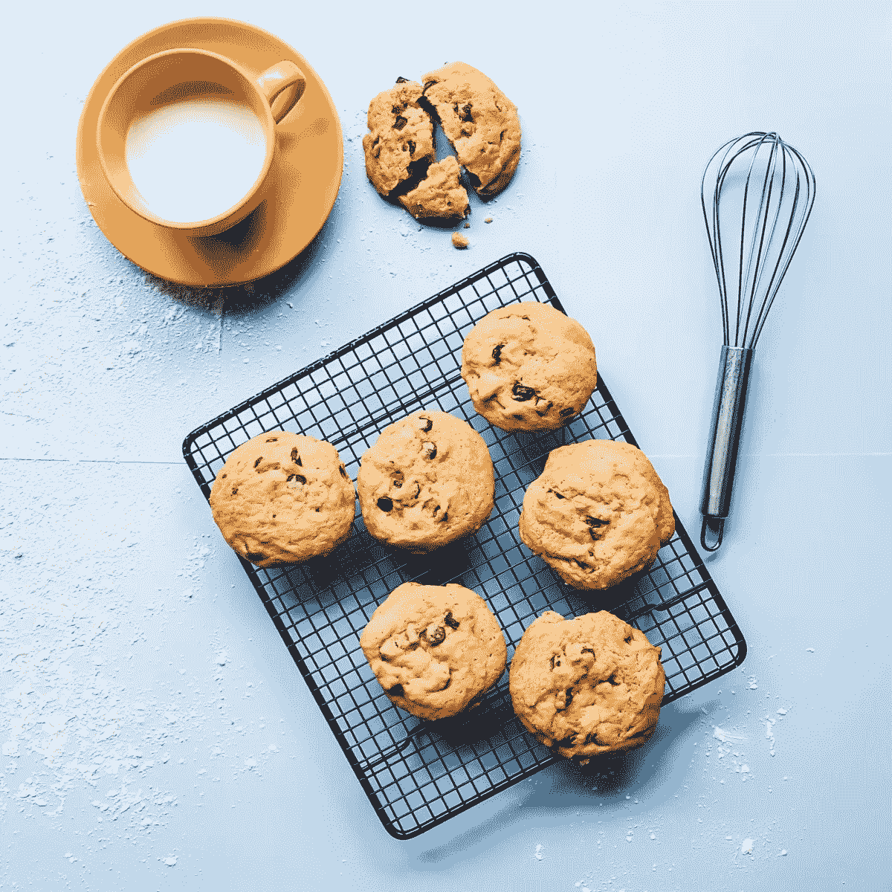

# JavaScript 中的 Cookies:指南

> 原文：<https://javascript.plainenglish.io/cookies-in-javascript-ac110c0575e0?source=collection_archive---------10----------------------->



JavaScript 中的 cookies 是什么？

让我们举一个例子:如果我们有一个网页或网站，我们想在那里存储用户的信息(注册或登录信息)，以便当用户返回到同一个页面时，服务器知道该用户，并根据需要在页面上呈现用户信息。因此，cookie 将用户信息存储在其中。

**创建 Cookie:**

在 JavaScript 中，创建 cookie 是一个非常简单的过程。我们编写下面一行代码来创建一个包含用户信息的 cookie。例如，我们希望存储当前登录用户的用户名。

```
document. cookie = “username = David Warner;”
```

上面一行创建了一个 cookie，名称为 username，但是我们还应该提到一个截止日期，即 cookie 应该在什么时候被删除，如果我们没有提到截止日期，那么 cookie 将在浏览器关闭时被删除。例如，我们希望在用户注销时删除当前登录用户的 cookie。

我们可以在创建 cookie 时提及到期日期，如下所示:

```
document. cookie = “username = David Warner; expires = Thu, 17 Nov 2022 23:00:00 UTC;”
```

或者可以在浏览器关闭时删除。

创建 cookie 时，还需要设置一个属性，即 path:

`path=path`(如:`/`、`/mydir`)，如果没有指定，默认为当前单据位置的当前路径。

我提到 path = "/"是因为我想在我的网站上的任何地方访问 cookies。

**删除 Cookie:**

以上，我们已经创建 cookie 一年了。现在，如果我们想在用户注销时删除 cookie，在“注销”按钮的 click 事件侦听器或您用于注销的任何 HTML 元素下，我们将编写以下代码:

```
document.cookie = "username= ; expires = Thu, 01 Jan 1970 00:00:00 GMT;path=/";
```

在上面的代码中，cookie 的名称(即用户名)被清空，到期日期被设置为过去的日期，cookie 被删除。

**获取 Cookie:**

要获取当前的 cookie，我们只需编写:`document.write`

下面是我在一个项目中用来创建、获取和删除 cookies 的代码:

```
function createCookie(userKey,r_token){
    let separator = ";" ;
    document.cookie = "user_key=" + userKey + ";expires = Thu, 17 Nov 2022 23:00:00 UTC;path=/";
    document.cookie = "renew_token = " + r_token + ";expires = Thu, 17 Nov 2022 23:00:00 UTC;path=/"

}
```

在上面的代码中，我想在 cookie 中存储两个值，所以我可以使用上面的方法用两个不同的值分别创建两个 cookie，或者我们也可以编写下面的代码:

```
function createCookie(userKey,r_token){
    let separator = ";" ;
    let values = [userKey,r_token].join(separator);
    document.cookie = "myValues="+values+";expires = Thu, 17 Nov 2022      23:00:00 UTC;"
}
```

***注销时删除 cookie:***

```
document.getElementById("logoutBtn").addEventListener("click",function(){
    document.cookie = "user_key= ; expires = Thu, 01 Jan 1970 00:00:00 GMT;path=/";
    document.cookie = "renew_token= ; expires = Thu, 01 Jan 1970 00:00:00 GMT;path=/"

})
```

我希望这篇文章有助于理解 cookies 的概念。

关注我的博客[webdevlearning.com](https://webdevlearning.com/)了解更多的网络开发概念。

*更多内容请看*[***plain English . io***](http://plainenglish.io/)