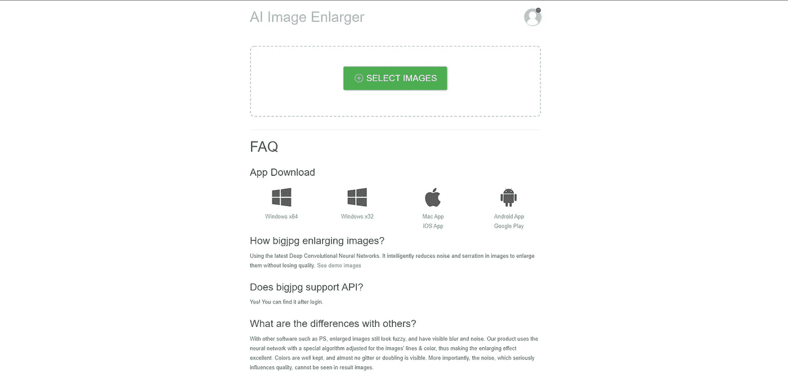

# 很酷的神经网络，你现在就可以尝试

> 原文：<https://javascript.plainenglish.io/cool-neural-networks-that-you-can-try-right-now-75dbac9f69d2?source=collection_archive---------8----------------------->

## 神经网络

## 这些神经网络中有许多真的有惊人的功能，你会发现它们很有用或者很有趣。

Photo by [Uriel SC](https://unsplash.com/@urielsc26?utm_source=unsplash&utm_medium=referral&utm_content=creditCopyText) on [Unsplash](https://unsplash.com/s/photos/neural-network?utm_source=unsplash&utm_medium=referral&utm_content=creditCopyText)

神经网络是一个自适应系统，可以根据输入信息改变其内部结构。今天，神经网络有助于积极创造新技术和发展现有技术。它们被积极用于机器视觉(汽车上的自动驾驶)，生成随机的面孔或声音，提高图像或视频质量，甚至为您的企业生成徽标和名称

我试着找出最有用的，然后呈现给你

## [移除 Bg](https://www.remove.bg/)

最流行的神经网络之一，也是最有用的网络之一。你可能已经从标题中注意到，它去除了你的图像的背景。你所需要的只是在主页上传你的图片，它会自动完成这项工作。即使有两个人和很多细节

[https://www.remove.bg/](https://www.remove.bg/)

## [Namelix](https://namelix.com/)

这是一个神经网络，可以为你的品牌、商标以及商品的外观命名。如果你不知道如何称呼你的品牌，也不想花钱买一个好的标志，你可以做下面三个步骤，然后选择你喜欢的设计:

*   写几个关键词。
*   然后选择名称的长度。
*   最后，为你的品牌选择一种风格。

[https://namelix.com/](https://namelix.com/)

## [GNOD](https://www.gnod.com/)

这是一个出色的神经网络。它帮助你找到音乐、电影、文学、艺术家，甚至像电话、电脑等设备的推荐。你需要做的就是:

*   按下“发现”按钮。
*   写出三个你最喜欢的乐队或歌手(如果你选择了音乐)。
*   它会根据你的口味随机生成歌手或乐队，你只需要点击“我喜欢”、“我不喜欢”或“我不知道”。

[https://www.gnod.com/](https://www.gnod.com/)

## [此人不存在](https://thispersondoesnotexist.com/)

这是最有趣的神经网络之一，因为它随机生成从未存在过的人的面孔，要查看新的“从未存在过的面孔”，您只需重新加载页面。

[https://thispersondoesnotexist.com/](https://thispersondoesnotexist.com/)

## [自动绘制](https://www.autodraw.com/)

它有助于你画画。你可以画任何你想画的东西，这个神经网络会给你你正在画的东西。

[https://www.autodraw.com/](https://www.autodraw.com/)

## [反映](https://reflect.tech/)

它可以用其他人代替一些人的脸，同时保留元数据(深度、光照、锐度、环境等)。你可以上传自己的图片，做任何你想做的事情。那很有趣，不是吗？我把埃隆·马斯克的脸换成了威尔·史密斯的。

[https://reflect.tech/](https://reflect.tech/)

## [着色](https://colorize.cc/)

这个神经网络允许你从黑白图像制作彩色图像。它决定了草、天空、人等的位置。就我个人而言，我试过了，效果很好。

[https://colorize.cc/](https://colorize.cc/)

## [Bigjpg](https://bigjpg.com/en)

我自己使用这个神经网络大约一年了，我可以告诉你，它真的很有效。它可以提升照片/艺术品的分辨率。选择上调:4x 和降噪:高或最高。仅此而已。只要等到你的图像准备好，然后下载它。

[https://bigjpg.com/en](https://bigjpg.com/en)

## 结论

非常感谢你阅读这篇文章。我希望你喜欢这篇文章，并且发现这些神经网络是有用的。

*更多内容尽在*[*plain English . io*](http://plainenglish.io/)