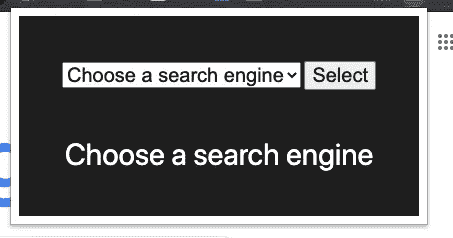

# 创建一个复制和搜索 Chrome 扩展

> 原文：<https://javascript.plainenglish.io/copy-search-chrome-extension-1a1ac95adae4?source=collection_archive---------8----------------------->

## 复制一些文本，搜索这些文本。简单。


本教程使用了一个样板谷歌浏览器扩展设置。如果你想知道如何设置，请点击这里查看我们的文章:

[](https://anobjectisa.medium.com/how-does-a-chrome-extension-work-web-development-6e85bd2bccc1) [## Chrome 扩展是如何工作的？(网络开发)

### Chrome 扩展有 5 个部分:

anobjectisa.medium.com](https://anobjectisa.medium.com/how-does-a-chrome-extension-work-web-development-6e85bd2bccc1) 

# 《丛林奇兵》

我们将有一个简单的 HTML 页面，允许用户选择搜索引擎；这个页面将成为我们 Chrome 扩展中的**弹出窗口**。

在**前台**脚本中，我们将监听用户何时复制一段文本。当他们这样做时，我们将让我们的**后台**脚本打开一个新的带有适当的 URL 和搜索参数的。

**我们开始吧。**

# 我们的清单. json

这里没什么特别的。

```
{
 “name”: “Clipboard Search”,
 “manifest_version”: 2,
 “description”: “Testing clipboard functionality.”,
 “version”: “0.0.0”,
 “background”: {
 “scripts”:[“background.js”]
 },
 “browser_action”: {
 “default_popup”: “popup.html”
 },
 “permissions”: [
 “tabs”,
 “<all_urls>”
 ]
}
```

我们需要的唯一权限是**选项卡**，这样我们就可以将**前台脚本**注入到特定的选项卡中，以及 **< all_urls >** ，这样我们就可以将**前台脚本**注入到特定的网页中。

# popup.html

这是一个简单的网页。这里没什么复杂的。

我们有一个带有**选项**的**选择**，一个用于提交的**按钮**，以及一个 **div** 来显示他们选择的搜索引擎。

```
<div class=”container”>
  <div class=”section1">
    <select name=”search_engine” id=”search_engine”>
      <option value=”” disabled selected>Choose a search engine</option>
     <option value=”google”>Google</option>
     <option value=”startpage”>Start Page</option>
     <option value=”duckduckgo”>Duck Duck Go</option>
     <option value=”ecoasia”>Ecoasia</option>
     <option value=”bing”>Bing</option>
   </select>
 <button>Select</button>
 </div> <div class=”section2">
   <div class=”search_engine_choice”>Your Current Search Engine</div>
 </div>
</div>
```

这是我们所拥有的



# 我们的前景脚本

这里没有很多代码。

```
document.addEventListener(‘copy’, () => {
 navigator.clipboard.readText()
   .then(res => {
     chrome.runtime.sendMessage({
       message: ‘search’,
       payload: `”${res}”`
     });
   })
 .catch(err => console.log(err));
});
```

我们为**复制**事件创建一个监听器。当被触发时，我们使用 **readText()** 方法从**剪贴板**获取复制的素材。

然后，我们使用**chrome . runtime . sendmessage()**方法将复制的文本发送到我们的**后台脚本**。

# **我们的后台脚本**

## 这是我们大部分扩展编写的地方。

这里我们有一个保存所有搜索引擎字符串的对象。

```
const search_engines = {
 google: ‘[https://www.google.com/search?q='](https://www.google.com/search?q='),
 startpage: ‘[https://www.startpage.com/do/dsearch?query='](https://www.startpage.com/do/dsearch?query='),
 duckduckgo: ‘[https://duckduckgo.com/?q='](https://duckduckgo.com/?q='),
 ecoasia: ‘[https://www.ecosia.org/search?q='](https://www.ecosia.org/search?q='),
 bing: ‘[https://www.bing.com/search?q='](https://www.bing.com/search?q=')
}
```

当我们的 Chrome 扩展检测到用户打开了一个新标签页时，我们确保将我们的**前台脚本**注入到该页面中。

```
chrome.tabs.onUpdated.addListener((tabId, changeInfo, tab) => {
  if (/^http/.test(tab.url) && changeInfo.status === ‘complete’) {
    chrome.tabs.executeScript(tabId, { file: 
                           ‘./scripts/foreground.js’ }, () => {
        console.log(‘The foreground script has been injected.’);
    });
  }
});
```

在**后台**监听器中，我们监听来自我们**前台**的消息“**搜索**”。

当我们收到它时，我们为用户打开一个新标签。

```
chrome.runtime.onMessage.addListener((request, sender, sendResponse) => {
 if (request.message === ‘save_search_engine’) {
   current_search_engine = request.payload;
   sendResponse({ message: ‘success’ });
 } else if (request.message === ‘get_current_search_engine’) {
   sendResponse({ payload: current_search_engine });
 } else if (request.message === ‘search’) {
   chrome.tabs.create({
     active: true,
     url:  
       `${search_engines[current_search_engine]}${request.payload}`
   });
 }
});
```

请注意 **url** 属性的值是如何由选择的**搜索** **引擎**加上搜索项 r **equest.payload** 构成的，并被修改为字符串。

# 就是这样！

你可以在这里得到源文件[或者你可以看下面的视频教程。](https://github.com/an-object-is-a/chrome-ext-copy-paste)

如果你想要更深入的指导，请查看我在 YouTube 上的完整视频教程， [**一个物体是一个**](https://www.youtube.com/c/anobjectisa) 。

请务必关注我们的 [**Instagram**](https://www.instagram.com/an_object_is_a/) 和 [**Twitter**](https://twitter.com/anobjectisa1) 以跟上我们最新的 **Web 开发教程**。