# 我们在办公室或家里日常工作中使用的俚语

> 原文：<https://javascript.plainenglish.io/corporate-jargon-hilarious-phrases-we-use-daily-and-what-we-actually-mean-by-them-160ffb2a03a3?source=collection_archive---------9----------------------->

## 办公室笑话

## 他们所说的和他们真正的意思

Photo by [Daria Shevtsova](https://unsplash.com/@daria_shevtsova?utm_source=medium&utm_medium=referral) on [Unsplash](https://unsplash.com?utm_source=medium&utm_medium=referral)

在办公室或在家工作时，我们与不同的人交流。有时我们会使用一些我们倾向于交流的词语，但是在我们的内心深处，我们正在培养非常不同的感觉。

在这篇文章中，我收集了一些我们日常使用的短语，以及我们在使用这句话时的真实想法。

请在评论中分享你的短语和真实意思，这样我就可以添加它们了。

# 抱歉说得不清楚

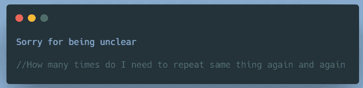

# 希望这有帮助！

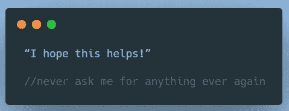

# 不好意思！我开了静音。

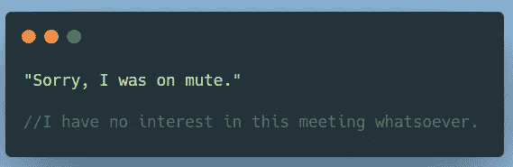

# 让我们回到这个话题。

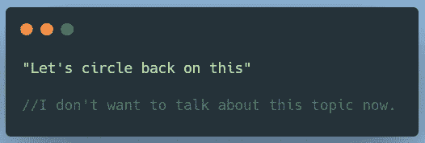

# 让我知道我是否能在这件事上提供更多的帮助。

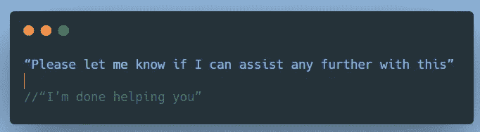

# 我想跟进一下…

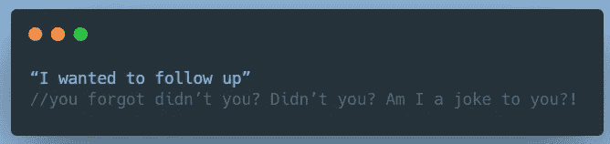

# 我想你已经传达了我刚才所说的信息。

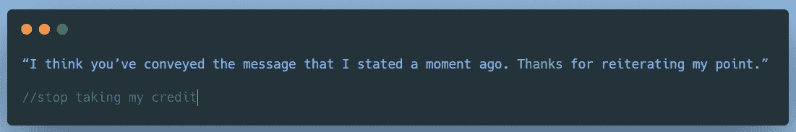

# 只是想确保每个人都在同一页上。

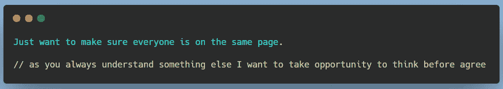

# 我们实际上已经决定走另一个方向。如果我们的优先事项发生变化，我们会与您联系。

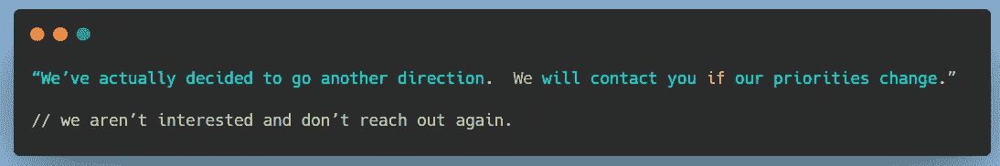

# 温馨提醒。

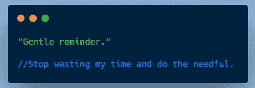

# 根据我的最后一封电子邮件…

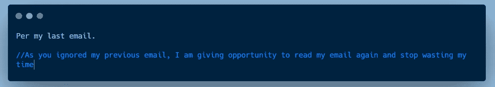

# 我能了解一下这方面的最新情况吗？

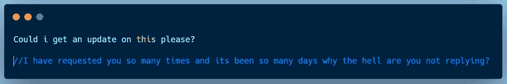

# 帮我理解一下…

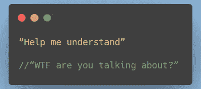

# 我们把这个下线吧。

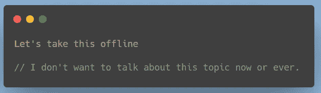

# 请随意 ping 我…

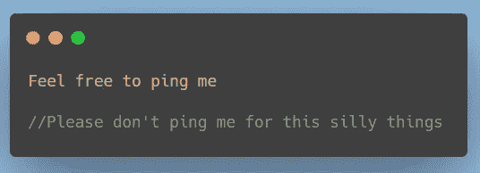

# 我有很多事要做…

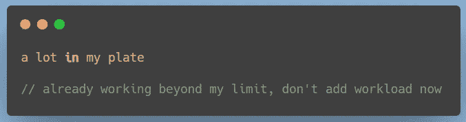

# 我没有带宽。

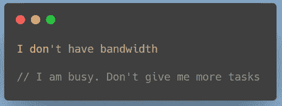

# 让我们停在这…

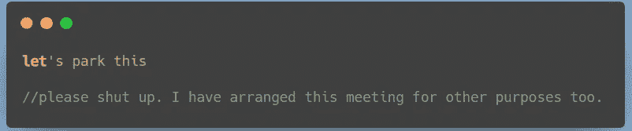

# 让我们下周联系一下。

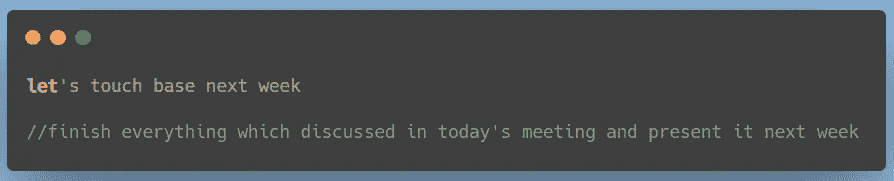

# 我会给你打电话…

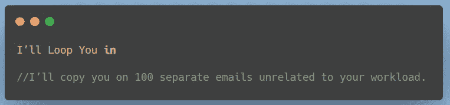

# 行动项目…

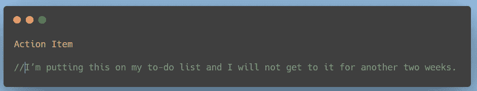

> *请在评论框里分享你最喜欢的公司术语。*

**参考:**

https://www . them use . com/advice/the-corporate-congonal-decoder-that-is-just-little-too-real

[https://wavelength . asana . com/work style-workplace-congonal-cheat-sheet/](https://wavelength.asana.com/workstyle-workplace-jargon-cheat-sheet/)

[https://blog . hubspot . com/agency/烦人-公司-行话-信息图](https://blog.hubspot.com/agency/annoying-corporate-jargon-infographic)

[https://twitter.com/delia_p/status/1222550811802247173](https://twitter.com/delia_p/status/1222550811802247173)

# 延伸阅读:

 [## 20 个最好最搞笑的编程迷因

### 程序员的日常幽默

javascript.plainenglish.io](/20-of-the-best-and-most-hilarious-programming-memes-f3a9b75ae6ac)  [## 检验你是否是程序员的 10 个幽默模因

### 程序员的周五幽默

javascript.plainenglish.io](/10-humorous-memes-to-check-out-if-you-are-a-programmer-3244248e3e7e)  [## 给程序员的 10 个 Ulitmate 笑话

### 最佳编程笑话汇编 2021 系列

javascript.plainenglish.io](/10-ulitmate-jokes-for-programmers-4cc070cbbcf5)  [## 有趣的比较:程序员与普通人

### 是什么让程序员与众不同？

javascript.plainenglish.io](/funny-comparisons-programmers-vs-normal-people-3aa7002f62f0) 

*更多内容看* [***说白了. io***](http://plainenglish.io/)