# 计数排序算法举例说明

> 原文：<https://javascript.plainenglish.io/counting-sort-algorithm-a-brief-explanation-with-an-example-72cee2d49670?source=collection_archive---------8----------------------->

我们在[上一篇文章](https://himnickson.medium.com/sorting-algorithms-b1d0ef09c72e)中已经看到了排序算法。在本文中，我们将讨论**计数排序算法**。

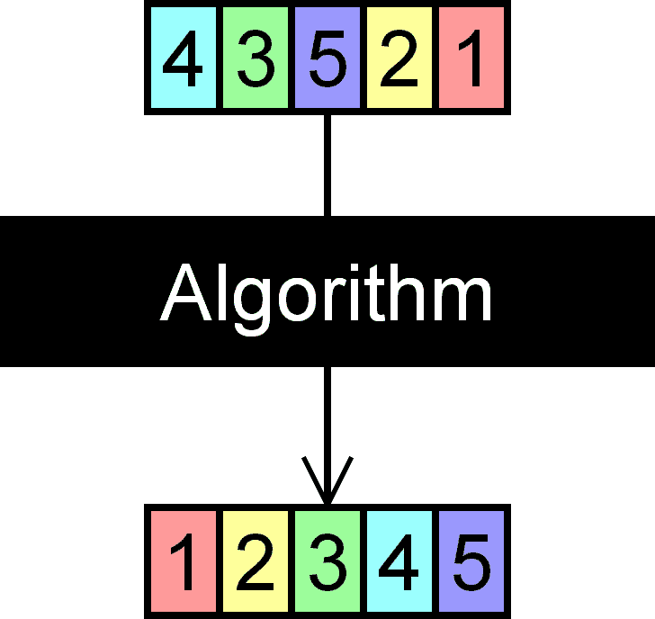

在比较元素时，没有任何排序算法可以在小于 ***O(n log n)*** 的时间内对 n 个元素进行排序。幸运的是，如果我们提前知道元素的一些信息，我们可以用其他方法对它们进行排序。假设我们被要求对 ***n*** 个元素进行排序，但被告知每个元素都在范围 ***0-k*** 内，其中 ***k*** 比 ***n*** 小得多。我们可以利用这种情况创建一个线性的***【n】***排序算法。那是计数型的。

## 什么是计数排序算法？

计数排序(ultra sort 或 math sort)是一种排序算法，它通过计算每个不同数组元素出现的次数来对数组元素进行排序。计数存储在辅助数组中，排序是通过将计数映射到辅助数组中的索引来完成的。

计数排序使用数组 ***arr*** 中数字的范围 ***(k)*** 进行排序。它使用这个范围生成这个长度的数组。数组*中的每个索引 ***i*** 然后用于计算 arr 中有多少元素具有值***I****存储在 ***桶*** 中的计数然后可用于将 ***arr*** 中的元素以正确的顺序放入最终排序的数组中。哈罗德·h·苏厄德在 1954 年发明了这个算法。**

**

***Harold H. Seward***

## *它是如何工作的？*

*这个算法有三个阶段。*

1.  *计算元素*
2.  *聚集直方图*
3.  *写回已排序的对象*

## *计算元素*

*下面的数组必须排序。*

*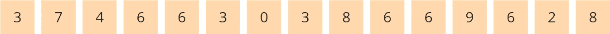*

*找到给定数组中最大的元素(假设是 ***max*** )。创建一个长度为 ***max+1*** 的数组，所有元素设置为 0(当我们初始化一个数组时，它的所有元素默认取 0)。该数组用于跟踪数组的元素计数。这里， ***max=9*** ，因此创建的数组大小为 10。数组索引显示在图表中线的下方。*

*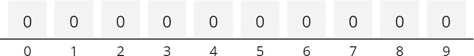*

*我们现在遍历要排序的数组。因为第一个元素是 3，所以我们将辅助数组中位置 3 处的值增加 1。*

*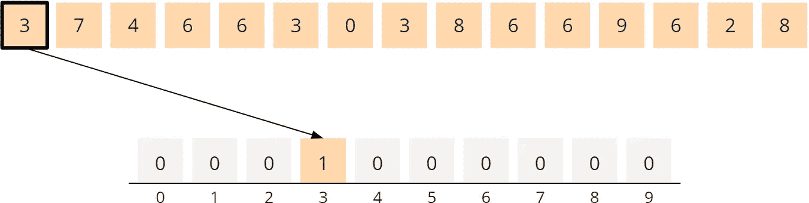*

*第二个分量是 7。在辅助数组中，我们在位置 7 递增字段。*

*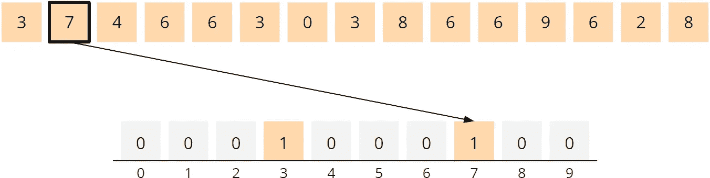*

*接下来是元素 4 和 6，所以我们将位置 4 和 6 的值增加 1。*

*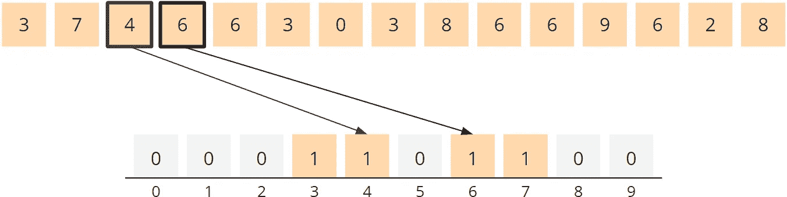*

*接下来的元素 6 和 3 已经出现。因此，辅助阵列的相应字段从 1 增加到 2。*

*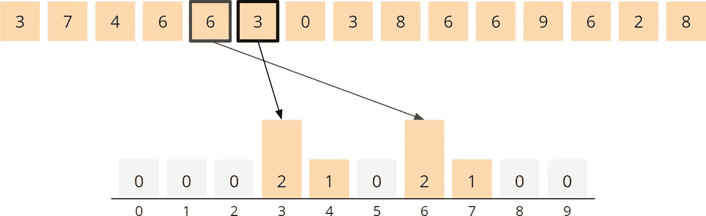*

*这个概念应该是清楚的。在增加了剩余元素的辅助数组值之后，辅助数组终于有了这样的感觉。*

*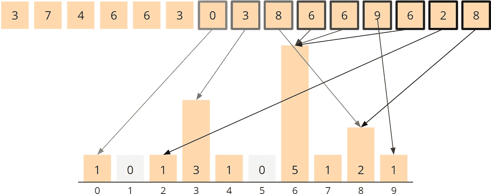*

*这些信息将被传递到第二阶段。*

## *聚集直方图*

*我们现在确切地理解了键为 0 的元素只出现一次，但是我们不能仅仅将 0 放入数组进行排序，我们真的需要一个键为 0 的对象！*

*为了快速找到这一点，我们首先聚合直方图中的值。为了实现这一点，我们从索引 1 开始遍历辅助数组，并将左侧邻近字段的值添加到每个字段中。*

*在位置 1，我们将字段 0 的值加到 0。总数是一。*

*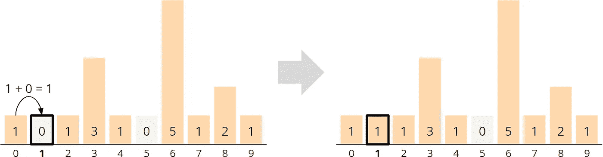*

*在位置 2，我们将字段 1 中的 1 附加到 1 上，得到 2。*

*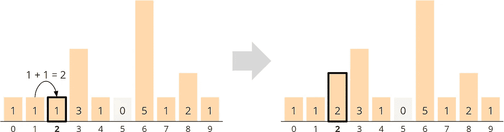*

*以此类推，直到我们最终将字段 8 中的 14 与字段 9 中的 1 相加，得到 15。*

*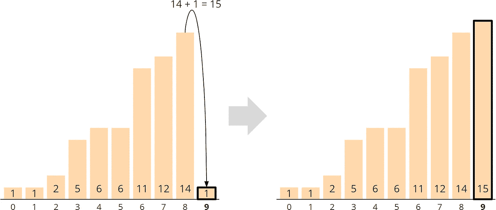*

*这个合并的直方图目前不仅告诉我们具有特定关键字的对象出现的频率，还告诉我们具有相应关键字的最后一个组件属于哪里。位置不是从 0 开始，而是从 1 开始。*

*例如，键为 0 的对象属于位置 1(数组索引 0)，键为 2 的对象属于位置 2，键为 3 的三个对象属于位置 3、4 和 5。(数组索引 2，3，4)。*

## *写回已排序的对象*

*我们需要一个长度为输入数组( ***、大小为*** )的附加数组来对对象进行排序。*

*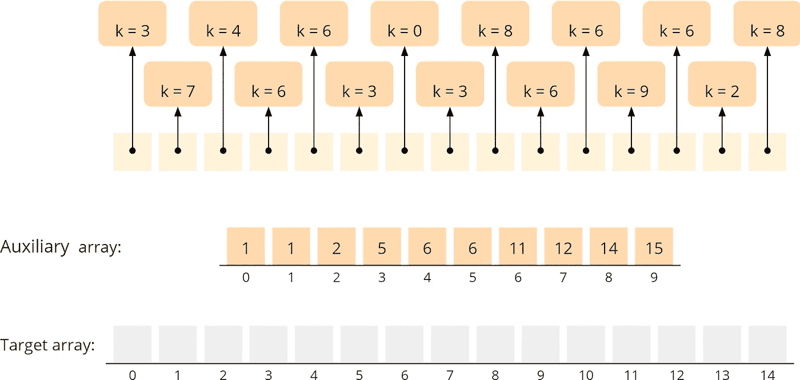*

*我们现在向后遍历要排序的数组，将每个对象写入目标数组中辅助数组所指示的位置。为了将具有相同关键字的下一个元素向左移动一个字段，我们将辅助数组中的相应值减 1。*

*让我们从输入数组的最顶端开始，从键为 8 的对象开始。辅助数组中位置 8 的值为 14。我们将值递减到 13，并将键为 8 的对象复制到目标数组中的位置 13(记住:辅助数组中的位置信息是从 1 开始的，所以我们写在位置 13，而不是 14)。*

*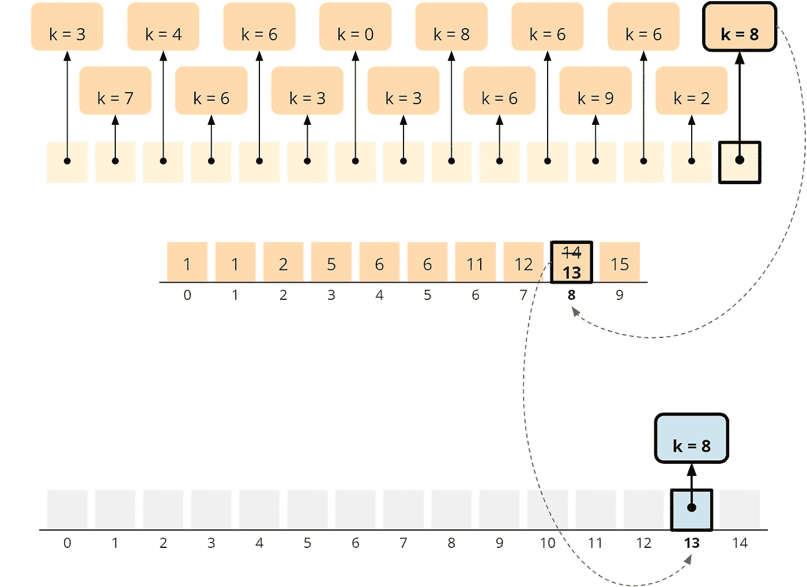*

*键 2 位于右边第二个对象上。辅助数组中位置 2 的值为 2。我们将辅助数组中的值减为 1，并将对象复制到目标数组中的适当位置。*

*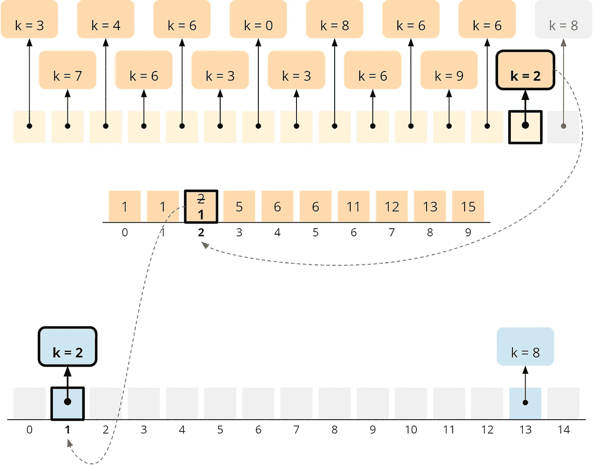*

*我们对每个元素重复上述步骤，直到我们到达键为 3 的对象。辅助数组的字段 3 现在有一个 3。我们将这个值减为 2，并将对象复制到位置 2，即目标数组中的最后一个空闲位置。*

*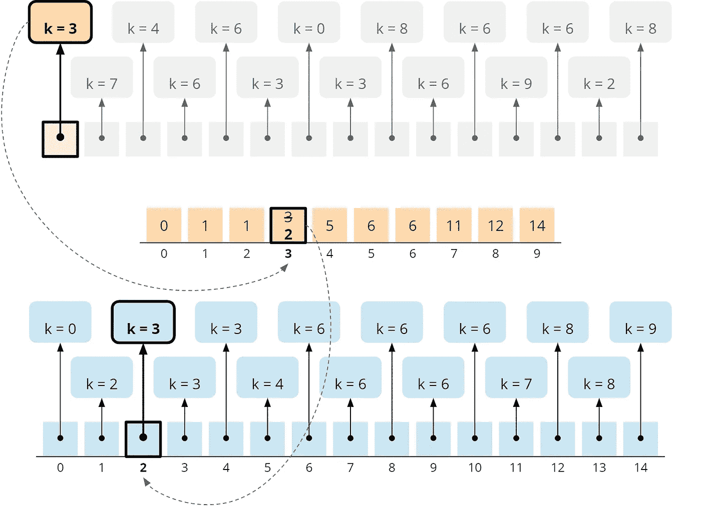*

## *结论*

***完成后，我们对给定的数组进行了排序。***

*让我们在下一篇文章中讨论这个算法的**实现和分析**。*

*希望能有帮助。也分享你的想法。*

**更多内容尽在*[***plain English . io***](https://plainenglish.io/)*