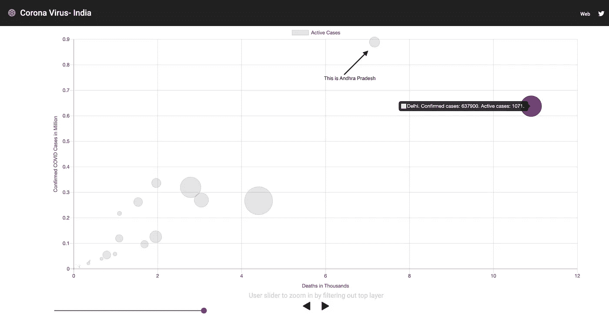
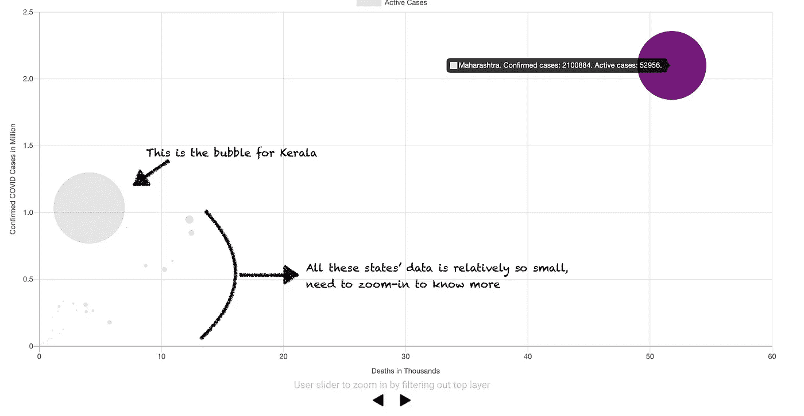
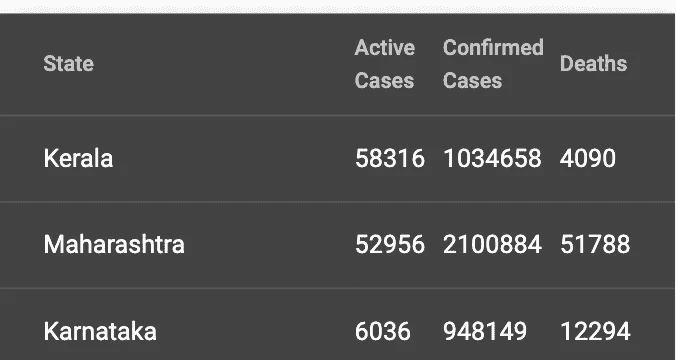
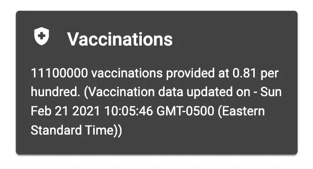
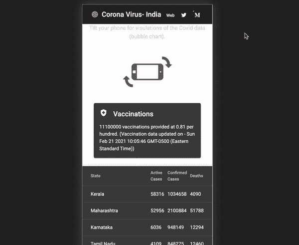

# 新冠肺炎印度可视化

> 原文：<https://javascript.plainenglish.io/covid-19-india-visualization-f6abfaa091ee?source=collection_archive---------14----------------------->

## 我偶然发现了一个可靠的印度众包新冠肺炎数据。想尝试将它可视化。用 Angular 和 ng2-charts 库建立了一个网页。选择气泡图进行可视化；试着让它变得互动和移动友好。以下是我对周末项目的一点看法。

## 基于角度的冠状病毒数据气泡图

该网页将州级新冠肺炎数据可视化。跟着[这个链接](https://kvkirthy.github.io/covid-sample/)玩应用。该网页使用新冠肺炎印度组织提供的服务，这是一个众包，志愿者组织。*大声喊出来，谢谢*[T5【Covid19India.org】](https://www.covid19india.org/about)*。他们在志愿者的帮助下取得的成就令人惊叹。数据非常详细、准确，并定期更新。*

该图表显示了印度所有邦和中央直辖区的数据。为了不增加他们服务器的负载，我将 JSON 缓存在浏览器的会话存储中。您可以重新打开窗口，重新调用服务(如果您整夜都在查看页面)。

气泡图代表三个数据点。

1.  Y 轴表示某个州的所有案例。
2.  X 轴上的死亡计数；
3.  活动案例的数量——气泡的大小。这可能是一个重要的指标，因为它代表了一个地区的感染风险。



Figure-1- Bubble chart showcasing Covid data in India

# 泡泡说了什么？

请注意，x 轴显示的是以百万计的整体案例；y 轴以千计死亡数。参见上面的图 1(根据少数状态进行过滤)。在各邦中，德里的死亡人数较多，位于图表的最右侧，而安得拉邦的病例较多，报告的死亡人数相对较少。因此，它在 y 轴上的位置更高，在 x 轴上位于德里之前。

> 不要混淆德里是全国死亡人数最多的城市。请注意底部的紫色滑块，它对数据集应用过滤器以放大到特定的状态。

气泡的大小表示活动案例的数量。泡沫越大，案例越活跃。这也意味着，泡沫越大，该州的人感染的风险就越高。

请参见下面的图 2，了解大图——该国的所有州。马哈拉施特拉邦和喀拉拉邦盖过了其他邦。这两个州都有大量活跃的新冠肺炎病例。其他大多数州都是小点。

马哈拉施特拉邦位于极右，死亡人数和活跃病例数非常高。这种情况可能是因为像孟买和浦那这样的城市人口密度高。

请注意，尽管喀拉拉邦的活跃病例数量很高，但死亡率却很低。因此，它位于 x 轴的左侧。在某种程度上，它很好地说明了喀拉拉邦的免疫和医疗保健。



Figure 2: Big picture — India covid Situation

探索和理解其他州是一项挑战，除非我们放大并过滤掉感染、死亡和活跃病例数极高的州。因此，使用图表底部的滑块。它会放大，过滤掉排名靠前的州。见左边视频(并在网页上试用[)。](https://kvkirthy.github.io/covid-sample/)

# 页面上使用的库

## ng2-图表

包括气泡图的 ng2 图表库。该库提供了八种不同的图表，包括折线图、饼图、条形图等。

对于气泡图，每个数据点由三个方面表示。x 轴、y 轴和半径。考虑下面的代码片段。如前所述，y 轴表示确诊病例数，单位为百万(100 万卢比)。请注意，这个数字被除以 1，000，000。死亡人数以千计。然而，半径因子是动态的。

```
x: d.deaths / 1000,y: d.confirmed / 1000000,r: d.active / radiusFactor,
```



前两个邦和排在第三位的卡纳塔克邦的活跃病例数量差异很大。如果我使用一个一致的因素，喀拉拉邦和马哈拉施特拉邦的气泡半径是吹出来的。这提出了一个有趣的挑战，因此需要一个动态半径因子。考虑下面的代码片段。请注意，半径因子的变化基于活动案例数

```
if(data[0].active > 10000) {radiusFactor = 1000;} else if(data[0].active > 1000) {radiusFactor = 50} else if(data[0].active > 300){radiusFactor = 25;} else if(data[0].active > 100){radiusFactor = 10;} else {radiusFactor = 1;}
```

考虑在模板中呈现气泡图的以下代码片段。

```
<canvas baseChart [datasets]="bubbleChartData" [options]="bubbleChartOptions" [colors]="bubbleChartColors" [legend]="bubbleChartLegend" [chartType]="bubbleChartType"></canvas>
```

## 角状材料

[棱角分明的素材库](http://material.angular.io/)让它变得简单

*   为页面提供一个主题——在本例中使用紫色/绿色主题。
*   为网页/网站提供版式。
*   现成的组件包括工具栏，卡片，数据网格，滑块，图标等。



该页面还显示了该国疫苗接种的高级状态。这个数据还没有被广泛获得，*还没有*。将期待在未来几周的工作。

## 引导 CSS

最后但不是最不重要的，网页是有反应的。使用 bootstrap 优雅地适应平板电脑和移动设备外形。



注意，在手机上，在纵向模式下，page 不显示气泡图。它显示一个 gif，要求用户旋转。当她将手机旋转到横向时，它会显示交互式气泡图，可以使用滑块放大。

## 参考和链接

1.  https://www.covid19india.org/about
2.  ng2-图表—[https://github.com/valor-software/ng2-charts](https://github.com/valor-software/ng2-charts)
3.  棱角分明的材料—[http://material.angular.io/](http://material.angular.io/)
4.  代码-[https://github.com/kvkirthy/covid-sample](https://github.com/kvkirthy/covid-sample)(使用开发分支)

*查看更多内容请点击*[***plain English . io***](https://plainenglish.io/)