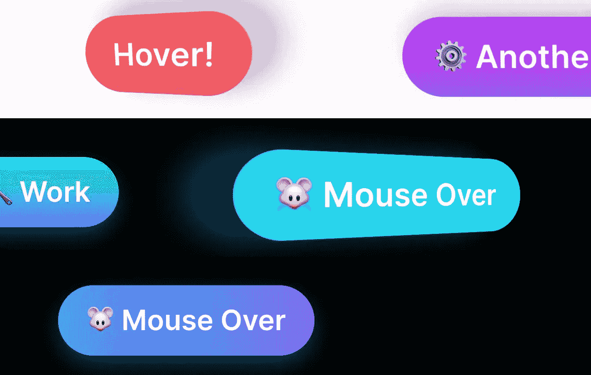

# 创建 3D CSS 按钮，当鼠标经过时会移动

> 原文：<https://javascript.plainenglish.io/create-3d-css-buttons-which-move-as-you-mouse-over-8b8b53f34fd0?source=collection_archive---------4----------------------->



**最近，我在考虑一个 3d 按钮的想法，当用户移动鼠标时，它就会移动**。为了进一步增强这种效果，我添加了一些 3d 阴影，这些阴影一前一后地移动，给人一种 3d 按钮不在页面上的错觉，它随着用户的鼠标移动而移动。

# 演示

# 它是如何工作的？

这些按钮背后的基本概念是，我们需要跟踪用户何时将鼠标放在按钮上、移动以及移开鼠标。鼠标悬停时，我们将移动按钮，使其显示为 3d。鼠标离开时，我们将重置它。

在我们开始 JavaScript 之前，让我们让按钮看起来更好。我们的 HTML 将如下所示:

```
<button class***="button"***><span>Hover!</span></button>
```

我们的 CSS 看起来像这样:

# 🎨次要背景动画

你可能已经注意到第三个按钮有一个背景动画。如果你对我是如何做到的感兴趣，我使用了一个通过动画移动的伪元素。伪元素有简单的渐变，溢出是隐藏的。您可以通过从`span`和`button`元素中移除`overflow: hidden`来测试这一点。

# JavaScript 如何工作

现在让我们来看看我们的 JavaScript。您可能已经注意到我们的按钮有两个元素——按钮本身和按钮内部的一个 span。这样做有一个很好的理由——这让我们可以在父对象上应用 3d 透视，这是效果工作所必需的。它还允许我们将悬停效果的目标对准父母——如果我们在孩子身上使用悬停，效果会随着孩子的旋转而消失，我们会错过 hitbox。

我使用了一个使用事件变量(e)的函数，并且引用了 span(这里记为 item)和 button(引用为 parent)。

这有效地将按钮分成了 4 个象限。中点表示 X 和 Y 轴上的变化角度为 0 °,而向左移动会产生更负的 Y 角，向右移动会产生更正的 Y 角。这同样适用于 X，向上移动光标会使 X 角度变得更正，向下移动会变得更负。

一些值得注意的事情:

*   我们使用了过滤框-阴影——这是因为它们可以更好地过渡 CSS 的属性。
*   我添加了添加自定义透视和框阴影颜色的功能，以便在无需更改代码的情况下提供更大的灵活性。
*   通过划分`calcAngle*`变量来调节效果。如果你改变你除以多少，甚至改变视角，效果会变得或多或少的明显。

# 将我们的功能应用到每个按钮

为了将我们所有功能应用于每个按钮，我们简单地用`forEach`遍历它们。如果您想了解更多关于如何将 JavaScript 事件添加到多个元素的信息，请点击下面的链接。

# 我们完了

在那之后，我们将在文章的开头重新创建效果。我们希望您喜欢本指南，以下是一些有用的链接:

*   [CodePen 上的源代码](https://codepen.io/smpnjn/pen/qBjJwar)
*   [如何给多个元素添加 JavaScript 事件](https://fjolt.com/article/javascript-foreach-on-queryselectorall)
*   [了解 CSS 如何转换工作](https://fjolt.com/article/css-transformations)

*更多内容请看*[***plain English . io***](http://plainenglish.io/)