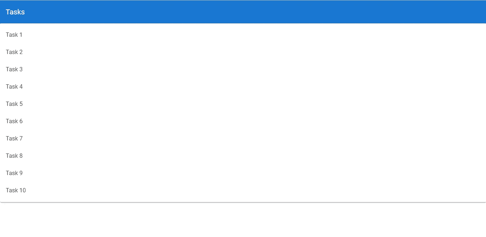
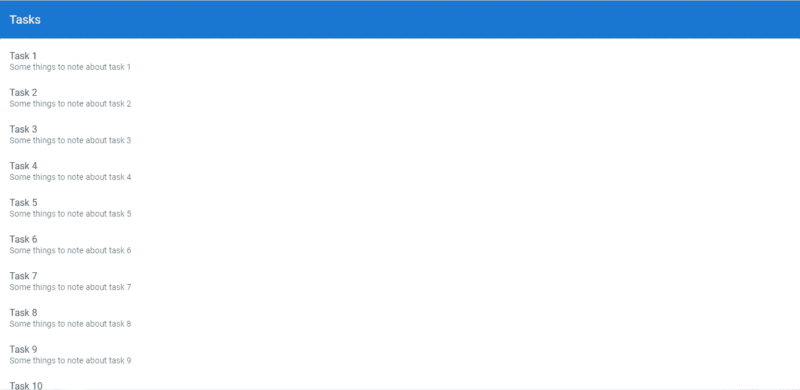
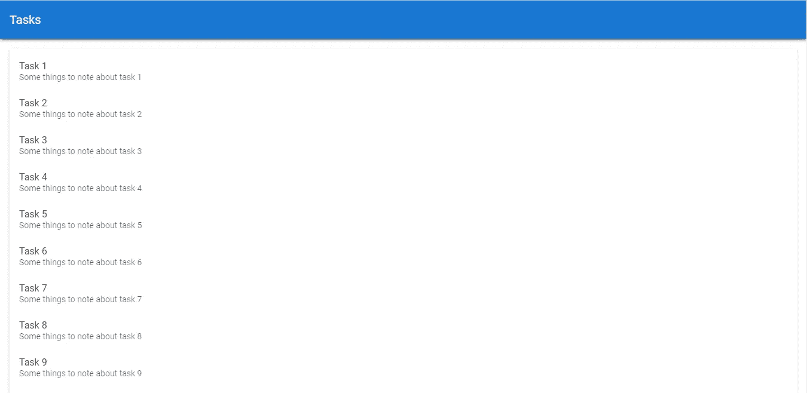
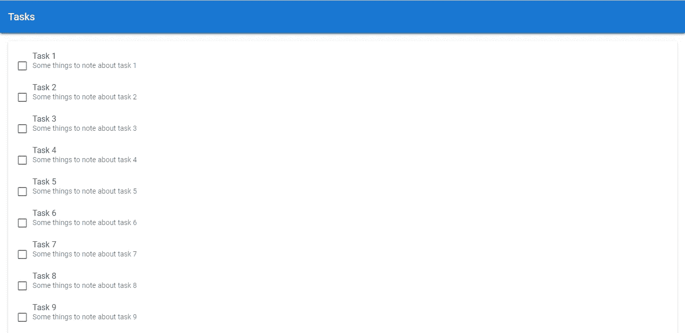
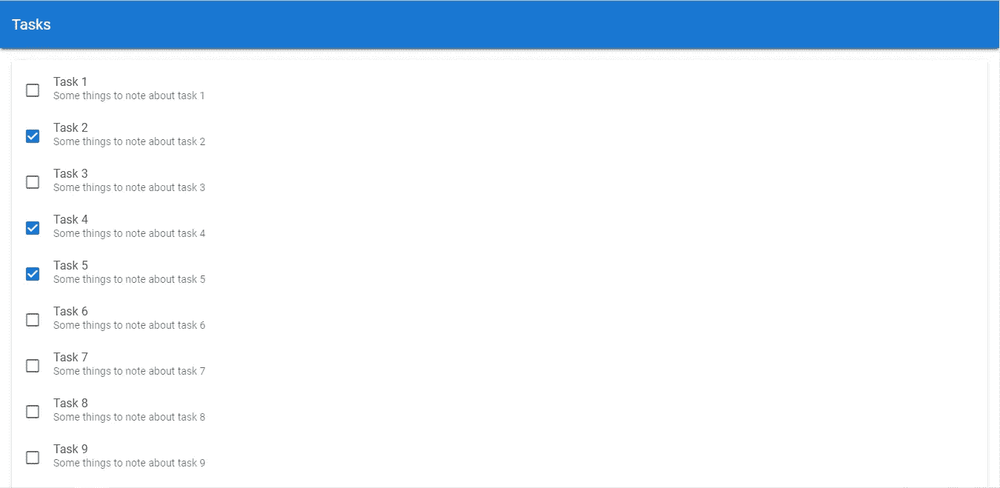
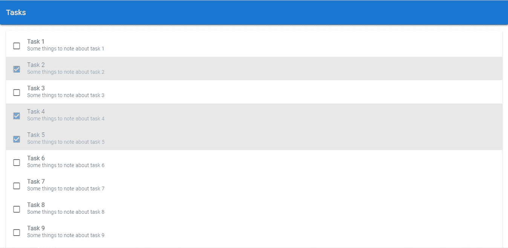

# 显示任务列表|验证待办事项列表应用程序教程

> 原文：<https://javascript.plainenglish.io/create-a-beautiful-to-do-list-app-in-vuetify-displaying-the-list-of-tasks-lists-margins-cc0fde2ed2c1?source=collection_archive---------11----------------------->


欢迎回到我们正在进行的教程系列，我们将从头到尾使用 Vuetify.js 构建一个 todo 应用程序。在我们的[最后一集](https://codingbeauty.medium.com/create-a-beautiful-todo-app-in-vuetify-toolbars-5e321f43c548)中，我们从创建应用程序的工具栏开始。今天，我们将展示数据并增加一些交互性。

刚开始使用 Vuetify？

[](https://codingbeautydev.com/blog/getting-started-with-vuetify/) [## 开始使用 Vuetify -编码美容

### 从头开始设计一个优秀的用户界面需要付出很多努力。除了建造所需的技能之外…

codingbeautydev.com](https://codingbeautydev.com/blog/getting-started-with-vuetify/) 

## 创建示例任务

首先，让我们做一些样例任务来填充我们将要创建的列表。在后面的教程中，我们将让用户能够自己添加任务，但是现在，这个示例数据必须:

```
**src/App.vue**<template>
  <v-app>
    <v-card>
      <v-toolbar color="primary" elevation="3" dark rounded="0">
        <v-toolbar-title>Tasks</v-toolbar-title>
      </v-toolbar>
    </v-card>
  </v-app>
</template><script>
export default {
  name: 'App',
  data: () => ({
 **tasks: [...Array(10)].map((value, index) => ({
      id: `task${index + 1}`,
      title: `Task ${index + 1}`,
      note: `Some things to note about task ${index + 1}`,
    })),**
  }),
};
</script>
```

我们使用 JavaScript array `map()`方法自动生成 10 个样本任务的列表，每个任务都有惟一的 ID、标题和注释。

## 显示任务列表

我们将使用`v-list`组件和其他一些子组件来显示任务列表。`v-list`被一个`v-card`组件包裹着。

```
**src/App.vue**<template>
  <v-app>
    <v-card>
      <v-toolbar color="primary" elevation="3" dark rounded="0">
        <v-toolbar-title>Tasks</v-toolbar-title>
      </v-toolbar>
    </v-card>
 **<v-card>
      <v-list>
        <v-list-item v-for="(task, index) in tasks" :key="index">
          <v-list-item-content
            ><v-list-item-title>{{ task.title }}</v-list-item-title>
          </v-list-item-content>
        </v-list-item>
      </v-list>
    </v-card>**
  </v-app>
</template>
...
```

使用`v-for`指令，我们遍历`tasks`并为每个数组元素显示一个`v-list-item`。为了显示每个列表中的内容，我们使用了`v-list-item-content`组件。然后我们使用`v-list-item-title`来显示列表项的标题，在本例中是任务标题。



# 获取这个应用程序的完整源代码

在此注册[获得这个伟大应用的最新源代码！](https://mailchi.mp/e784cee7e19a/todo-list-app-source-code)

## 显示任务注释

Vuetify 中的`v-list-item`组件有三种变体:单线、双线和三线，其中单线变体是默认的。我们需要显示每个任务的注释，所以让我们设置两行变量:

```
**src/App.vue**<template>
  <v-app>
    <v-card>
      <v-toolbar color="primary" elevation="3" dark rounded="0">
        <v-toolbar-title>Tasks</v-toolbar-title>
      </v-toolbar>
    </v-card>
    <v-card>
      <v-list>
        <v-list-item v-for="(task, index) in tasks" :key="index" **two-line**>
          <v-list-item-content
            ><v-list-item-title>{{ task.title }}</v-list-item-title>
            **<v-list-item-subtitle>{{ task.note }}</v-list-item-subtitle>**
          </v-list-item-content>
        </v-list-item>
      </v-list>
    </v-card>
  </v-app>
</template>
...
```



仔细看工具栏，它是平的！我们不是在上次的教程中把它抬高了吗？

工具栏现在看起来是平的，因为包含任务列表的`v-card`就在它的正下方。让我们使用 Vuetify 的一个 margin 类在它们之间设置一些间距。

```
**src/App.vue**<template>
  <v-app>
    <v-card>
      <v-toolbar color="primary" elevation="3" dark rounded="0">
        <v-toolbar-title>Todos</v-toolbar-title>
      </v-toolbar>
    </v-card>
    <v-card **class="mt-4"**>
      <v-list>
        <v-list-item v-for="(todo, index) in todos" :key="index" two-line>
          <v-list-item-content
            ><v-list-item-title>{{ todo.title }}</v-list-item-title>
            <v-list-item-subtitle>{{ todo.note }}</v-list-item-subtitle>
          </v-list-item-content>
        </v-list-item>
      </v-list>
    </v-card>
  </v-app>
</template>
...
```

`mt-4`是我刚才提到的保证金等级。m 代表边距，t 代表顶部。4 是指 Vuetify 中 32 种不同边距大小中的一种。

让我们也将`v-card`的左、右、下页边距设置为相同的大小 4:

```
**src/App.vue**<template>
  <v-app>
    <v-card>
      <v-toolbar color="primary" elevation="3" dark rounded="0">
        <v-toolbar-title>Tasks</v-toolbar-title>
      </v-toolbar>
    </v-card>
    <v-card class="mt-4 **ml-4 mr-4 mb-4**">
      <v-list>
        <v-list-item v-for="(task, index) in tasks" :key="index" two-line>
          <v-list-item-content
            ><v-list-item-title>{{ task.title }}</v-list-item-title>
            <v-list-item-subtitle>{{ task.note }}</v-list-item-subtitle>
          </v-list-item-content>
        </v-list-item>
      </v-list>
    </v-card>
  </v-app>
</template>
...
```

但是这里有一个更好更短的方法:

```
**src/App.vue**<template>
  <v-app>
    <v-card>
      <v-toolbar color="primary" elevation="3" dark rounded="0">
        <v-toolbar-title>Tasks</v-toolbar-title>
      </v-toolbar>
    </v-card>
    <v-card **class="ma-4"**>
      <v-list>
        <v-list-item v-for="(task, index) in tasks" :key="index" two-line>
          <v-list-item-content
            ><v-list-item-title>{{ task.title }}</v-list-item-title>
            <v-list-item-subtitle>{{ task.note }}</v-list-item-subtitle>
          </v-list-item-content>
        </v-list-item>
      </v-list>
    </v-card>
  </v-app>
</template>
...
```

正如你猜测的那样，`ma-4`类将在 v 卡的所有方向上设置大小为 4 的边距。

下面是我们的应用程序现在应该是什么样子:



我们的工具栏提升回来了，包含我们的列表的卡片更加清晰地突出，我们增加了页边空白。

## 用复选框显示任务完成

创建任务的本质实际上是完成它，所以让我们在列表中为每个任务显示一个复选框，指示其完成状态。我们将使用`v-checkbox`组件来完成这项工作。

```
<template>
  <v-app>
    <v-card>
      <v-toolbar color="primary" elevation="3" dark rounded="0">
        <v-toolbar-title>Tasks</v-toolbar-title>
      </v-toolbar>
    </v-card>
    <v-card class="ma-4">
      <v-list>
        <v-list-item v-for="(task, index) in tasks" :key="index" two-line>
 **<v-checkbox hide-details v-model="task.isCompleted"></v-checkbox>**
          <v-list-item-content>
            <v-list-item-title>{{ task.title }}</v-list-item-title>
            <v-list-item-subtitle>{{ task.note }}</v-list-item-subtitle>
          </v-list-item-content>
        </v-list-item>
      </v-list>
    </v-card>
  </v-app>
</template><script>
export default {
  name: 'App',
  data: () => ({
    tasks: [...Array(10)].map((value, index) => ({
      id: `task${index + 1}`,
      title: `Task ${index + 1}`,
      note: `Some things to note about task ${index + 1}`,
      **isCompleted: false,**
    })),
  }),
};
</script>
```

注意，我们为每个任务创建了一个新的`isCompleted`属性，默认设置为`false`。使用`v-model`，我们在复选框和`isCompleted`之间创建了一个双向绑定。



我们的复选框现在显示出来了，但是它的位置有点偏离。让我们用之前使用的一些 margin 类来解决这个问题:

```
<template>
  <v-app>
    <v-card>
      <v-toolbar color="primary" elevation="3" dark rounded="0">
        <v-toolbar-title>Tasks</v-toolbar-title>
      </v-toolbar>
    </v-card>
    <v-card class="ma-4">
      <v-list>
        <v-list-item v-for="(task, index) in tasks" :key="index" two-line>
          <v-checkbox hide-details v-model="task.isCompleted" **class="mt-0 mr-2"**></v-checkbox>
          <v-list-item-content>
            <v-list-item-title>{{ task.title }}</v-list-item-title>
            <v-list-item-subtitle>{{ task.note }}</v-list-item-subtitle>
          </v-list-item-content>
        </v-list-item>
      </v-list>
    </v-card>
  </v-app>
</template>
...
```



现在看起来好多了，因为我们已经移除了上边距(将其设置为 0 ),并在 Vuetify 中将右边距的大小设置为 2。

## 用颜色表示任务完成

除了使用复选标记来表示任务已经完成，我们还可以使用 Vue 的条件类绑定语法来更改列表项的背景颜色和不透明度，以表示任务已经完成:

```
<template>
  <v-app>
    <v-card>
      <v-toolbar color="primary" elevation="3" dark rounded="0">
        <v-toolbar-title>Tasks</v-toolbar-title>
      </v-toolbar>
    </v-card>
    <v-card class="ma-4">
      <v-list>
        <v-list-item
          v-for="(task, index) in tasks"
          :key="index"
          **v-bind:class="{ 'task-completed': task.isCompleted }"** two-line
        >
          <v-checkbox
            hide-details
            v-model="task.isCompleted"
            class="mt-0 mr-2"
          ></v-checkbox>
          <v-list-item-content>
            <v-list-item-title>{{ task.title }}</v-list-item-title>
            <v-list-item-subtitle>{{ task.note }}</v-list-item-subtitle>
          </v-list-item-content>
        </v-list-item>
      </v-list>
    </v-card>
  </v-app>
</template><script>
...
</script>**<style scoped>
.task-completed {
  background-color: #d8d8d8;
  opacity: 0.6;
}
</style>**
```



## 未完待续…

今天我们学习了列表在 Vuetify 中的工作方式，我们能够使用它在应用程序中显示一个任务列表示例。我们还利用了一些现成的 Vuetify 类来设置元素的边距。请继续关注我们的下一集，我们将使用这个奇妙的材料设计框架，从头到尾一起构建这个待办事项列表应用程序。

[***注册***](http://eepurl.com/hRfyJL) *订阅我们的每周时事通讯，了解有关 Vuetify 和 Vue 的所有最新提示和教程！*

*到*[*codingbeautydev.com*](https://codingbeautydev.com/blog/displaying-the-task-list-vuetify-to-do-list-app-tutorial/)*获取更新教程。*