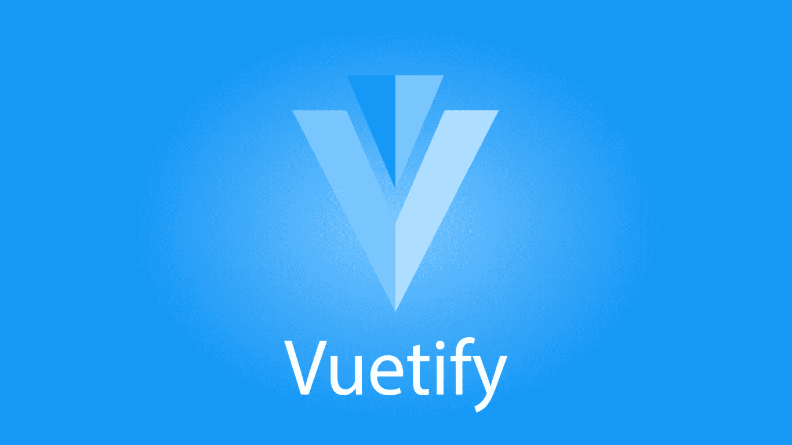

# 工具栏|验证待办事项应用教程

> 原文：<https://javascript.plainenglish.io/create-a-beautiful-todo-app-in-vuetify-toolbars-5e321f43c548?source=collection_archive---------22----------------------->



欢迎来到这个全新的教程系列，在这里我们将使用流行的 Vuetify.js UI 库从头到尾创建一个待办事项列表应用程序。您现在可以创建一个新的 Vuetify 项目，如果您愿意，可以继续进行。当我们完成时，您应该对框架提供的特性有了更广泛的了解。我们将讨论大量的 Vuetify 组件，包括工具栏、表单、列表、导航抽屉等等。

刚开始使用 Vuetify？看看这篇[文章](https://codingbeautydev.com/blog/getting-started-with-vuetify/)。

## 创建工具栏

Vuetify 将`v-toolbar`组件用于工具栏。要创建一个，我们需要将它包装在一个`v-card`组件中——尽管我们也可以将它与`v-navigation-drawer`组件结合使用。

```
**src/App.vue**<template>
  <v-app>
    <v-card>
      <v-toolbar></v-toolbar>
    </v-card>
  </v-app>
</template>
...
```


## 改变颜色

与其他一些 UI 库类似，Vuetify 使用主题来指定影响其所有组件的样式。在下面的代码中，我们将工具栏的颜色设置为`primary`，这是由 Vuetify 主题设置决定的颜色。我们还没有自定义主题，所以这种颜色将是默认的蓝色。

```
**src/App.vue**<template>
  <v-app>
    <v-card>
      <v-toolbar **color="primary"**></v-toolbar>
    </v-card>
  </v-app>
</template>
...
```


# 获取这个应用程序的完整源代码

在此注册[获得这个伟大应用的最新源代码！](https://mailchi.mp/e784cee7e19a/todo-list-app-source-code)

## 更改工具栏标高

我们可以通过调整名副其实的`elevation`属性来改变工具栏的高度。让我们把它设置为 3:

```
**src/App.vue**<template>
  <v-app>
    <v-card>
      <v-toolbar color="primary" **elevation="3"**></v-toolbar>
    </v-card>
  </v-app>
</template>
...
```

让我们使用`v-toolbar`中的`v-toolbar-title`组件来设置工具栏的标题:

```
<template>
  <v-app>
    <v-card>
      <v-toolbar color="primary" elevation="3">
        **<v-toolbar-title>Tasks</v-toolbar-title>**
      </v-toolbar>
    </v-card>
  </v-app>
</template>
```


## 应用黑暗主题变体

现在标题显示出来了，但是注意它的颜色是黑色的。我们应该通过使用`dark`属性将 Vuetify 的深色主题变体应用到`v-toolbar`来使它变成白色，这样它在蓝色工具栏背景下会更加突出。

```
**src/App.vue**<template>
  <v-app>
    <v-card>
      <v-toolbar color="primary" elevation="3" **dark**>
        <v-toolbar-title>Tasks</v-toolbar-title>
      </v-toolbar>
    </v-card>
  </v-app>
</template>
```

许多其他 Vuetify 组件也有这个属性，允许它们被改变到它们的黑暗模式。根据部件的不同，部件不同部分的某些颜色可能会发生变化。对于`v-toolbar-title`，其中任何文本的颜色都变为白色，如您所见:


## 移除工具栏圆度

仔细观察工具栏，你会发现它的每个角都有一点弯曲。这个曲率由`rounded`属性控制。我们将通过将`rounded`设置为 0 来消除圆度:

```
**src/App.vue**<template>
  <v-app>
    <v-card>
      <v-toolbar color="primary" elevation="3" dark **rounded="0"**>
        <v-toolbar-title>Tasks</v-toolbar-title>
      </v-toolbar>
    </v-card>
  </v-app>
</template>
...
```


# 未完待续…

我们有了一个好的开始！让我们继续本系列的下一集，在这里我们将学习如何使用列表、边距和复选框来显示任务列表，并为我们的新应用程序添加交互性。