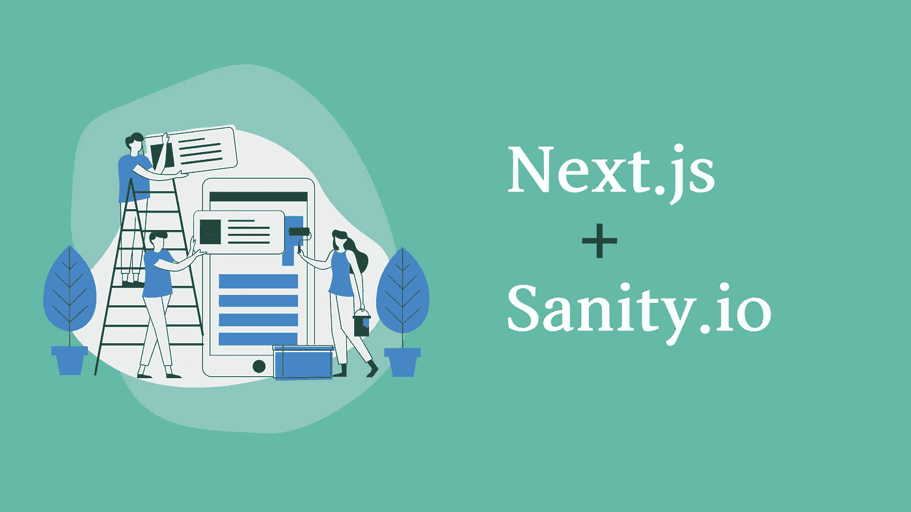

# 通过集成 Sanity.io 和 Next.js 创建一个博客

> 原文：<https://javascript.plainenglish.io/create-a-blog-by-integrating-sanity-io-a-headless-cms-with-next-js-af7383220e0c?source=collection_archive---------9----------------------->



# 介绍

Next.js 是一个做前端应用的 React 框架，Sanity.io 是一个无头 CMS。本文旨在以尽可能简单的方式提供使用这两种技术创建博客的基本信息。我们不会在这里创建一个完全成熟的博客；我们只遍历使用 Sanity.io 创建博客文章所需的配置，并在使用 Next.js 创建的前端应用程序中呈现这些博客。

# 创建帐户

首先要做的是在 Sanity.io 创建一个帐户，如果你还没有的话。Sanity.io 为在其平台上启动项目提供了不同的计划。对于这个演示，我们将使用一个免费程序。做好账之后，下一步就是创建项目了。要创建一个新项目，我们必须在本地设置 Sanity studio。使用终端，导航到您想要让项目复制以下命令并运行它的文件夹。

```
npm install -g @sanity/cli && sanity init
```

这个命令做两件事:第一，全局安装 sanity 命令行工具，第二，初始化一个新的 sanity 项目。在初始化项目期间，会要求您提供项目名称，选择方案和数据集。当询问模式时，选择博客模式，因为我们正在创建一个博客。在完成安装后，另一个命令 *sanity start* 将在本地运行到位于 URL [http://localhost:3333 上的 sanity studio。](http://localhost:3333.)

# 创建帖子

使用用于在 Sanity.io 创建帐户的凭据登录到 sanity studio。由于我们在安装过程中选择了 blog schema，因此我们可以选择在 sanity studio 的左上角创建文章、作者和类别。将有一个按钮，使一个新的职位。点击那个按钮，一个新的标签就会弹出来，要求你填写标题、slug(用于唯一标识你的博客)、主图片和主体。同样，填写所有必需的信息，然后发布博客。

# 创建下一个应用

```
npx create-next-app
```

在执行上述命令时，我们将生成下一个应用程序样板文件。在样板文件中，您可以看到一个名为 pages 的文件夹，它创建了另一个名为 post 的文件夹，并创建了一个名为[slug]的文件。新创建的 post 文件夹中。文件夹结构类似于 pages > post > [slug]。射流研究…

将上面的代码片段复制到[slug]中。js，我们已经完成了在 Next.js 应用程序中呈现 Sanity.io 帖子的配置。异步函数 getServerSideProps 检索页面路径，并从 Sanity.io 数据集中获取相应的数据。

页面路径应该与我们在 sanity studio 创建文章时给出的 slug 值相同，因此如果给定文章的 slug 是“first-post ”,那么它的路径应该是 http://localhost:3000/post/first-post。在获取 API URL 时，您必须用相应的项目 ID 和数据集替换[您的项目 ID]和[您的数据集名称]。

# 结论

感谢您的阅读。我希望这对你有所帮助，并且你对使用 Next.js 和 Sanity.io 创建博客更有信心了。

[*更多内容看 plainenglish.io*](http://plainenglish.io/)