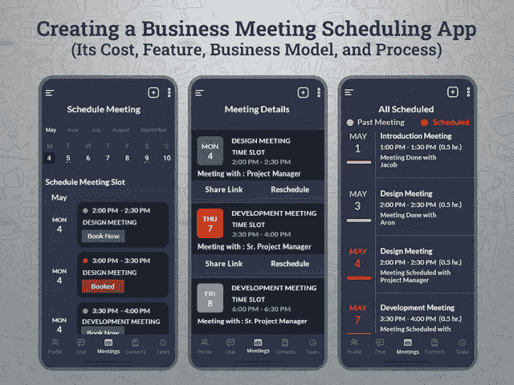
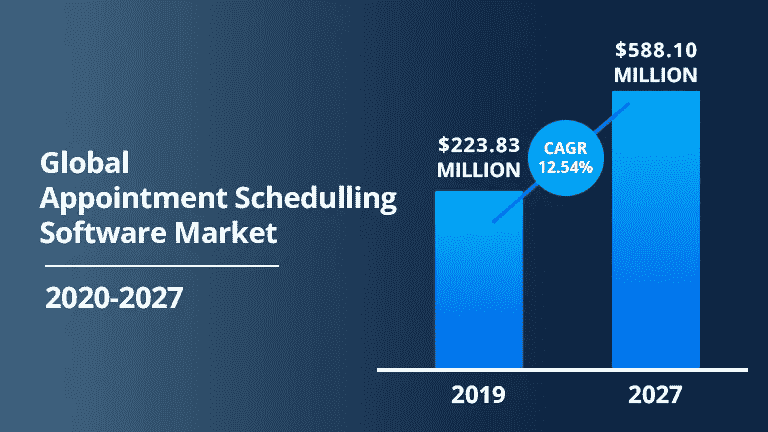
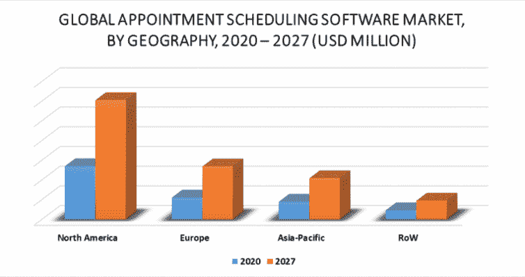

# 创建一个商务会议日程安排应用程序:它的成本、功能、商业模式和流程

> 原文：<https://javascript.plainenglish.io/create-a-business-meeting-scheduling-app-its-cost-feature-business-model-and-process-650624e707f9?source=collection_archive---------4----------------------->

## *通过实施按需在线会议安排软件，使您的业务流程实现自动化，并使客户更容易预订会议或阻止讨论日历……*

在当今快节奏的生活中，保持组织有序并让你的业务目标保持在正轨上是企业目前面临的最大障碍之一。一方面，事情正在快速向数字平台发展，而另一方面，初创企业和中型企业正在努力应对日益增长的会议管理需求。

这一切都要归功于应用程序开发行业，它为企业提供了像 Calendly 这样的按需商务会议安排应用程序，并使整个会议安排和管理过程对客户来说没有痛苦。

事实上，随着越来越多的虚拟会议、在线电话会议和网络研讨会在全球范围内举行，您是否仍然喜欢坚持使用那些疲惫的或手动的方式来预订日历…

当然，在这个竞争激烈的世界里，你一定很想拥有几个新的解决方案，让你的企业在技术上听起来更好，更灵活，管理更好，运营更无缝。

因此，来自世界各地的数百万人喜欢在日历上预订他们的商务会议，而不是打电话或手动标记日历。我们认为，在 2022 年开发一个按需会议安排应用程序，将使使用平板电脑和智能手机的客户更容易预订会议。

客户在线预订的趋势正在大幅增长，并引领着快速增长。医疗保健和教育部门也越来越多地采用在线预订软件。因为，随着该软件的实施，有一个更好的机会来提供一个改进的客户体验，虽然开发一个会议预订应用程序是一个相当大的决定。

但问题是如何开始，为您的企业构建一个按需会议安排应用程序需要多少成本…

## **以下是博客的主要亮点:**

*   *了解在线预约应用程序的概念并提高知名度*
*   *在线会议安排应用开发入门
    -为什么在线会议安排应用会流行？
    -在线预约排班 App 是做什么的，谁在用？
    -可以与*相比的最佳在线日程安排应用
*   *如何创建一个成功的在线预约排班 App？
    -预开发阶段:降低风险和削减成本的技巧
    -顶级特性和功能及其粗略估计
    -应用程序的 UI/UX 设计
    -用真实用户测试您的预订应用程序*
*   *2022 年打造一个按需预约排班 App 需要多少钱？*
*   *结论:准备好使用行业领先的在线会议安排应用程序*

为了更好地理解，让我们深入了解每一点的细节…

# **了解在线预约申请的概念并提高知名度**

约会安排应用程序已经成为当今商业世界的时髦词汇。无论业务垂直市场如何，人们都在积极采用这些解决方案来简化他们的业务流程。

如果你仍然没有接触到这个概念，那么你需要知道在线会议安排软件是基于网络的应用程序，它允许你通过使用基于日历的界面邀请来自世界各地的其他人或与他们协作。使用这个工具的最大好处是可以防止在同一个时间段重复预订，这种情况在你使用多个预订平台时经常发生。多人在多个平台上协调会议时间，因此，将会议重叠和浪费宝贵资源的风险降至最低。

预约安排软件提供了一个商业工具，允许客户通过网络界面或移动设备来预订、重新安排和取消预约。

此外，在线会议解决方案可以在桌面和移动设备上轻松访问，因此您可以在世界任何地方预订会议。在了解了关于按需会议安排应用程序的所有这些事实后，你们中的许多人都很好奇要雇佣一家 [**移动应用程序开发公司**](https://www.xicom.biz/services/mobile-app-development/) 来开始使用一个应用程序，但是你们中的许多人都想知道为什么这个应用程序解决方案会如此受欢迎…

> 市场洞察显示在线预约应用程序越来越受欢迎

预约日程安排解决方案正在各种垂直业务领域迅速出现，并导致市场规模不断扩大。以下是市场统计数据，有助于更好地了解情况:

*   据统计，全球预约排班软件市场规模预计将从 2018 年的 2.0885 亿美元增长到 2026 年的[5.4631 亿美元。](https://www.verifiedmarketresearch.com/product/appointment-scheduling-software-market/)

[Image Source](https://www.verifiedmarketresearch.com/product/appointment-scheduling-software-market/)

*   根据调查研究，从 2019 年到 2026 年，预约安排软件市场预计以 13.1%的 [CAGR 增长。](https://www.verifiedmarketresearch.com/product/appointment-scheduling-software-market/)
*   根据这些报告，[北美占据了](https://www.verifiedmarketresearch.com/product/appointment-scheduling-software-market/)整个预约安排软件市场份额，因为他们是数字化的早期采用者。

[Image Source](https://www.verifiedmarketresearch.com/product/appointment-scheduling-software-market/)

*   根据市场调查报告，在线会议安排应用程序的[主要参与者是 Calendly、Appointy、Square，Inc .、TimeTrade 等。](https://www.verifiedmarketresearch.com/product/appointment-scheduling-software-market/)
*   根据类型，市场分为基于网络的移动应用和其他平台，但在 2019 年，[基于网络的市场份额最大。](https://www.verifiedmarketresearch.com/product/appointment-scheduling-software-market/)

简而言之:希望这些统计数据能够代表在线会议安排市场在各种垂直业务中如何逐步取代传统的预约方式。

*让我们直接进入应用开发入门的细节…*

> **在线预约日程 App 开发入门**

随着移动应用开发行业各种新兴技术和创新的出现，预订应用已经脱颖而出，成为企业中要求最高的解决方案。

此外，全球疫情的影响加速了对在线会议预订平台的需求，并提供了与您的企业在线互动的可能性。但是，在进入 [**招聘移动应用程序开发人员**](https://www.xicom.biz/offerings/hire-mobile-developers/) 的过程之前，你们中的许多人都困惑于这个需求会持续多久，以及创建一个商务约会安排应用程序是否是一个值得的决定，那么你需要检查一下为什么这些解决方案是有用的…

## **为什么在线会议安排应用成为趋势？**

首先，开发在线会议预订应用程序可以为你的企业提供增值解决方案。它对企业主和客户都有效。让我们了解如何…

> 为客户开发在线预订应用程序的好处

*   **让他们了解即将召开的会议**

预订应用程序与客户日历的集成将使他们随时了解即将到来的活动。这可能是你的应用程序最酷的功能之一，让他们参与到平台中来。有了这一功能，客户还可以检查会议的预订状态，查看预订历史，并直接从他们的设备上浏览信息。

*   **您品牌的全天候可用性**

为您的企业提供预约应用程序意味着您的客户可以在全球任何地方通过任何设备安排会议。

*   **轻松访问预定日历**

在访问在线会议安排应用程序时，客户只需点击一下，就可以访问日历并预订最合适的会议时段。这都要归功于软件开发公司，他们让它变得简单，更容易访问。预订仪表板将让他们知道会议的可用时间。一旦他们点击该槽，它将从仪表板上消失，并确认会议。

> **对于企业主**

*   **自动化工作流程**

使用在线预订工具，您可以将预约详情直接发送到您的 CRM 上，这进一步帮助您收集客户的个人信息，并将其用于营销目的。通过利用这些信息，您可以设置通知、跟进电子邮件、提醒客户预约、检查服务质量并寻求反馈。

*   **全年无休**

在线预订应用程序还为您提供了一个机会，让您的客户根据自己的喜好随时预订会议，从而将他们转化为潜在交易。当你和你的目标受众在不同的时区工作时，它会起作用。

*   **更好的员工时间管理**

当您拥有在线会议安排系统时，您的团队可以更好地管理高优先级任务，并能够专注于服务增强。

希望这些优势能够影响您投资这款移动应用解决方案。但作为一个企业主，你不断关注的一定是 app 开发成本和谁需要预约软件的问题。

*让我们进一步讨论…*

## **在线预约排班 App 是做什么的，谁在用？**

按需在线日程安排应用程序更像是具有无缝日程安排功能的日历，但独特的是，它通常可以与视频会议应用程序、Gmail、Google Meets 等其他应用程序集成。这个应用程序解决方案的一些功能将与支付处理器一起工作，你可以在下一次会议之前收取费用。

此外，这些工具在你的网站上就像一块磁铁，特别是对于那些渴望了解你的服务并希望与你进一步联系的人。

***但问题是谁能从预约解决方案中受益……***

嗯，所有的商业人士都可以利用这些工具的优势，但它们主要有利于企业、医疗保健、教育、美容和健康以及其他行业。然而，根据调查报告，企业在 2019 年占据了最大的市场份额。此外，各种规模的企业越来越多地采用基于云的解决方案来改善服务。

所以无论你是创业公司还是领先企业，在你进一步前进之前，你都需要比较市场上其他可用的在线日程安排应用程序。

## **可与**相比的最佳在线日程安排应用

不可否认的是，所有企业都可以从在线会议安排应用中受益，但在你进入这个行业之前，请记住你需要与谁竞争。在这里，我们收集了一些会议安排应用程序，它们已经统治了这个领域，并为一些企业提供了支持。

> **你需要知道的顶级会议安排应用**

*   **日历:**如果你想建立一个像日历一样简单的会议安排应用程序，那么“日历”是一个可靠的选择。随着人工智能功能的实现，Calendar 简化了整个日程安排过程，并将所有设备和会议更新与付费版本同步。
*   Calendly: Calendly 是最受欢迎的在线预订系统之一，适合那些希望与多个团队成员合作的人。凭借各种独特的功能，如一对一会议、集体会议、循环会议等，它迅速树立了市场标杆。
*   **Acuity:** 这种类型的预约应用程序有一些独特的概念，允许用户圈出适合他们的时间，并允许与会者从可用的会议时段中进行选择。如果企业打算通过这款应用发展业务，可以进一步寻找付费版本。

阅读完所有这些细节后，摆在你面前的一个核心问题是“如何开发一个成功的在线日程安排应用程序，为你的业务增加竞争优势……

# **如何创建一个成功的在线预约排班 App？**

此时，你已经知道预约安排应用程序到底是什么，它们如何工作，以及你需要在市场上与谁竞争。因此，要开始应用程序开发流程，你需要聘请一家 [**移动应用程序开发公司**](https://www.xicom.biz/services/mobile-app-development/) ，它能够理解你的商业想法，并能够将其转化为成功的解决方案。如果你计划开发一个日程安排应用程序，比如 Calendly 或 Acuity，那么确保你的应用程序开发团队必须由经验丰富的项目经理、熟练的软件开发人员、有能力的业务分析师、UI/UX 设计人员和可以直接领导项目的应用程序测试人员组成。

因此，为了降低复杂性，并帮助您了解应用程序开发的哪些元素获得了最大的预算和风险，我们划分了开发阶段。

> **前期开发阶段:降低风险和削减成本的技巧**

当你决定开发一个应用程序时，你首先想到的是理解“你需要在一个应用程序中提供什么功能”？

## **1。主要特性和功能及其粗略估计**

当开发一个日程安排应用程序时，“你在日程安排应用程序中提出什么特性和功能”，是开发一个应用程序的最大部分。因此，在为您的企业开发日程安排应用程序时，您可以选择实现以下功能…

*   **注册/注册:**要开始使用该应用程序，允许用户使用电子邮件注册您的应用程序。ID、联系方式或社交媒体整合功能。只需轻轻一点，用户就可以使用他们的社交媒体帐户的凭据注册该应用程序。
*   **预约:**一旦用户注册了这款应用，他们将被直接转换成日历，在日历上他们可以在自己喜欢的时间安排会议。
*   **不同时区:**由于来自不同地区的人访问这个应用程序，为了避免时区混淆，有必要添加不同时区的时钟功能。
*   **编辑约会详情:**增加了在会议开始前编辑或删除现有约会、任务和事件的灵活性。
*   **自动化工作计划:**该应用程序的自动化功能将通过自动计划生成的简单功能帮助您创建最佳工作计划。基于以前的工作时间表，一个应用程序将进一步创建它。
*   **日程安排工具:**提供从不同会议室中进行选择的工具，例如一对一会议、协作会议、小组会议等等。
*   **可用时间段:**为团队成员添加查看可用时间段的功能，使他们在特定时间可用。
*   **标记休假:**确保你的应用程序中有一个功能，允许你的团队成员将日期或时间标记为休假，或者列出所有当地假期，这样应用程序就不会提供任何预订时段。
*   **推送通知:**这是你的应用程序最重要的功能之一，让你的用户和团队成员通过应用内消息、电子邮件或短信了解即将召开的会议。
*   **防止重复预订:**该应用程序应该有能力通过限制人们使用相同的 ID 或相同的细节再次预订来防止重复预订。
*   **轻松集成:**确保你的应用程序可以轻松地与 Gmail、Excel 等其他应用程序集成。来扩展功能。
*   **支付网关:**允许人们使用多种支付选项和网关进行支付，如信用卡、借记卡、PayPal、Google Pay 等。

平均而言，创建一个具有这些功能的日程安排应用程序需要大约 3 到 4 个月的时间，成本大约为 20，000 美元以上。但是，你如何确保用户会喜欢这个产品呢？

为了避免风险，值得推出一个功能更少的基本应用版本，并快速营销该应用。规划 MVP 应用程序或日程安排应用程序的最大好处是，它可以帮助你获得市场反馈，并提供空间，如果用户不喜欢它，可以回到线框架对应用程序进行修改。如果他们喜欢这个概念，你可以根据市场反馈扩大产品规模。

但是有一个这样的因素可以决定你商业想法的成败，那就是应用导航。

## **2。应用程序的用户界面/UX 设计**

开发一个 app 的时候，用户体验和 app 导航是最重要的考虑因素。企业通常犯的最大错误是给他们的应用程序一个花哨的外观，不幸的是，这使得复杂的应用程序结构难以导航。为了避免这种情况，值得 [**雇佣移动应用开发者**](https://www.xicom.biz/offerings/hire-mobile-developers/) 来帮助定制应用的简单、容易和迷人的 UI/UX 设计。

此外，确保屏幕间无缝导航的简单应用程序设计总是受到用户的赞赏。平均而言，根据应用程序的复杂程度，应用程序的 UI/UX 设计需要大约 120 小时到 150 小时。

## **3。用真实用户测试你的预订应用程序**

一旦你完成了开发阶段，现在是时候在各种测试模块上运行应用程序，以识别应用程序中的 bug 或错误。确保质量保证工程师将使用不同的手动和自动测试工具深入测试应用程序，以确保应用程序的高性能。

最后，一个主要问题仍然没有答案:“开发一个日程安排应用程序要花多少钱？”

## **搭建一个按需预约排班 App 需要多少钱？**

会议安排应用程序提供了大量的业务增长机会，也为客户提供了从他们自己的移动设备上预约会议时间和进一步检查细节的灵活性。

由于每个企业都有不同的要求，因此开发这些服务应用程序，因此开发日程安排应用程序没有标准价格。

开发此类解决方案的成本主要取决于功能和特性、UI/UX 设计、测试流程、应用程序的复杂性、启动应用程序的平台选择等等。虽然有很大范围的可能性来定制具有不同功能的应用程序解决方案，因此，没有永久的成本。

但是，如果你计划创建自己的日程安排应用程序，并想知道创建一个应用程序的成本是多少，那么考虑到应用程序的所有这些功能和复杂性，每个平台的应用程序开发成本在 25，000 美元到 35，000 美元之间。

在你得出任何结论之前，咨询专家来讨论你的项目细节并得到评估是值得的。

**结论:准备好使用行业领先的在线会议安排应用程序**

通过这篇博客，你一定会明白移动预订是一种新常态，也是一个未来的商机。因为客户需求现在正迅速从电话或电子邮件预订转变为简单易用、导航清晰的功能性应用。因此，聘请一家 [**app 开发公司**](https://www.xicom.biz/services/mobile-app-development/) 来打造一款类似 Calendly 的日程安排 app 是一个值得做的决定。

因此，如果你也计划有一个像 Calendly 这样的解决方案，那么你所需要的就是有一个合适的应用程序开发团队，他们可以了解你的目标受众，并用你的客户期待的功能来个性化应用程序。由于他们在处理市场需求方面经验丰富，因此，他们可以为您提供更好的解决方案来满足他们的需求。

感谢您的阅读。

====================================

*更多内容请看*[*plain English . io*](http://plainenglish.io/)*。报名参加我们的* [*免费周报*](http://newsletter.plainenglish.io/) *。在我们的* [*社区获得独家写作机会和建议*](https://discord.gg/GtDtUAvyhW) *。*