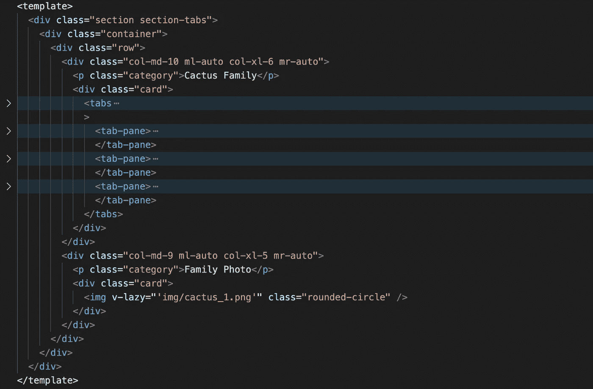
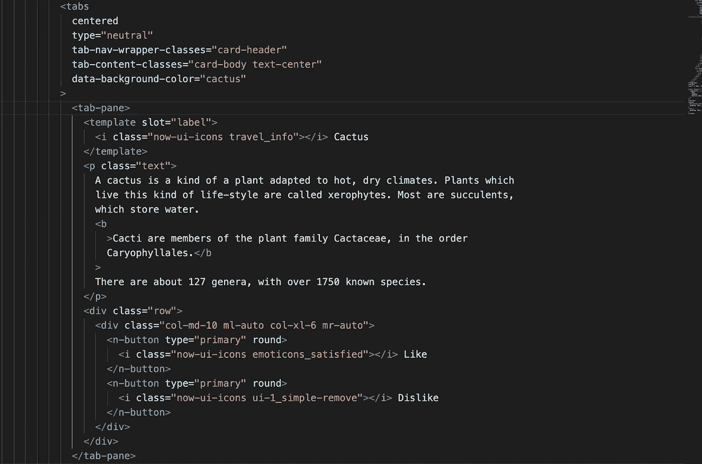
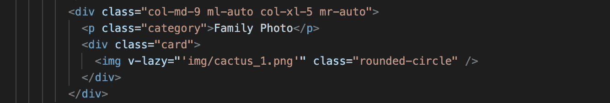
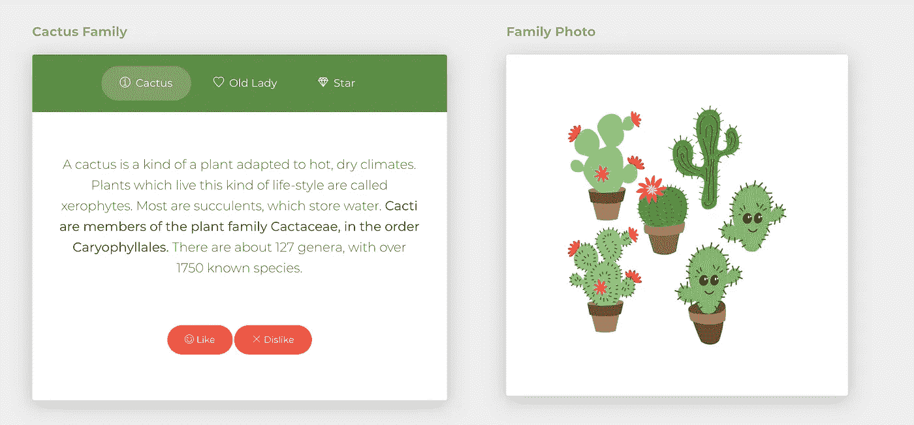
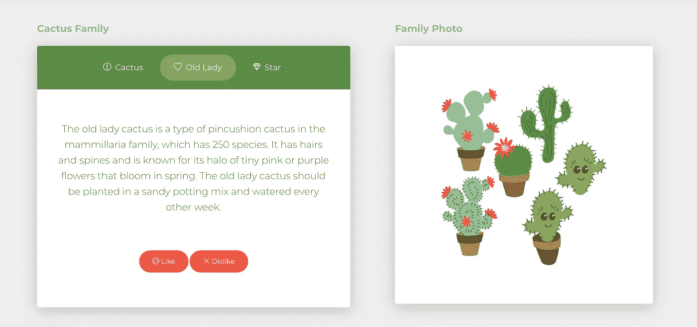
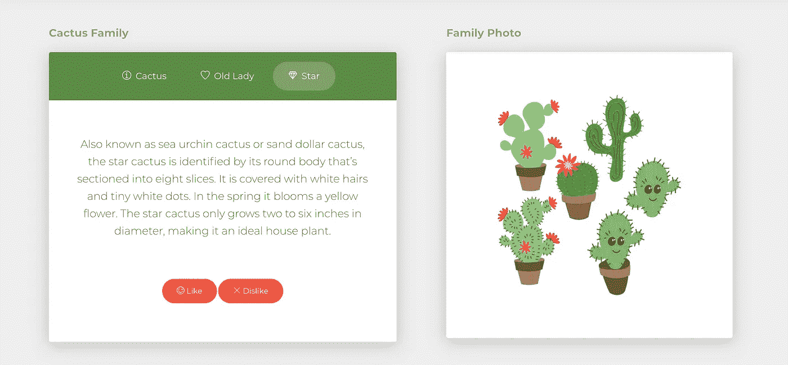

# 使用免费的 Vue.js 模板创建卡片设计

> 原文：<https://javascript.plainenglish.io/create-a-card-design-with-the-free-vue-js-template-now-ui-kit-5676a738e518?source=collection_archive---------11----------------------->

## 使用免费主题可能是开发设计和学习的最佳方式之一。

Photo by [Yancy Min](https://unsplash.com/@yancymin?utm_source=medium&utm_medium=referral) on [Unsplash](https://unsplash.com?utm_source=medium&utm_medium=referral)

你好！今天我尝试了一个 Vue JavaScript 主题。Vue.js 通过自己的网站提供付费和免费的主题。据我所知，更多的功能已经被添加到免费主题中，并以付费形式提供。你的选择应该取决于你想完成什么。如果你有足够的关于 Vue.js 的信息，我推荐你去找免费版本。

*点击* *可以进入* [*站点。*](https://vuejs.org/resources/themes.html)

我使用了 [**Now UI Kit**](https://www.creative-tim.com/product/vue-now-ui-kit?affiliate_id=116187) 主题。

我在主题中选择了一个区域，我想改变它。我想看看免费给我的东西我能做些什么。

总而言之，我喜欢这个主题的内容。使用组件的例子逐一给出。我可以从那里拿走我想要的东西并使用它。但是考虑一下这些现成主题中的一些情况。CSS 结构有点复杂，或者说在我看来复杂是因为我没有完全主导。

易用性当然也有难度。需要一点时间来适应。我想我已经为自己的作品集找到了一个可以用的主题。

我心中有一个卡片设计。我思考如何用最简单的形式在这个主题中做这个设计。我使用了主题提供给我们的**标签、卡片、按钮**组件。

Vue.js 的文件结构:

`<template></template>  <style><style>`

在模板内部，我们使用 HTML 代码。

直到`<tabs>`我们使用 HTML 5 **标签**。`<tabs> and <tabs-pane>` Vue.js 自己的标签。

除了`data-background-color`这些都是我们知道的标签。

`&[data-background-color="cactus"] {`

`background-color: #5F8C3F; }`

在 **_cards.scss** 文件中是这样定义的。当我们想要改变或添加颜色时，我们从文件中改变它。

`<i class="now-ui-icons emoticons_satisfied"></i>`

这是我们定义图标的部分。主题使用了自己的图标。

在这部分，我加了一张照片。我之所以用`v-lazy`；

通过使用延迟加载，您可以延迟加载不在屏幕上的图像，使站点打开得更快，并防止站点上不必要的加载。这样，不在视图区域中的图像提高了首页加载性能。

在这个`<script>`部分，我定义了我想要的组件。

在这个`<style>`部分，我定义了一些 CSS，除了那个**。scss** 文件。

如果你想试试，你可以通过我给的链接下载这个项目。我创建的 **Tabs.vue** 文件可以更改 vue 文件的内容，并实时查看它所做的更改。

如果您正在考虑下载项目，请首先执行以下操作:

`cd project_directory`

`npm install`

`npm run serve`

之后，该项目将可用于 http [://localhost/8080](http://localhost:8080/#/) 或 http://your_ip/8080

我在加一张我最近做的改动的截图。我想研究仙人掌。我提到了仙人掌科和两个品种的仙人掌。边上是一张卡片上的仙人掌照片。

仅此而已。希望你觉得这篇文章有用，感谢你阅读它。

 [## 如何将角度组件样式与特殊选择器一起使用

### 在具有独立样式文件的组件的基础上，将样式添加到您的 Angular 应用程序有助于您创建一个更…

javascript.plainenglish.io](/how-to-use-angular-component-styles-with-special-selectors-dc877514372c) 

*更多内容请看*[*plain English . io*](http://plainenglish.io/)