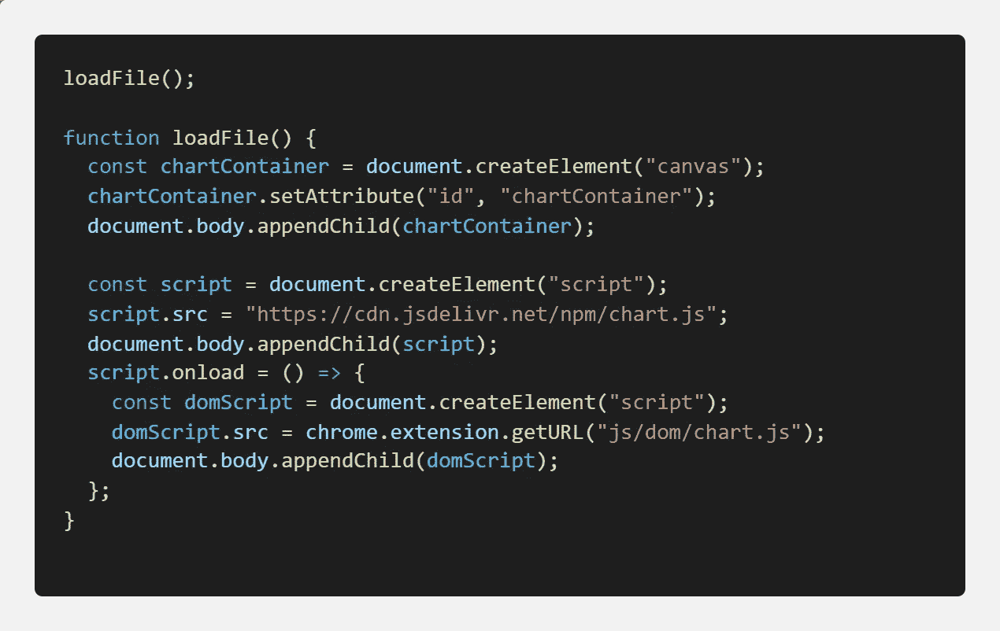

# 创建一个 Chrome 扩展来注入脚本

> 原文：<https://javascript.plainenglish.io/create-a-chrome-extension-to-inject-script-8579717b2c17?source=collection_archive---------2----------------------->

## 创建 chrome 扩展以将任何脚本注入客户端应用程序的指南。


Photo by [Sara Bakhshi](https://unsplash.com/@sarabakhshi?utm_source=medium&utm_medium=referral) on [Unsplash](https://unsplash.com?utm_source=medium&utm_medium=referral)

今天，我将尝试一些不同于我原来领域的东西，即创建一个 chrome 扩展，将任何脚本注入到客户端应用程序中。

## 你熟悉 Chrome 扩展吗？

不存在你不知道什么是 Chrome 扩展的世界。所以让我们避开这个粗糙的问题来代替 ***你想知道如何创建一个吗？***

让我们首先创建一个 chrome 扩展，无论你何时访问任何网站，它都可以简单地登录。

# 我们开始吧

首先，我们需要创建一个文件夹，假设`launcher`进入这个文件夹并创建一个名为`manifest.json`的文件，你可以给这个文件夹起任何名字。

这个文件是我们 chrome 扩展的入口点，当我们上传它时，将使用 manifest.json 开始:


manifest.json

在这里，总结一下，`content_script`是一个我将`matches`设置为所有网站并在网页加载时加载`test.js`的参数。

现在，让我们创建一个文件名`test.js`并将一些内容放在那里:

```
 loadFile();function loadFile() { console.log('page has been loaded!');}
```

## 发布解包版本

我们去`chrome://extensions`发布版本吧。

1.  检查开发人员选项
2.  点击加载解压缩版本，并选择当前文件夹

现在，如果你去任何网页，你会看到我们的日志会出现:


## 添加脚本标签

继续使用我们创建的 test.js 文件添加脚本标记，步骤将非常简单:



test.js

在这里，我们创建了一个画布容器来显示我们的 chart.js 库，然后注入脚本，一旦加载了脚本，我们将再注入一个包含加载图表所需数据的脚本，因此让我们移动并在`js/dom/chart.js`下再创建一个文件来管理属性文件结构:


js/dom/chart.js

现在，让我们转到“extension”选项卡，单击“refresh”来刷新我们的扩展。

现在，如果刷新任何打开的页面，您可能会看到某种错误，可以通过在清单文件中添加额外的一行来修复，如下所示:

```
"web_accessible_resources": ["js/**/*"],
```

现在，你完成了。

如果你进入同一个页面，你会在页面底部看到一个图表。

## 结论

您可以通过添加扩展和特性来做大量的事情。你可以在这里找到完整的源代码。

如果你喜欢我的内容，请点击这里订阅我的 substack 账户[。](https://piyushdubey.substack.com/?r=omfzc&utm_campaign=pub&utm_medium=web)

感谢您的阅读。

*更多内容看* [*说白了。在这里注册我们的*](http://plainenglish.io/) [*免费周报*](http://newsletter.plainenglish.io/) *。*