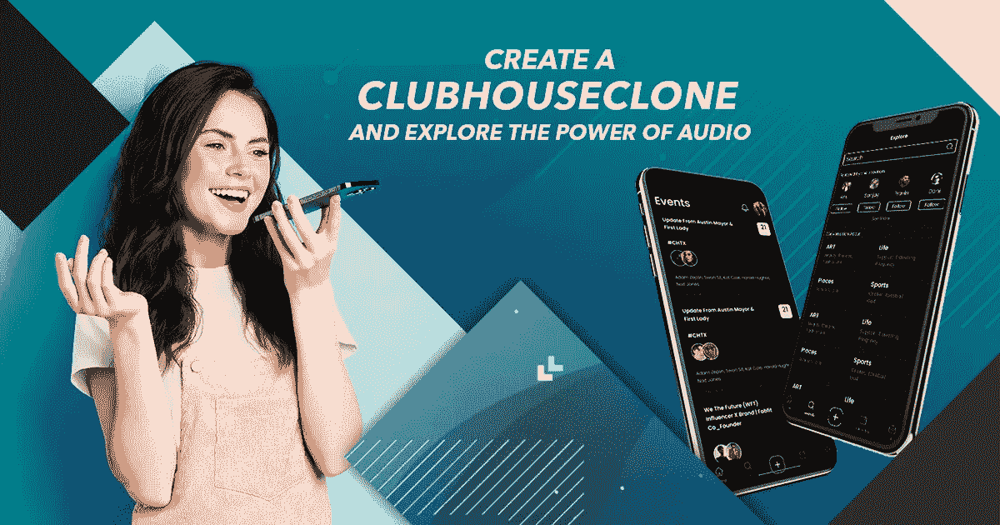
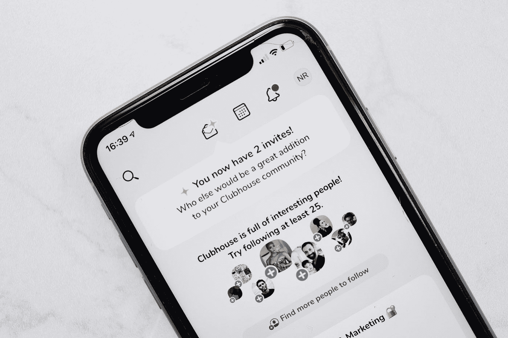

# 创建一个克隆的俱乐部会所，探索音频的力量

> 原文：<https://javascript.plainenglish.io/create-a-clubhouse-clone-and-explore-the-power-of-audio-f7bad979355c?source=collection_archive---------15----------------------->

对于一个纯音频平台来说，从一家小型初创公司到社交媒体世界的一股力量的旅程一直令人鼓舞。是的，你猜对了！Clubhouse 是在新冠肺炎疫情流行的平台。自 2020 年 4 月推出以来，Android 上的用户下载量已超过 1000 万。随着数字时代聚焦于基于语音的对话，企业家可以开始克隆会所的时候到了。

**了解会所克隆应用的重要性**

这是一个预建的社交媒体平台，包含类似于会所 的特性和功能 [**。重要的是，用户可以创建房间，参与引人入胜的对话、活动和广播节目。他们还可以随时随地加入和进入房间(开放、封闭和社交)。此外，技术创业者可以在几天/几周内部署纯音频社交媒体解决方案。**](https://www.appdupe.com/clubhouse-clone)

这给了科技创业者在社交媒体领域与对手竞争的优势。您还可以修改品牌元素，如颜色、图形主题、徽标和名称。因此，应用程序开发公司将提供灵活性和个性化等好处。

Photo by [Josh Rose](https://unsplash.com/@joshsrose?utm_source=medium&utm_medium=referral) on [Unsplash](https://unsplash.com?utm_source=medium&utm_medium=referral)

**推出一个俱乐部克隆平台有什么好处？**

*   **快速增长—** 尽管面临大型科技企业的激烈竞争，但 Clubhouse 在今年 9 月获得了约 30 万次下载。同样，企业家可以用一个类似俱乐部会所的平台将整个世界牢牢地绑在一起。

这是怎么发生的？网民可以毫不费力地听到名人、有影响力的人、媒体大亨和运动员的声音。他们将收到关于即将举行的活动和人才搜寻的实时通知。此外，用户可以加入一个房间，扮演各种角色，如管理员、主持人、听众、主持人、演讲者等。

*   **接触庞大的目标受众—** 在多媒体内容盛行的今天，声音仍然很重要。与 gif、表情符号、照片、视频等相比，清晰度、人们内向的天性以及匿名的能力等众多原因使音频对话更具优势。

除此之外，关于会所的讨论涵盖了很多类型和主题。例如，用户可以分享他们对商业、教育、健康、游戏、音乐、政治、宗教、体育等话题的想法。

此外，用户可以点击热门栏目。这将提供关于专家就某些问题和主题发表意见的实时更新。因此，网络冲浪者可以按下“加入俱乐部”按钮。这使他们能够与志同道合的人联系，并参与随意的谈话和严肃的辩论。

*   分享相同的思想— 如果人们拥有相似的思想，他们会很容易团结起来。会所克隆平台确保了具有不同兴趣、偏好和品味的用户可以相互交流。

除了聊天室，网络公民还可以通过秘密渠道保持联系。用户可以发送和接收来自个人的消息。此外，他们可以创建群组，分享嵌入了图像和视频的链接。

这种特殊的功能对于演讲者和他们的共同主持人交谈很有用。在他们开始一个房间后，点击 Backchannel 按钮的用户将通过短信向演讲者提问。宿主可以通过逐个授予权限来管理查询的流入。此外，发言者将回答听众提出的问题。

个人可以利用反向渠道的力量吗？他们可以开始一个音频会议，与其他主持人协调，以特定的顺序组织问题，确定将回答观众的嘉宾，然后开始直播。

Photo by [Nathana Rebouças](https://unsplash.com/@nathanareboucas?utm_source=medium&utm_medium=referral) on [Unsplash](https://unsplash.com?utm_source=medium&utm_medium=referral)

**看看克隆会所的顶级特色**

**固定链接—** 随着会所用户群的稳步上升，讨论中必须避免歧义。因此，固定链接确保了思维过程的清晰。

用户可以将统一资源定位器(URL)附加到任何房间的顶部。这适用于正在进行实时会话的情况。此外，语音讨论的主持人可以随时添加和删除 URL 链接。

类似地，俱乐部式平台的成员可以包括游戏、投票甚至社交媒体平台上的视频趋势的 URL。从长远来看，这提供了友好的用户界面(UI)和不间断的通信等好处。

**探索版块—** 普通人可以发现并关注名人的生活。他们可以按下“探索”面板，搜索男演员、女演员、主播、作家、企业家、企业大亨、记者、音乐作曲家、单口相声演员、政治家、运动员、电视节目主持人等的个人资料。当知名人士分享他们的观点时，用户将收到实时更新。

**开房间按钮——**在会所 这样的 [**平台上，思想的流通相当容易。用户可以点击“开始一个房间”选项，添加标题，并向所有人开放。其他使用类似俱乐部会所应用的网民将在他们的设备上收到推送通知。因此，他们可以加入一个见解深刻的房间(开放的、封闭的和社交的)并提出他们的观点。**](https://www.appdupe.com/clubhouse-clone)

**即将推出的 for You panel —** 毫无疑问，Clubhouse 不仅仅是一个语音对话的社交网络。企业家也可以利用它的能力来组织活动。他们可以选择两个选项，即将为你和我的活动。用户将收到关于未来几天将要发生的事件的信息。

他们可以按下他们喜欢的事件，查看音频讨论的日期和时间、主持人和发言人的姓名以及主题的议程。此外，网上冲浪者可以点击铃声图标来设置即将到来的事件的提醒。他们还可以与他们的亲密圈子分享活动，复制语音讨论链接，在推特上发布，并将其添加到他们的日历中。

**添加个人简介—** 用户可以更新个人简介，并加入一些关于个人和职业生活的内容。他们可以点击“完成”选项，发布的信息将在全球范围内共享。此外，网络用户可以添加照片，链接他们的社交网络，如 Instagram 和 Twitter，还可以验证他们的电子邮件地址。

**帮助中心—** 企业家可以通过设立帮助台来提高他们基于音频的社交网络的可信度。因此，内容创建者以及用户可以解决与数据保护、知识产权(IP)侵犯、与品牌和名人的合作、交易处理、简档验证、隐私、安全等相关的问题。

**包装完毕**

随着社交媒体世界的快速变化，企业家可以开始他们的荣耀之路。你现在可以联系一家应用程序开发公司，并很快建立一个俱乐部会所克隆。

*更多内容请看*[***plain English . io***](http://plainenglish.io/)