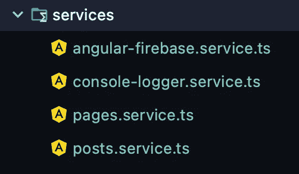

# 用 Angular + Firebase 创建一个 CMS 第 2 部分

> 原文：<https://javascript.plainenglish.io/create-a-cms-with-angular-firebase-153e48d911a1?source=collection_archive---------11----------------------->

## ANGULAR — FIREBASE CMS 系列—第 2 部分

## 使用 Firebase 系列构建 Angular 11 CMS


Angular + Firebase = CMS

欢迎来到我们 Angular Cms 教程的第二部分。以下是教程其他部分的链接(我会在发布后添加链接):

*   第一部分
*   第 2 部分——不需要链接，对吗？你已经在里面了！
*   第 3 部分—即将添加:)
*   第 4 部分—即将添加:)

因此，我们已经设置好了一切(firebase、数据库和项目结构)。现在是时候填写我们所有的路线，服务，警卫，管道和公用事业。

我们的应用程序树现在看起来像这样:


app-tree

让我们从服务目录开始。



services directory

我使用的任何应用程序中最常见的部分是日志记录部分。我写的每个应用程序都有大量的 console.log 命令。问题是，我们不希望最终用户看到日志！那么我们该怎么做呢？有两种方法可以做到。捷径和长路。

> 捷径

转到 main.ts 文件并添加以下内容:

```
if (environment.production) {
      window.console.log = () => { }
}

platformBrowserDynamic().bootstrapModule(AppModule).then(ref => {
  ...
}).catch(err => console.error(err));
```

这个函数将覆盖所有的 console.log 命令，并告诉它们在生产模式下不要做任何事情。

我不止一次使用它。但后来我决定用一种更好的方式，一种能控制我所有日志问题的服务来做这件事。

> 漫漫长路

在服务目录中，我们创建了一个新服务。控制台-logger.service.ts:

[https://gist.github.com/blakazulu/7bf73355bc9c1db281a2aa91d6af4855](https://gist.github.com/blakazulu/7bf73355bc9c1db281a2aa91d6af4855)

每次我们需要记录一些东西的时候，我们都会使用这个服务。每个功能内部都一样。不同之处在于我们将记录什么，错误/警告/日志/信息。如果不是在生产模式下，将会进行实际的日志记录，之后，将会调用来自 Material 的 Snackbar(一个简单的消息)。我们为 snackbar 传递一个值和一个类名。还记得第一部分[的主](https://medium.com/javascript-in-plain-english/create-a-cms-with-angular-firebase-8ecdf0dd63d9) [styles.scss](https://gist.github.com/blakazulu/18f07461fffa14fd5c3ef1ac023a5e05) 文件吗？

每个日志记录函数都有两个传递给它的参数，一个是 any 类型的值，另一个是 rest 类型的 any[]。你说那三个点是什么？那是传播算子。这是什么，它有什么作用？

> spread 语法将数组“扩展”到单独的参数中

你可以在这里了解更多信息[。它会接受我们传入的任何数组，并将其展开。](https://medium.com/coding-at-dawn/how-to-use-the-spread-operator-in-javascript-b9e4a8b06fab)

> 奖金。如果您想以不同的方式显示对象，可以在类中添加一个很好的函数——以表格的形式。这样更容易观察物体。你只要用 console.table(object)代替 console.log 就行了，试试吧:)。请记住，虽然 IE 不支持`console.table()`,但是现在谁还会使用 IE 呢。

您可以看到它实现了一个名为 Logger 的接口。我们以后会用到所有的接口。

现在，我们将创建第二个服务。当您开始对外部资源进行调用时，您可以创建一个单独的服务来进行所有的实际调用(可能以一个很大的文件结束)，或者将它们分开。当我开始的时候，我想使用这两种方法，你会看到的。

我们将创建的第一个服务是 angular-firebase.service.ts:

[https://gist.github.com/blakazulu/a03b0957391fe2efa10abb4ec7277d1b](https://gist.github.com/blakazulu/a03b0957391fe2efa10abb4ec7277d1b)

关于 firebase，您首先需要了解的是，所有内容都是流式的。这意味着无论什么时候发生变化，我们都会意识到。为什么？可观测性，这就是原因。

首次创建服务时，它检查用户是否存在；如果没有，我们调用身份验证方法来获取用户。然后，我们使用用户 id 从用户集合中获取用户信息，并使用 valueChanges()函数，该函数监听来自文档的更新(参见[第 1 部分](https://medium.com/javascript-in-plain-english/create-a-cms-with-angular-firebase-8ecdf0dd63d9)关于 firebase 如何存储其[数据](https://miro.medium.com/max/1050/1*gGQL860oZHW69O9BCTBPeQ.png))。我们将这些数据传递给我们的用户“可观察”，这样我们就可以在应用程序的任何地方使用它们。

第一个功能是谷歌登录功能。使用 google 帐户登录后，我们调用 updateUser()函数，该函数使用 google 帐户中的数据更新数据库中的用户数据。

接下来是注销()函数，非常简单。

最后一个函数是 getCollection()。我们 passא我们正在寻找的集合名称(页面或帖子)，我们调用 snapshotChanges()函数，它创建了一个同步的变更流。正如我之前所说，在 Firebase 中，所有内容都是流式的。Firebase 返回所有 firebase 文档，然后我们将其映射到一个集合，并返回一个带有 id 和扩展数据的可观察对象。

现在我知道这并不容易理解，但是在我们完成所有的实现后，事情会简单得多。

我们将创建第三个服务页面。service . ts——该服务将负责我们的 firebase 页面功能。这是我呼出电话综合方法的一部分:

[https://gist.github.com/blakazulu/754d8fe8336688292aacb621949bf8f5](https://gist.github.com/blakazulu/754d8fe8336688292aacb621949bf8f5)

当第一次创建服务时(单例服务:)，我们调用 getPages()函数，该函数调用 angular Firebase 服务并调用 getCollection()方法，并将所有页面保存到我们的可观察页面中。

第一个函数是 getPage()函数，它接受 3 个参数。字段路径、条件和值。该功能负责从 Firebase 获取特定页面。为了得到页面，我们将一个查询函数传递给存储区，存储区使用了我们在构造函数中导入的 AngularFirestore 中的 where()函数。where()函数接受三个参数:搜索路径、条件和值。然后，我们返回带有数据的可观察值。

接下来的函数是 addPage()、deletePage()和 updatePage()函数。它们非常简单。在 addPage()中，我们创建了一个新页面。我们调用 AngularFirestore 集合()并添加/删除/更新页面。然后我们记录一切。请注意，我们为所有内容都保留了当前时间戳。

你可以在这里找到 Angular Firestore [的所有文档。](https://github.com/angular/angularfire)

现在，我们将创建第四个服务帖子。service.ts —该服务将负责我们的 firebase 帖子功能:

[https://gist.github.com/blakazulu/cbf9270dd95ad479f0b01e35c0b59dcc](https://gist.github.com/blakazulu/cbf9270dd95ad479f0b01e35c0b59dcc)

除了数据类型之外，这里的所有方法都与 pages.service.ts 相同。您可以将它们合并成一个服务，或者像这样保存它。

就是这样；我们的服务结束了。让我们继续接口目录。


Interfaces directory.

第一个是我们的 logget.ts，它由我们的 logger 服务使用:

[https://gist.github.com/blakazulu/277fcf7572a44f037a527da4ab15680b](https://gist.github.com/blakazulu/277fcf7572a44f037a527da4ab15680b)

接下来是我们的 page.ts，这是我们的页面模型:

[https://gist.github.com/blakazulu/1a17126c88ae0b26825f3bc390c434f1](https://gist.github.com/blakazulu/1a17126c88ae0b26825f3bc390c434f1)

第三个是我们的 post.ts 模型:

[https://gist.github.com/blakazulu/c1fafc5d85200b0d8b87ba27ab03ade7](https://gist.github.com/blakazulu/c1fafc5d85200b0d8b87ba27ab03ade7)

最后一个是我们的 user.ts，它同时具有用户模型和角色模型，因为它们在逻辑上是联系在一起的:

[https://gist.github.com/blakazulu/7fa49b91d7b9fcd4f1773d128843c078](https://gist.github.com/blakazulu/7fa49b91d7b9fcd4f1773d128843c078)

现在，我们将转向定制管道。如果您已经知道如何构建定制管道，那么您可以复制代码，并进入下一节。如果没有——继续读:)。

那么什么是管道呢？管道是 Angular 中的一个有用功能。它们是在角度模板中转换值的简单方法。有一些内置管道(如异步管道)，但您也可以构建自己的管道。你可以在这里了解更多关于[的信息。](https://www.lucidchart.com/techblog/2017/11/08/5-usage-ideas-for-angular-pipes/)

我们的第一个管道是安全管道。ts:

[https://gist.github.com/blakazulu/7d75721b3859a30aeb90db2c66a87abb](https://gist.github.com/blakazulu/7d75721b3859a30aeb90db2c66a87abb)

这个安全管道是什么？这将有助于净化 HTML 代码。这意味着您可以在输入中编写 HTML 语法；例如，它将显示结果 HTML，而不是代码本身。

第二个管道是 date-format.pipe.ts:

[https://gist.github.com/blakazulu/e981d1cee9283398db296a2b584b52e8](https://gist.github.com/blakazulu/e981d1cee9283398db296a2b584b52e8)

我知道你们有些人会说——沙加，你在做什么？angular 中已存在日期管道。我知道，你的权利。但是我需要一个不存在的特定格式。

这个管道接收数字形式的日期，并将其转换为 UTC 日期字符串。

就是这样；我们已经完成了管道。让我们继续我们的实用程序目录。


utilities directory

第一个文件是我们的日期助手。ts:

[https://gist.github.com/blakazulu/e2d2875c68162dc8aa8e0e3b05df70fd](https://gist.github.com/blakazulu/e2d2875c68162dc8aa8e0e3b05df70fd)

第二个文件是 rxjs-helper.ts:

[https://gist.github.com/blakazulu/3a0159cda09bfc44ffe464883229089d](https://gist.github.com/blakazulu/3a0159cda09bfc44ffe464883229089d)

这个文件只有一个目的，摧毁我们的目标，确保我们没有内存泄漏。

现在是第 2 部分教程的最后一部分，守卫的目录。


guards directory

为什么我们需要警卫？就像我在教程的[第一部分](https://medium.com/javascript-in-plain-english/create-a-cms-with-angular-firebase-8ecdf0dd63d9)中所说的，我们需要确保任何人“**不小心**去了他不应该去的地方；警卫检查那个人是否应该在那里。

第一个防护是 admin.guard.ts:

[https://gist.github.com/blakazulu/046211e144443b2f30f10ce7b9d7fcd7](https://gist.github.com/blakazulu/046211e144443b2f30f10ce7b9d7fcd7)

事情是这样的。如果用户转到 admin 路径，它将激活 AdminGuard。为什么？因为我们就是这样配置 app-routing.module.ts 文件的:


app-routing.module.ts

现在 admin.guard.ts 开始检查用户是否有管理员角色。如果没有，它就把他送回家。

第二个文件是 subscriber.guard.ts:

[https://gist.github.com/blakazulu/19ac485118678502496e0b8218273bde](https://gist.github.com/blakazulu/19ac485118678502496e0b8218273bde)

这是一样的。唯一的区别是它检查用户是否是订户。

仅此而已。我们已经完成了 Angular CMS 教程的第二部分。

请务必查看下一部分(将于下周发布)，在这一部分中，我们将处理管理方面的事情。

以下是教程其他部分的链接(我会在发布后添加链接):

*   [第一部分](https://medium.com/javascript-in-plain-english/create-a-cms-with-angular-firebase-8ecdf0dd63d9)
*   第 2 部分——不需要链接，对吗？你已经在里面了！
*   第 3 部分—即将添加:)
*   第 4 部分—即将添加:)

下次见！


Photo by [Reuben Juarez](https://unsplash.com/@sunnystate?utm_source=medium&utm_medium=referral) on [Unsplash](https://unsplash.com?utm_source=medium&utm_medium=referral)