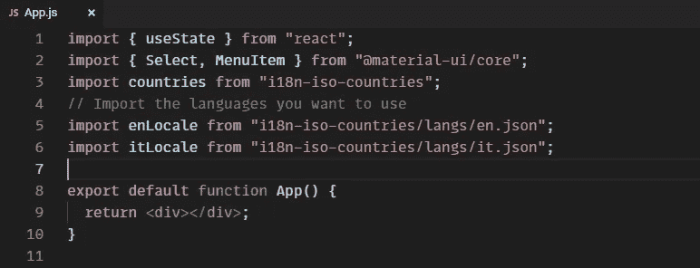
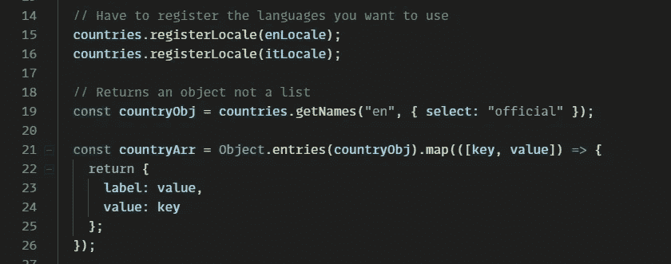
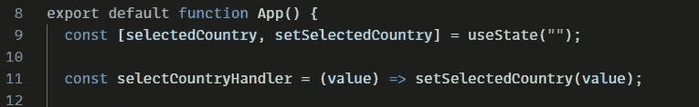
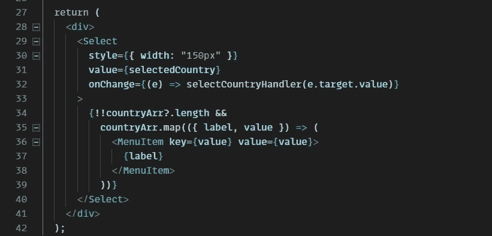
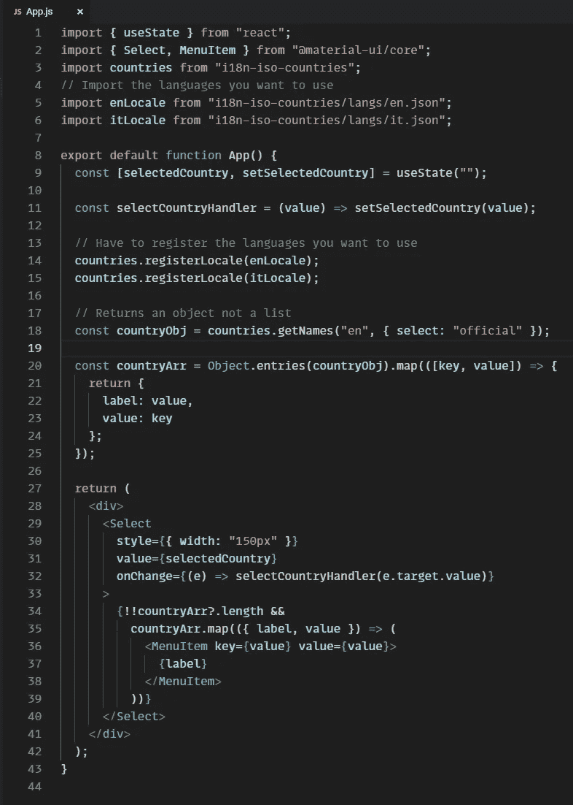
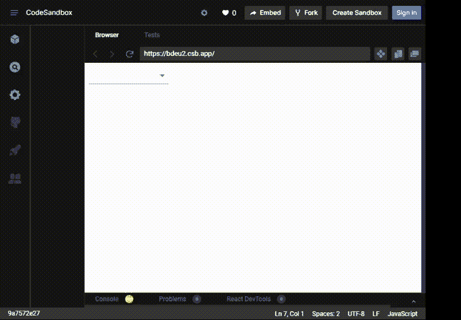

# 使用 React 创建国家选择组件

> 原文：<https://javascript.plainenglish.io/create-a-country-select-component-with-react-2021-a259bd0350d5?source=collection_archive---------3----------------------->

React.js

如何在 React 中使用 Material-UI 和 i18n-iso-countries 创建国家选择下拉列表。

在本教程中，我们将学习如何为所有国家创建一个简单的选择/下拉列表，因为逐个输入非常耗时。因此，我们将使用外部库/包来获取所有国家的数据。

我们将使用:

*   反应
*   [物料界面](https://material-ui.com/getting-started/installation/)
*   [i18n-iso-countries](https://www.npmjs.com/package/i18n-iso-countries) (点击此处获取软件包链接)

我们使用这个特定的包，因为它附带了一些其他功能，如果你的应用程序使用多种语言，或者你已经在你的应用程序中实现了类似 [i18next](https://www.i18next.com/) 的东西，这些功能可能会很有用。

注意:你可以使用任何 UI 库，为了简单起见，我只使用 Material-UI

首先，启动 react-app，并安装所有必要的依赖项。

确保将以下依赖项导入到您的应用程序中

Import required libraries

接下来，让我们获取我们国家的数据并进行分类。从库中返回的数据不是数组，而是键值对的对象，例如:{ MY:“Malaysia”}。所以我们需要在使用它之前对它进行分类。

Convert countries objects into an array

总结一下我们上面做的事情:

1.  注册我们想要使用的任何语言(确保在上面导入它们)
2.  使用附加在`countries`上的`getNames()`方法获取所有国家的对象并存储在`countryObj`中，注意`"en"`，你可以将它换成你想要使用的语言
3.  我们使用`Object.entries(countryObj)`返回一个由`countryObj` 自己的可枚举键值对组成的数组
4.  最后，将这些键值对映射到一个包含标签& value 的对象数组中

现在，我们可以在一个精选组件中使用新的国家数组了！我们将使用`useState`钩子来管理选择的状态，并创建一个函数来处理`onChange`事件。

Handler function & useState for selectedCountry

我们现在可以渲染我们的国家选择组件，我们在这个部分使用 Material-UI。

Render the countries

总结一下我们在这里做的事情:

1.  将当前选择的国家和 onChange 处理程序传递给`Select`
2.  接下来，作为父节点`Select`的子节点，我们将绘制出我们的国家数组，并将每一个渲染为一个`MenuItem`，确保将关键道具作为每一个项目的独特元素进行传递。

Full code

Working demo

这就是在 React 中实现基于语言的国家选择所需的全部内容

您可以在此基础上进行扩展，通过添加语言切换器使其更加动态，并通过用动态值替换`getNames()`方法中的`"en"`来切换国家使用的语言。

链接到代码沙盒 [**这里**](https://codesandbox.io/s/currying-sunset-bdeu2?file=/src/App.js)

感谢你坚持到最后，我希望这有所帮助，请在评论中留下你的任何问题。👋

 [## 如何使用 Node.js (2021)创建一个简单的 web 服务器

### 使用 Node.js 的简单 web 服务器(2021)

jrpotatodev.medium.com](https://jrpotatodev.medium.com/how-to-create-a-simple-web-server-using-node-js-2021-5c3e89833128)  [## Axios 与获取

### 探索 Axios 和 Fetch 之间的差异，并最终找出哪个更好。

jrpotatodev.medium.com](https://jrpotatodev.medium.com/axios-vs-fetch-aeaec89023b3) 

*更多内容请看*[***plain English . io***](http://plainenglish.io/)