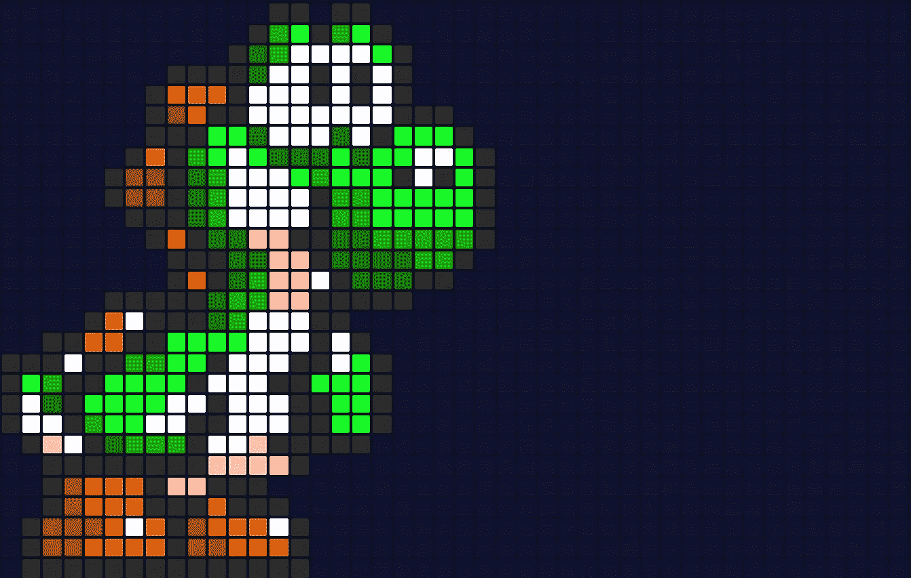

# 用 JavaScript 创建 CSS 像素艺术生成器

> 原文：<https://javascript.plainenglish.io/create-a-css-pixel-art-generator-with-javascript-584889a221bf?source=collection_archive---------12----------------------->



最近，我[读了一篇文章](https://pokecoder.hashnode.dev/making-pixel-art-with-pure-css)概述了如何创建 **CSS 像素艺术**与框阴影。我认为这是一个非常酷的想法——我认为用 JavaScript 制作一个生成器让你使用这种效果从浏览器创建可导出的像素艺术会很有趣。[**在 Codepen demo**](https://fjolt.com/article/css-pixel-art-generator) (如下图)中，你可以画出你的像素作品，然后点击“生成 CSS”得到你的 CSS 中的像素艺术，你可以将它复制到你的网页中。

# 它是如何工作的

如文章中的[所述，我们使用放大的方框阴影作为屏幕上的像素。我们可以将这些放大或缩小，使我们的像素艺术更大或更小。](https://pokecoder.hashnode.dev/making-pixel-art-with-pure-css)

由于每个方框阴影都是 1px 乘以 1px，我们可以创建一个像素艺术作品，其中每个“像素”都是 1x1。如果我们希望每个像素为 20x20，我们只需使用`transform`将其缩放 20x:

```
transform: scale(20);
```

为了达到我们想要的效果，我们使用 Javascript 创建一个 UI，让我们画出我们的像素艺术作品。[**UI 的代码可以在 codepen 这里**](https://codepen.io/smpnjn/pen/OJjGgPM) 找到，或者如果你喜欢，可以在下面找到:

# JavaScript 概述

为了让这一切工作，我们必须使用 JavaScript。第一步是使用一个简单的循环生成像素网格:

```
let config = {
    width: 40,
    height: 40,
    color: 'white',
    drawing: true,
    eraser: false
}let events = {
    mousedown: false
}document.getElementById('pixel-art-area').style.width = `calc(${(0.825 * config.width)}rem + ${(config.height * 2)}px)`;
document.getElementById('pixel-art-area').style.height = `calc(${(0.825 * config.height)}rem + ${(config.width * 2)}px)`;
document.getElementById('pixel-art-options').style.width = `calc(${(0.825 * config.width)}rem + ${(config.height * 2)}px)`;for(let i = 0; i < config.width; ++i) {
    for(let j = 0; j < config.height; ++j) {
        let createEl = document.createElement('div');
        createEl.classList.add('pixel');
        createEl.setAttribute('data-x-coordinate', j);
        createEl.setAttribute('data-y-coordinate', i);
        document.getElementById('pixel-art-area').appendChild(createEl);
    }
}
```

这最终创建了大约 40x40 像素，或 1600 个新的 HTML 元素。对于更大的实验，你可以很容易地放大它，但是 40x40 也可以。

# 跟踪用户的鼠标移动

然后，我们可以用三个事件来跟踪用户的鼠标移动: **pointerdown** 、 **pointermove** 和 **pointerup** 。**因为我们必须将此应用于所有像素**，我们使用一个循环来循环每个像素以添加事件。

然后，如果用户继续按住，我们可以使用 **e.target** 来跟踪他们正在哪个像素上，这将返回当前悬停在 **pointermove** 上的 HTML 实体。如果他们使用橡皮擦，我们可以在这里考虑。

```
document.querySelectorAll('.pixel').forEach(function(item) {
    item.addEventListener('pointerdown', function(e) {
        if(config.eraser === true) {
            item.setAttribute('data-color', null);
            item.style.background = `#101532`;
        } else {
            item.setAttribute('data-color', config.color);
            item.style.background = `${config.color}`;
        }
        events.mousedown = true;
    });
});document.getElementById('pixel-art-area').addEventListener('pointermove', function(e) {
    if(config.drawing === true && events.mousedown === true || config.eraser === true && events.mousedown === true) {
        if(e.target.matches('.pixel')) {
            if(config.eraser === true) {
                e.target.setAttribute('data-color', null);
                e.target.style.background = `#101532`;
            } else {
                e.target.setAttribute('data-color', config.color);
                e.target.style.background = `${config.color}`;
            }
        }
    }
});document.body.addEventListener('pointerup', function(e) {
    events.mousedown = false;
});
```

最后，我们在颜色和橡皮擦上设置了一些事件，这样我们就可以跟踪选择了什么工具和颜色:

```
[ 'click', 'input' ].forEach(function(item) {
    document.querySelector('.color-picker').addEventListener(item, function() {
        config.color = this.value;
        document.querySelectorAll('.colors > div').forEach(function(i) {
            i.classList.remove('current');
        });
        this.classList.add('current');
        config.eraser = false;
        document.querySelector('.eraser').classList.remove('current');
    });
});

document.querySelectorAll('.colors > div').forEach(function(item) {
    item.addEventListener('click', function(e) {
        document.querySelector('.color-picker').classList.remove('current');
        document.querySelectorAll('.colors > div').forEach(function(i) {
            i.classList.remove('current');
        })
        item.classList.add('current');
        config.eraser = false;
        config.color = `${item.getAttribute('data-color')}`;
        document.querySelector('.eraser').classList.remove('current');
    })
});
```

# 结论

当我看到最初的文章时，我认为只用 CSS 创建像素艺术真的很酷——但创建一种导出像素艺术创作的方法会更酷——而且只用一点点 JavaScript 也没那么难。以下是一些有用的源代码链接:

*   [关于 CSS 像素艺术的文章](https://pokecoder.hashnode.dev/making-pixel-art-with-pure-css)
*   [代码笔上的源代码](https://codepen.io/smpnjn/pen/OJjGgPM)
*   [Github 上的源代码](https://github.com/smpnjn/CSS-Pixel-Art)

*更多内容请看*[*plain English . io*](http://plainenglish.io/)*。在这里注册我们的* [*免费周报*](http://newsletter.plainenglish.io/) *。*