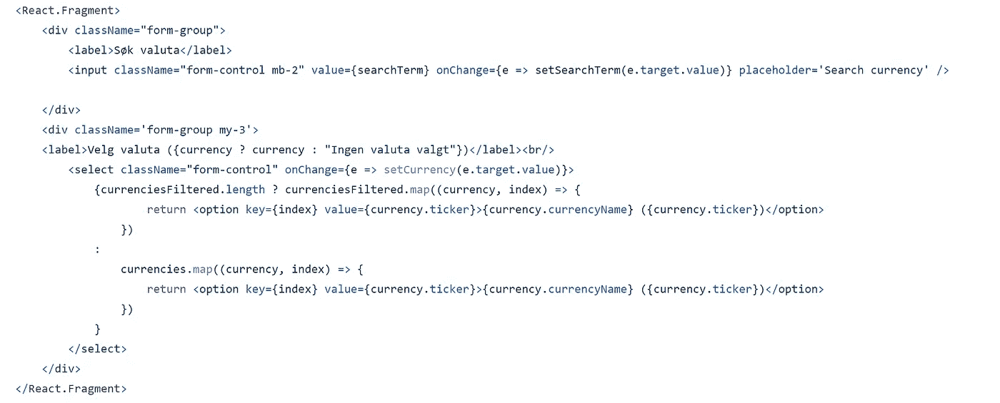

# 在 React 中创建货币转换器

> 原文：<https://javascript.plainenglish.io/create-a-currency-converter-in-react-7e67ac290c39?source=collection_archive---------4----------------------->

## 使用最新的可用数据转换货币


Photo by [John McArthur](https://unsplash.com/@snowjam?utm_source=medium&utm_medium=referral) on [Unsplash](https://unsplash.com?utm_source=medium&utm_medium=referral)

应用程序是使用 create-react-app 在 React 中编写的。[https://reactjs.org/docs/create-a-new-react-app.html](https://reactjs.org/docs/create-a-new-react-app.html)

在这个例子中，我将使用一个外部 API 来获取最新的货币汇率。

在此链接到外部 API:

[](https://rapidapi.com/natkapral/api/currency-converter5/) [## 货币转换器 API 文档(natkapral) | RapidAPI

### 提供基于官方银行数据的汇率。

rapidapi.com](https://rapidapi.com/natkapral/api/currency-converter5/) 

应用程序托管在以下位置:

 [## React 应用

### 使用 create-react-app 创建的网站

货币-计算器-app.netlify.app](https://currency-calculator-app.netlify.app/) 

# 使用货币 API

为了处理数据，我将使用 axios。成功进行 API 调用需要货币转换器的 API 密钥。

```
import Axios from 'axios'
const RAPID_KEY = "" // Add your key here
```

为了获取所有可用的货币，我将创建一个向端点"https://currency-converter5.p.rapidapi.com/currency/list"发送请求的函数。

```
export async function fetchCurrencies() {    
    let response    
    try {        
        const options = {            
            method: 'GET',            
            url: 'https://currency-converter5.p.rapidapi.com/currency/list',            
            headers: {              
                'x-rapidapi-key': RAPID_KEY,              
                'x-rapidapi-host': 'currency-converter5.p.rapidapi.com'            
            }          
        };                  
        response = await Axios.request(options)    
    } catch (error) {        
        console.log(error)        
        response = "fail"    
    }    
    return response
}
```

为了转换我想要比较的货币，我将添加一个对新端点的新 API 调用“https://currency-converter 5 . p . rapidapi . com/currency/convert”。

这个请求需要一个头，包含从货币的**，从**到**货币，以及要转换的**金额**。**

```
export async function convertCurrencies(from, to, amount) {    
    let response    
    try { const options = {            
            method: ‘GET’,            
            url: ‘https://currency-converter5.p.rapidapi.com/currency/convert’,            
            params: {
                format: ‘json’, 
                from: from, 
                to: to, 
                amount: amount},            
                headers: {              
                    ‘x-rapidapi-key’: RAPID_KEY, 'x-rapidapi-host': 'currency-converter5.p.rapidapi.com'            
                }          
            };
            response = await Axios.request(options);    
    } catch (error) {         
        response = "fail"    
    }    
    return response
}
```

# 转换货币

要兑换货币，您可以向 API 发出一个请求，其中包含要兑换的货币以及要兑换的金额。

useState 挂钩用于处理不同的状态变化。

```
const [fromCurrency, setFromCurrency] = useState()    
const [toCurrency, setToCurrency] = useState()    
const [amount, setAmount] = useState(0)   

const [calculatedRate, setCalculatedRate] = useState(0) // Get all currencies and store in a state variable
const [currencies, setCurrencies] = useState([])    
const [currenciesFormattedArray, setCurrenciesFormattedArray] = useState([]) // Toggle between from amount and to amount
const [switchMessage, setSwitchMessage] = useState(false)    
const [currencySwitchedTo, setCurrencySwitchedTo] = useState(null)    const [currencySwitchedFrom, setCurrencySwitchedFrom] = useState(null)
```

useEffect 钩子用于处理对**fetch currency()**的 API 调用。

函数 **calculateCurrency** 处理转换所选货币进行比较的请求。

```
async function calculateCurrency() {        
    if (fromCurrency && toCurrency && amount) {            
        try {                
            const calculatedSum = await convertCurrencies(fromCurrency, toCurrency, amount)                               console.log(calculatedSum)                               console.log(calculatedSum.data.rates[toCurrency].rate_for_amount)                   

setCalculatedRate(calculatedSum?.data?.rates[toCurrency]?.rate_for_amount || 0)            
        } catch (error) {                
            console.log(error)            
        }        
    }     
}
```

响应将是一个对象，存储在 **calculatedSum** 变量中。使用以下方式访问计算的比率

```
calculatedSum?.data?.rates[toCurrency]?.rate_for_amount
```

使用 useState()设置转换后的金额，如下所示:

```
setCalculatedRate(calculatedSum?.data?.rates[toCurrency]?.rate_for_amount || 0)
```

如果计算的金额为空或未定义，它将被设置为 0。

# 创建 CurrencySelector 组件

为了方便地选择要比较的货币，我将使用 API 调用函数**fetchallcurrences**。这些数据将被发送到组件 CurrencySelector.jsx 中，我们可以在其中更改所选的货币。

该组件接受三个属性，**货币，setCurrency** 和**货币。**该组件使用两次，一次用于**从币**，一次用于**到币**。



The currency selector jsx

# 列出所有货币

AllCurrencies.jsx 文件呈现所有可用的货币。它将从 api_currency.js 文件中调用 fetchCurrencies()函数。

```
useEffect(() => {        
    async function fetchData() {            
        const response = await fetchCurrencies();            
        if (response.data.currencies) {                
            const currenciesArray = Object.keys(response.data.currencies).map((key) => [String(key),    
response.data.currencies[key]]);   

            setCurrencies(currenciesArray)                    
            setFilteredCurrencies(currenciesArray)            
        }                  
        console.log(response.data, "Response useEffect")        
    }              fetchData()     
}, [])
```

# 使用 App.js 呈现应用程序

App.js 文件负责呈现应用程序组件。这是一个只有一页的应用程序，所以没有使用路由。

```
*import* AllCurrencies *from* "./components/AllCurrencies";*import* CurrencyConverter *from* "./components/CurrencyConverter"; *function* App() { *return* ( <div className="bg-light py-4"> <div className="container"> <CurrencyConverter /> <AllCurrencies /> </div> </div> );}*export* *default* App;
```

# 源代码

*更多内容看* [***说白了. io***](http://plainenglish.io/) ***。*** *报名参加我们的* [***免费每周简讯点击这里***](http://newsletter.plainenglish.io/) ***。***