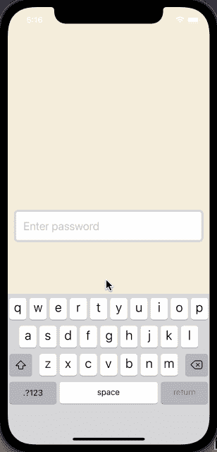

# 创建一个自定义挂钩来显示/隐藏 React Native 中的密码可见性

> 原文：<https://javascript.plainenglish.io/create-a-custom-hook-for-show-hide-password-visibility-in-react-native-db184a48126e?source=collection_archive---------4----------------------->


在 React 本地应用程序中构建登录和注册表单包括输入字段和按钮。您会发现自己经常添加到这些表单中的一个字段是密码字段。这个密码字段由 React Native 的`TextInput`组件组成。

该字段的常见行为是将用户密码隐藏在晦涩的字符后面。

看看用于创建密码字段的`TextInput`组件的例子。

```
import React, { useState } from ['react'](https://github.com/facebook/react/tree/master/packages/react);
import { StyleSheet, TextInput, View } from ['react-native'](https://github.com/facebook/react-native);export default function App() {
  const [password, setPassword] = useState(''); return (
    <View style={styles.container}>
      <View style={styles.inputContainer}>
        <TextInput
          style={styles.inputField}
          name='password'
          placeholder='Enter password'
          autoCapitalize='none'
          autoCorrect={false}
          textContentType='newPassword'
          secureTextEntry
          value={password}
          enablesReturnKeyAutomatically
          onChangeText={text => setPassword(text)}
        />
      </View>
    </View>
  );
}const styles = StyleSheet.create({
  container: {
    flex: 1,
    backgroundColor: '#F5EEDC',
    alignItems: 'center',
    justifyContent: 'center',
    paddingHorizontal: 12
  },
  inputContainer: {
    backgroundColor: 'white',
    width: '100%',
    borderRadius: 8,
    flexDirection: 'row',
    alignItems: 'center',
    borderWidth: 4,
    borderColor: '#d7d7d7'
  },
  inputField: {
     padding: 14,
    fontSize: 22,
    width: '90%'
  }
  }
});
```

它使用了`secureTextEntry`属性，这样当一个文本值被输入到输入字段中时，就不清楚在那个字段中输入了什么。

以下是上述片段在设备上的输出:



然而，给用户一个选项，让他们看到他们输入的当前值，可以带来良好的体验，在某些情况下可能是必要的。

# 显示或隐藏密码可见性挂钩

为了增加显示或隐藏密码字段可见性的能力，让我们在一个名为`useTogglePasswordVisibility.js.js`的新文件中创建一个定制钩子。

首先从 React 库中导入`useState`钩子。您需要创建两个不同的状态变量来切换字段的可见性和改变图标。

然后定义一个函数叫做`useTogglePasswordVisibility`。在这个函数中，创建两个新的状态变量。第一个叫`passwordVisibility`。它的初始值被设置为布尔型`true`。原因是这个变量将是`TextInput`组件上的属性`secureTextEntry`的值。当用户在输入字段中输入密码时，您可能希望最初隐藏密码字段。

定义的第二个状态变量称为`rightIcon`。它的默认值为`eye`。该值取决于您在 React 本机应用程序中使用的图标库。对于这个例子，我使用的是来自 [Expo 矢量图标](https://docs.expo.dev/guides/icons/)的 MaterialCommunityIcons。

```
export const useTogglePasswordVisibility = () => {
  const [passwordVisibility, setPasswordVisibility] = useState(true);
  const [rightIcon, setRightIcon] = useState('eye'); // ...
};
```

接下来，添加一个名为`handlePasswordVisibility`的方法，允许应用程序用户在显示和隐藏状态之间切换密码字段的可见性。

最后，不要忘记返回所有变量和处理程序方法。

```
export const useTogglePasswordVisibility = () => {
  const [passwordVisibility, setPasswordVisibility] = useState(true);
  const [rightIcon, setRightIcon] = useState('eye'); const handlePasswordVisibility = () => {
    if (rightIcon === 'eye') {
      setRightIcon('eye-off');
      setPasswordVisibility(!passwordVisibility);
    } else if (rightIcon === 'eye-off') {
      setRightIcon('eye');
      setPasswordVisibility(!passwordVisibility);
    }
  }; return {
    passwordVisibility,
    rightIcon,
    handlePasswordVisibility
  };
};
```

# 使用密码可见性挂钩

首先更新`App.js`文件中的导入语句:

```
import React, { useState } from ['react'](https://github.com/facebook/react/tree/master/packages/react);
import { StyleSheet, Pressable, TextInput, View } from ['react-native'](https://github.com/facebook/react-native);
import { MaterialCommunityIcons } from ['@expo/vector-icons'](https://github.com/expo/vector-icons);import { useTogglePasswordVisibility } from './hooks/useTogglePasswordVisibility';
```

接下来，从`useTogglePasswordVisibility`钩子访问所需的变量和方法。在`App`组件的顶部添加以下行:

```
export default function App() {
  const { passwordVisibility, rightIcon, handlePasswordVisibility } =
    useTogglePasswordVisibility();
  const [password, setPassword] = useState(''); // ...
}
```

修改`TextInput`组件的道具。确保将`passwordVisibility`作为值添加到`secureTextEntry`属性中。

```
<TextInput
  secureTextEntry={passwordVisibility}
  // ... rest of the props remain unchanged
/>
```

在包装`TextInput`的`View`组件内，使用`Pressable`组件添加一个按钮。该按钮将允许用户在密码字段的隐藏和显示状态之间切换。

该按钮包装图标组件。

```
<View style={styles.inputContainer}>
  {/* After TextInput component */}
  <Pressable onPress={handlePasswordVisibility}>
    <MaterialCommunityIcons name={rightIcon} size={22} color="#232323" />
  </Pressable>
</View>
```

仅此而已！这是此步骤后的输出:


以下是`App.js`文件的完整代码:

```
import React, { useState } from ['react'](https://github.com/facebook/react/tree/master/packages/react);
import { StyleSheet, Pressable, TextInput, View } from ['react-native'](https://github.com/facebook/react-native);
import { MaterialCommunityIcons } from ['@expo/vector-icons'](https://github.com/expo/vector-icons);import { useTogglePasswordVisibility } from './hooks/useTogglePasswordVisibility';export default function App() {
  const { passwordVisibility, rightIcon, handlePasswordVisibility } =
    useTogglePasswordVisibility();
  const [password, setPassword] = useState(''); return (
    <View style={styles.container}>
      <View style={styles.inputContainer}>
        <TextInput
          style={styles.inputField}
          name="password"
          placeholder="Enter password"
          autoCapitalize="none"
          autoCorrect={false}
          textContentType="newPassword"
          secureTextEntry={passwordVisibility}
          value={password}
          enablesReturnKeyAutomatically
          onChangeText={text => setPassword(text)}
        />
        <Pressable onPress={handlePasswordVisibility}>
          <MaterialCommunityIcons name={rightIcon} size={22} color="#232323" />
        </Pressable>
      </View>
    </View>
  );
}const styles = StyleSheet.create({
  container: {
    flex: 1,
    backgroundColor: '#F5EEDC',
    alignItems: 'center',
    justifyContent: 'center',
    paddingHorizontal: 12
  },
  inputContainer: {
    backgroundColor: 'white',
    width: '100%',
    borderRadius: 8,
    flexDirection: 'row',
    alignItems: 'center',
    borderWidth: 4,
    borderColor: '#d7d7d7'
  },
  inputField: {
    padding: 14,
    fontSize: 22,
    width: '90%'
  }
});
```

*   [**源代码在此 GitHub 回购**](https://github.com/amandeepmittal/react-native-examples/tree/master/custom-hook-password-toggle) **🐙**
*   [**看看我在 React Native 和 Expo 上写的其他博文**](https://amanhimself.dev/) 📄
*   [**在推特上打招呼**](https://twitter.com/amanhimself) 👋

*更多内容看* [*说白了就是*](http://plainenglish.io/) *。在这里注册我们的* [*免费周报*](http://newsletter.plainenglish.io/) *。*