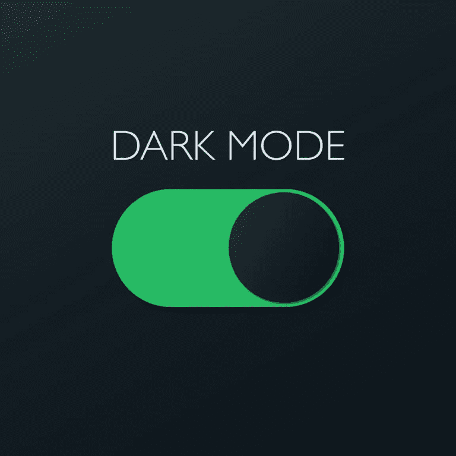
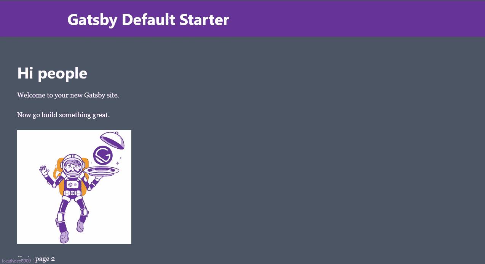
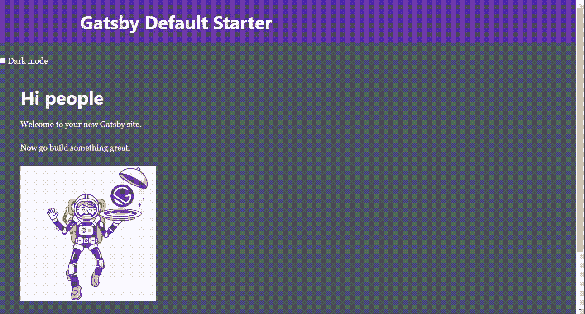

# 用 Gatsby 和 TailwindCSS 创建一个黑暗模式主题开关

> 原文：<https://javascript.plainenglish.io/create-a-dark-mode-theme-switch-with-gatsby-and-tailwindcss-d7691f337998?source=collection_archive---------3----------------------->



[https://www.heymarket.com/blog/announcements/dark-mode-support/](https://www.heymarket.com/blog/announcements/dark-mode-support/)

黑暗模式几乎是每项技术的最新特征。在 Tailwind CSS v2.0 的发布中，黑暗模式支持作为其功能的一部分被发布。

当我和盖茨比一起创作我的作品集时，我找不到一本简单的指南。但是经过这么多的研究，我想出了这个解决方案。我相信这个解决方案也将帮助您轻松地构建东西。

# **设置项目**

如果这是您第一次使用 gatsby，您应该在终端上运行`npm install -g gatsby-cli`来创建一个全局安装。但是我也会推荐你去看看盖茨比的快速指南。

**步骤 1:** 从默认的启动程序创建一个新的 gatsby 项目

```
*gatsby new dark-mode && cd dark-mode*
```

您的文件夹结构应该如下所示:

```
- src
  - components
    - header.js
    - image.js
    - layout.css
    - layout.js
    - seo.js
  - images
    - gatsby-astronaut.png
    - gatsby-icon.png
  - pages
    - 404.js
    - index.js
    - page-2.js
    - using-typescript.tsx
- .gitignore
- .prettierignore
- .prettierrc
- gatsby-browser.js
- gatsby-config.js
- gatsby-node.js
- gatsby-ssr.js
- LICENSE
- package-lock.json
- package.json
- README.md
```

**步骤 2:** 让我们在我们的项目中安装和配置`tailwindcss` 。

要安装:

```
*npm install tailwindcss --save*
```

运行下面的命令生成`tailwind.config.js`文件

```
*npx tailwindcss init*
```

**第三步:**安装设置`gatsby-plugin-postcss`。这是一个用 JavaScript 转换 CSS 的工具。

运行以下命令进行安装:

```
*npm install postcss gatsby-plugin-postcss*
```

**进行设置:**

1.  在你的`gatsby-config.js`文件中包含这个插件。

```
*module.exports* = {
    ...
    plugins: [
      `gatsby-plugin-postcss`,
       ...
```

2.在你的根目录下创建一个`postcss.config.js`文件并添加如下内容。

```
*module.exports* = () *=>* ({ plugins: [require("tailwindcss")],})
```

让我们在一个静态文件夹中创建我们的 CSS 文件

1.  在根目录下创建一个**静态**文件夹。在其中，创建一个包含 CSS 文件的 **styles** 文件夹；比方说`index.css`

```
- src
- static
    - styles
       - index.css
```

2.在您的`index.css`文件中包含下面的顺风指令。

```
@tailwind base;@tailwind components;@tailwind utilities;
```

**第五步:**让我们构建一个顺风 CSS

1.  将下面的脚本包含在我们的`package.json`文件中。该脚本将帮助在**样式**文件夹中生成一个完全编译的`tailwind.css`文件

```
*"scripts"*: {
    ... *"build:tailwind"*: "tailwind build static/styles/index.css -o    static/styles/tailwind.css",
```

2.现在，运行下面的命令

```
npm run build:tailwind
```

3.最后，在`gatsby-browser.js`文件中包含构建 CSS 文件的路径

```
// Import tailwind stylesimport "./static/styles/tailwind.css"
```

耶！，我们已经成功地用 gatsby 配置了我们的顺风 CSS🍿。

接下来，让我们做一些更改，然后我们运行我们的服务器

*   将`layout.js`文件更新为以下代码。

```
import React from "react"
import PropTypes from "prop-types"
import { useStaticQuery, graphql } from "gatsby"import Header from "./header"
import "./layout.css"*const* Layout = ({ *children* }) *=>* {
   *const* data = useStaticQuery(graphql`
                  query SiteTitleQuery {
                        site {
                           siteMetadata {
                               title
                            }
                         }
                    }
                `)return (
    <div className="**bg-gray-600** **text-white**"> <Header 
          siteTitle={data.site.siteMetadata?.title || `Title`}
        /> <main className="**p-10**">
           {*children*}
      </main> <footer style={{ marginTop: `2rem` }}>
             © {new *Date*().getFullYear()}, Built with{` `}
             <a href="https://www.gatsbyjs.com">Gatsby</a>
      </footer> </div>
  )
}Layout.propTypes = {
   children: PropTypes.node.isRequired,
}export default Layout
```

*   在您的终端上运行`npm start`来启动开发服务器
*   您现在可以在浏览器上使用 [http://localhost:8000/](http://localhost:8000/) 查看项目

您的项目应该如下所示:



# **构建黑暗模式主题**

到目前为止，我们还没有谈论我们生成的`tailwind.config.js`。目前，您应该有这样的东西:

```
*module.exports* = {
    purge: [],
    darkMode: false, // or 'media' or 'class'
    theme: {
        extend: {},
    },
    variants: {
        extend: {},
    },
    plugins: [],
}
```

现在，要在顺风上启用黑暗模式，将您的`tailwind.config.js`文件中的`darkMode`选项设置为`class`。这将使我们能够在启用黑暗模式时切换主题。

接下来，让我们在项目中启用黑暗模式

**第一步:**将`layout.js`中的退货单更新为:

```
<div className="bg-gray-600 **dark:bg-gray-900** text-white"> <Header siteTitle={data.site.siteMetadata?.title || `Title`} /> <main className="p-10 ">{*children*}</main> <footer style={{ marginTop: `2rem`,}}>
       © {new *Date*().getFullYear()}, Built with{` `}
      <a href="https://www.gatsbyjs.com">Gatsby</a>
    </footer></div>
```

**第二步:**这里有两件事要做:

1.  用 **ctrl + c** 停止正在运行的服务器
2.  再次重建`tailwind.css`文件。这将生成一个包含类似于**的类的更新文件。深色\:BG-灰色-900**

```
*npm run build:tailwind*
```

**第三步:**安装设置`gatsby-plugin-dark-mode`。这个插件帮助处理一些实现黑暗模式主题的细节。

要安装:

```
*npm install gatsby-plugin-dark-mode*
```

**进行设置:**

1.  将插件包含在您的`gatsby-config.js`文件中。

```
*module.exports* = {
    ...
    plugins: [
        `gatsby-plugin-postcss`,
         `gatsby-plugin-dark-mode`
          ...
```

2.在组件文件夹中创建一个`themeToggle.js`文件，并在其中包含以下内容:

```
import React from "react"
import { ThemeToggler } from "gatsby-plugin-dark-mode"export default *function* ThemeToggle() {
     return (
       <ThemeToggler>
        {({ *theme*, *toggleTheme* }) *=>* ( <label> <input type="checkbox" 
               onChange={e => 
                 toggleTheme(e.target.checked ? 'dark' : 'light')}
                  checked={theme === 'dark'}
               />{' '}  

            Dark mode           
          </label>    

         )}
        </ThemeToggler>
     )
}
```

在此阶段，自动设置黑暗模式主题(通过`prefers-color-scheme` [CSS 媒体查询](https://developer.mozilla.org/en-US/docs/Web/CSS/@media/prefers-color-scheme))。

**第三步:**导入`layout.js`中的`themeToggle.js`文件

```
import React from "react"
import PropTypes from "prop-types"
import { useStaticQuery, graphql } from "gatsby"import Header from "./header"
**import ThemeToggle from "./themeToggle"**
import "./layout.css"*const* Layout = ({ *children* }) *=>* {
   *const* data = useStaticQuery(graphql`
                  query SiteTitleQuery {
                        site {
                           siteMetadata {
                               title
                            }
                         }
                    }
                `)return (
    <div className="bg-gray-600 dark:bg-gray-900 text-white"> <Header 
          siteTitle={data.site.siteMetadata?.title || `Title`}
        /> **<ThemeToggle />** <main className="p-10">
           {*children*}
      </main> <footer style={{ marginTop: `2rem` }}>
             © {new *Date*().getFullYear()}, Built with{` `}
             <a href="https://www.gatsbyjs.com">Gatsby</a>
      </footer> </div>
  )
}Layout.propTypes = {
   children: PropTypes.node.isRequired,
}export default Layout
```

如果你现在正处于这个阶段，祝贺你。我们已经成功地使用 gatsby 和 tailwind 构建了一个黑暗模式主题开关。

现在，让我们通过再次运行开发服务器来测试我们的项目

```
*npm run start*
```

耶啊！☺️，你的项目应该是这样的:(*请不要介意文件压缩。*)



由于本教程只关注功能而不是样式，你可以通过让事情看起来更好来发挥创造力。

如果您想了解更多我们使用的资源，我提供了以下链接:

*   盖茨比外挂黑暗模式:[https://www.gatsbyjs.com/plugins/gatsby-plugin-dark-mode/](https://www.gatsbyjs.com/plugins/gatsby-plugin-dark-mode/)
*   顺风黑暗模式:[https://tailwindcss.com/docs/dark-mode](https://tailwindcss.com/docs/dark-mode)

谢谢您们。不要忘记鼓掌，并为任何贡献留下评论。