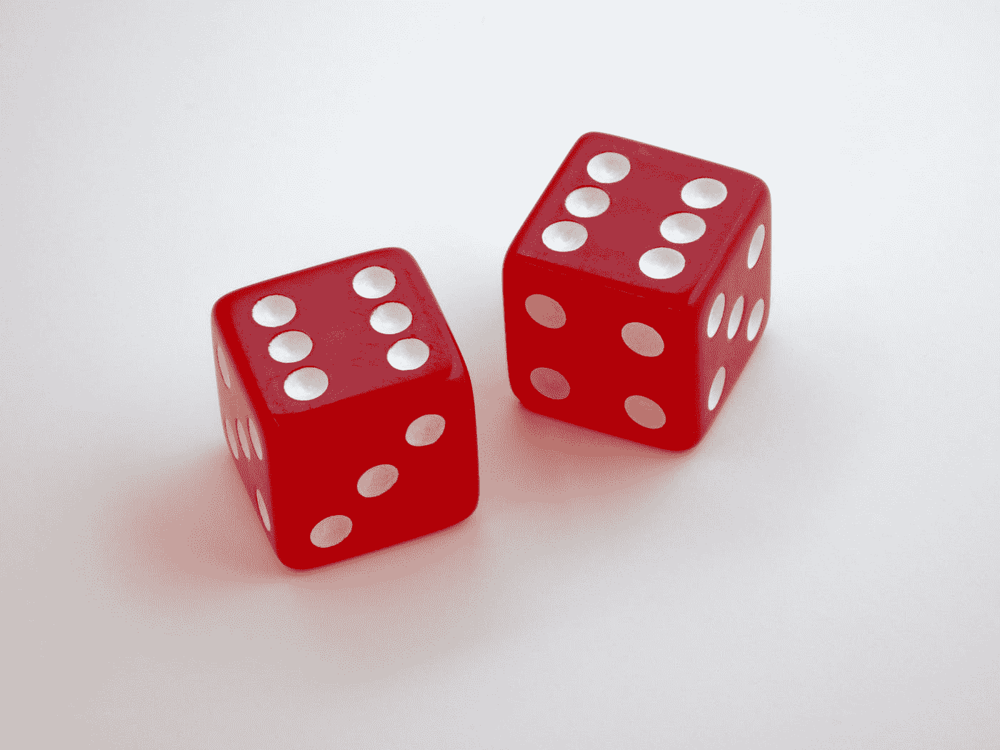

# 用 Vue 3 和 JavaScript 创建一个骰子游戏

> 原文：<https://javascript.plainenglish.io/create-a-dice-game-with-vue-3-and-javascript-f73e3a8df7aa?source=collection_archive---------14----------------------->



Photo by [Brett Jordan](https://unsplash.com/@brett_jordan?utm_source=medium&utm_medium=referral) on [Unsplash](https://unsplash.com?utm_source=medium&utm_medium=referral)

Vue 3 是易于使用的 Vue JavaScript 框架的最新版本，让我们可以创建前端应用程序。

在本文中，我们将看看如何用 Vue 3 和 JavaScript 创建一个骰子游戏。

# 创建项目

我们可以用 Vue CLI 创建 Vue 项目。

要安装它，我们运行:

```
npm install -g @vue/cli
```

与 NPM 或:

```
yarn global add @vue/cli
```

用纱线。

然后我们运行:

```
vue create dice-game
```

并选择所有默认选项来创建项目。

# 创建骰子游戏

为了创建骰子游戏，我们编写:

```
<template>
  <div>
    <button @click="roll">roll</button>
    <p>rolled dice value: {{ rolledValue }}</p>
  </div>
</template><script>
export default {
  name: "App",
  data() {
    return {
      rolledValue: 1,
    };
  },
  methods: {
    roll() {
      this.rolledValue = Math.ceil(Math.random() * 5 + 1);
    },
  },
};
</script>
```

我们有一个滚动按钮，当我们点击它时会调用`roll`。

其下方显示`rolledValue`。

在脚本标签中，我们有一个返回带有`rolledValue`反应属性的对象的`data`方法。

`roll`方法将`rolledValue`设置为 1 到 6 之间的一个随机数。

`Math.random`返回一个介于 0 和 1 之间的数字，所以我们必须将返回值乘以 5，再加 1，得到一个介于 1 和 6 之间的值。

`Math.ceil`返回向上舍入到最接近整数的数字。

# 结论

我们可以用 Vue 3 和 JavaScript 轻松创建一个骰子游戏。

喜欢这篇文章吗？如果有，通过 [**订阅我们的 YouTube 频道**](https://www.youtube.com/channel/UCtipWUghju290NWcn8jhyAw?sub_confirmation=true) **获取更多类似内容！**

*更多内容看* [***说白了. io***](https://plainenglish.io/)