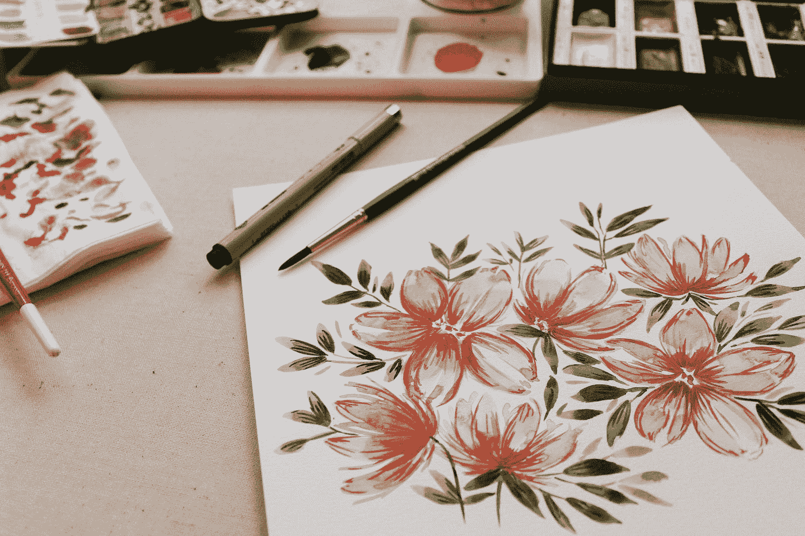

# 用 Vue 3 和 JavaScript 创建一个绘图应用程序

> 原文：<https://javascript.plainenglish.io/create-a-drawing-app-with-vue-3-and-javascript-78edbe88dc15?source=collection_archive---------17----------------------->



Photo by [Victoria Bilsborough](https://unsplash.com/@vicbils?utm_source=medium&utm_medium=referral) on [Unsplash](https://unsplash.com?utm_source=medium&utm_medium=referral)

Vue 3 是易于使用的 Vue JavaScript 框架的最新版本，它允许我们创建前端应用程序。

在本文中，我们将研究如何使用 Vue 3 和 JavaScript 创建一个绘图应用程序。

# 创建项目

我们可以使用 Vue CLI 创建 Vue 项目。

要安装它，我们运行:

```
npm install -g @vue/cli
```

与 NPM 或:

```
yarn global add @vue/cli
```

纱线。

然后我们运行:

```
vue create drawing-app
```

并选择所有默认选项来创建项目。

# 创建绘图应用程序

为了创建绘图应用程序，我们写道:

```
<template>
  <canvas
    ref="canvas"
    @mousemove="draw"
    @mousedown="setPosition"
    @mouseenter="setPosition"
    @resize="resize"
    id="canvas"
  ></canvas>
</template><script>
export default {
  name: "App",
  data() {
    return {
      pos: {},
    };
  },
  methods: {
    setPosition(e) {
      this.pos.x = e.clientX;
      this.pos.y = e.clientY;
    },
    resize() {
      const { canvas } = this.$refs;
      const ctx = canvas.getContext("2d");
      ctx.canvas.width = window.innerWidth;
      ctx.canvas.height = window.innerHeight;
    },
    draw(e) {
      if (e.buttons !== 1) {
        return;
      }
      const { canvas } = this.$refs;
      const ctx = canvas.getContext("2d");
      const { pos } = this;
      ctx.beginPath();
      ctx.lineWidth = 5;
      ctx.lineCap = "round";
      ctx.strokeStyle = "green";
      ctx.moveTo(pos.x, pos.y);
      this.setPosition(e);
      ctx.lineTo(pos.x, pos.y);
      ctx.stroke();
    },
  },
};
</script><style scoped>
#canvas {
  border: 1px solid black;
}
</style>
```

在模板中，我们添加了画布元素。

我们给它分配一个引用，这样我们就可以访问组件代码。

此外，我们在画布上添加了一些事件侦听器。

`mousemove`当我们移动鼠标时，倾听鼠标的移动并在画布上绘制。

`mousedown`和`mouseenter`事件分别在我们点击鼠标按钮或进入画布时被触发，所以我们设置位置开始画线。

当我们改变屏幕大小时`resize`事件被触发，我们需要倾听它来改变画布大小以匹配屏幕。

在脚本标签中，我们有`data`方法，返回我们用来存储鼠标位置的`pos`反应属性。

`setPosition`方法将`this.pos`设置为鼠标的当前位置。

`resize`方法获取画布，分别设置画布的宽度和高度。

我们调整它的大小，以便绘制时鼠标位置与画布位置匹配。

`draw`方法绘图。

我们只在点击鼠标左键时绘制，并且通过检查`e.buttons`是否为 1 来检查。

然后我们从`this.pos`得到画布和鼠标的位置。

我们调用`beginPath`开始绘图。

`lineWidth`设置线宽。

`lineCap`设置行尾样式。

`strokeStyle`设置线条的颜色。

`moveTo`将光标移动到指定位置。

`lineTo`将直线画至指定位置。

`stroke`绘制线条。

在样式标签中，我们设置了边框，这样就可以看到画布的位置。

# 结论

我们可以用 Vue 3 和 JavaScript 轻松创建一个绘图应用程序。

*更内容见于* [***普通英语中***](https://plainenglish.io/)