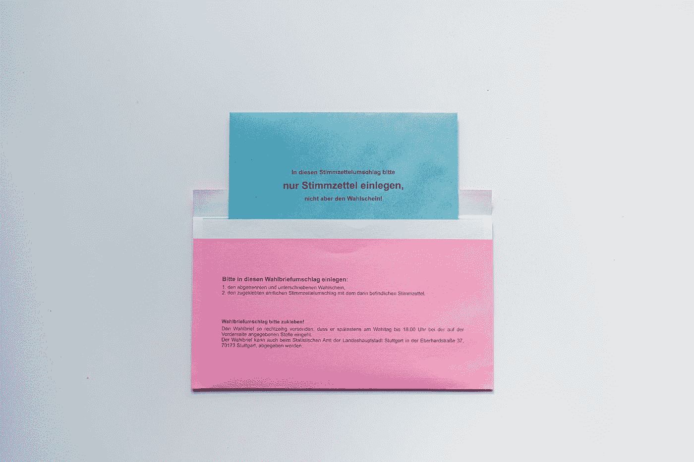

# 用 Vue 3 和 JavaScript 创建一个抽认卡应用程序

> 原文：<https://javascript.plainenglish.io/create-a-flashcard-app-with-vue-3-and-javascript-38397c01d7b1?source=collection_archive---------12----------------------->



Photo by [Bianca Ackermann](https://unsplash.com/@biancablah?utm_source=medium&utm_medium=referral) on [Unsplash](https://unsplash.com?utm_source=medium&utm_medium=referral)

Vue 3 是易于使用的 Vue JavaScript 框架的最新版本，让我们可以创建前端应用程序。

在本文中，我们将看看如何用 Vue 3 和 JavaScript 创建一个抽认卡应用程序。

# 创建项目

我们可以用 Vue CLI 创建 Vue 项目。

要安装它，我们运行:

```
npm install -g @vue/cli
```

与 NPM 或:

```
yarn global add @vue/cli
```

用纱线。

然后我们运行:

```
vue create flashcard
```

并选择所有默认选项来创建项目。

我们还需要`uuid`包来为我们的杂货清单项目生成唯一的 id。

为此，我们运行:

```
npm i uuid
```

# 创建抽认卡应用程序

为了创建抽认卡应用程序，我们编写:

```
<template>
  <form @submit.prevent="add">
    <div>
      <label>question</label>
      <input v-model="item.question" />
    </div>
    <div>
      <label>answer</label>
      <input v-model="item.answer" />
    </div>
    <button type="submit">submit</button>
  </form>
  <div v-for="(item, index) of items" :key="item.id">
    <b>question</b>
    <p>{{ item.question }}</p>
    <b>answer</b>
    <p>{{ item.answer }}</p>
    <button @click="deleteItem(index)">delete</button>
  </div>
</template><script>
import { v4 as uuidv4 } from "uuid";
export default {
  name: "App",
  data() {
    return {
      item: {
        question: "",
        answer: "",
      },
      items: [],
    };
  },
  methods: {
    add() {
      this.items.push({
        id: uuidv4(),
        ...this.item,
      });
      this.item = {};
    },
    deleteItem(index) {
      this.items.splice(index, 1);
    },
  },
};
</script>
```

在模板中，我们有一个表单，可以让我们在表单中输入问题和答案。

`v-model`绑定到输入的问题和答案的`item.question`和`item.answer`反应属性。

提交按钮触发了运行`add`方法的`submit`事件。

`prevent`修饰符停止默认的服务器端提交行为。

我们使用`v-for`来渲染`items`反应属性中的项目。

我们呈现来自对象条目的`item.question`和`item.answer`值。

我们有一个按钮让我们用`deleteItem`方法删除项目。

`deleteItem`获取要删除的项目的索引。

`key` prop 让我们为项目设置唯一的 ID，以便 Vue 3 可以正确地跟踪渲染的数组项目。

`data`方法返回一个带有反应属性初始值的对象。

`add`方法用一个对象调用`push`向数组中添加一个项目。

在推之前，我们将`id`与其他`this.item`属性合并以形成最终的对象。

`deleteItem`用`index`和 1 调用`splice`删除给定索引的项目，并且只删除 1 个项目。

现在我们看到，当我们输入一些内容并单击 submit 时，列表就会显示出来。

# 结论

我们可以用 Vue 3 和 JavaScript 轻松创建自己的抽认卡应用。

*详见*[***plain English . io***](https://plainenglish.io/)