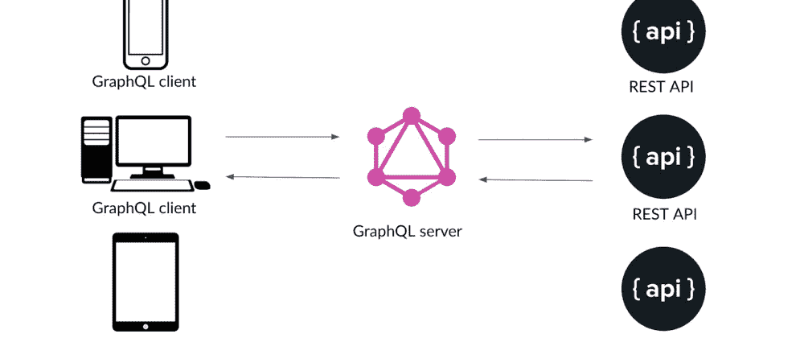
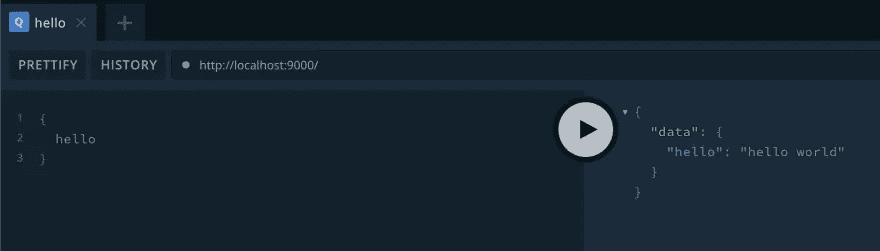
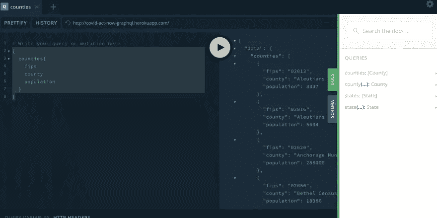
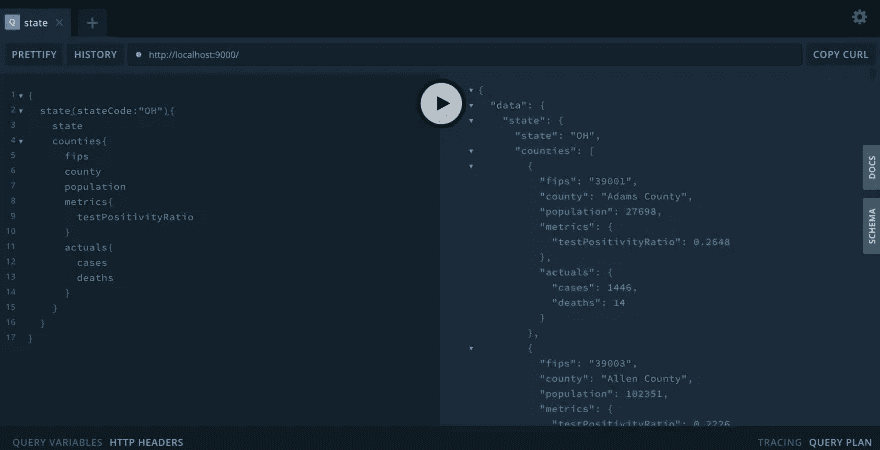

# 为您的 REST API 创建一个 GraphQL API 包装器

> 原文：<https://javascript.plainenglish.io/create-a-graphql-api-wrapper-for-your-rest-api-7873c63fcce2?source=collection_archive---------10----------------------->

## 使用现有的 REST API，我们将学习如何围绕现有的服务创建 GraphQL API，而不是完全重写



GraphQL Consuming REST Services

# 介绍

GraphQL 是一个在客户端使用的有趣的服务。凭借其文档、游乐场和状态管理选项，如 [relay](https://relay.dev/) 或 [apollo](https://www.apollographql.com/) ，开发人员体验对我和我的同事来说是一次爆炸。有一种常见的误解，认为可以使用 REST 或 GraphQL，但不能两者都用。你可以两者兼得！当我学习的时候，我认为这是 GraphQL 或者 REST 的全部。要了解这些规范之间的差异，请访问[通过 REST 了解 GraphQL】。我们中的许多人都有这样的情况，我们不想完全放弃现有的 REST API 来开始尝试 GraphQL。](https://johnfay.dev/blog/understanding-graphql/)

最后，您将拥有一个 GraphQL API，它利用了您在 JavaScript 中选择的 REST API。为了快速起见，我将使用 [Covid Act Now API](https://apidocs.covidactnow.org/) ，但是您可以随意替换您自己的 REST API 和模型。如果您将使用相同的 API，我建议[现在获取您的 API 密钥](https://apidocs.covidactnow.org/access)。这是即时的，所以不需要等待时间！让我们开始吧。


# 构建您的 API

我们将使用 hello world 脚本设置 JavaScript，将其转换为 GraphQL hello world 端点，添加 REST 数据源，并建立关系以组合 API 调用。

# 项目设置

项目设置有一些可选步骤，例如使用 [nodemon](https://nodemon.io/) 为我们重新加载应用程序，使用 [dotenv](https://github.com/motdotla/dotenv) 加载环境变量。这将是您在 JavaScript 中添加您喜欢使用的工具的地方。

# 创建项目

```
mkdir covid-graphql
```

# 初始化 npm 包

```
npm init -y
```

# 创建一个源目录和一个`index.js`文件

```
touch src/index.js
```

# 给`index.js`添加一个`hello world`日志

```
console.log("hello world")
```

# 打开`package.json`，添加`dev`和`start`脚本

```
"dev": "nodemon src/index.js --watch src/",
 "start": "node src/index.js"
```

*   `dev`利用 nodemon 来监视`src`目录中的任何变化。
*   `start`使用 node(比生产中的 nodemon 轻)。

# 在终端运行`npm run dev`

确保我们正常运行，不需要为未来的每一项变化重启我们的应用。

```
hello world
```

如果你认为这毫无意义，请对我宽容些。它会帮助某人。


Be nice

# 安装依赖项

```
npm install apollo-server apollo-datasource-rest dotenv
```

## 阿波罗服务器

用于启动 express 服务器。

## 阿波罗-数据源-休息

用于利用 REST 源周围的缓存和其他基于类的继承。

## dotenv

用于传入环境变量。

## nodemon

在开发模式下使用，因此您不需要在每次文件更改时重新启动应用程序。

# 创建 Hello World 模式

这个模式文件将是我们定义 GraphQL API 的地方。

```
touch src/schema.js// schema.js
const { gql } = require("apollo-server")const typeDefs = gql`
  type Query {
    hello: String
  }
`module.exports = typeDefs
```

我们在`typeDefs`对象中所说的是，当我们在 graphQL API 中进行查询时，我们只能查询`hello`并且我们期望一个可空的`String`返回类型。为了使响应不可为空，我们将在末尾添加一个感叹号，就像这样`hello: String!`。

# 构建 Apollo 服务器

```
// src/index.js
require("dotenv").config()
const { ApolloServer } = require("apollo-server")
const typeDefs = require("./schema")const server = new ApolloServer({ typeDefs })
const port = process.env.port || 9000server.listen(port).then(() => {
  console.log(`server running 🚀 http://localhost:${port}`)
})
```

在 [http://localhost:9000](http://localhost:9000/) 查看您的模式定义。如果您碰巧尝试查询`hello`，您将会发现响应为空。我们仍然需要定义解析器响应。


You’re not losing it…expected

# 为`hello`创建解析器

解析器是完成实际工作的地方。该模式根据客户端可以做什么来设置 API 的限制。实际上做这些工作是解析器的工作。类似于我以前帖子中的查询和突变解释，如果需要，我们将返回`Query`和`Mutation`。在 query 下，我们现在添加我们的`hello`解析器来返回`hello world`。

```
touch src/resolvers.jsmodule.exports = {
  Query: {
    hello: () => {
      return "hello world"
    }
  }
}
```

# 将解析器添加到`src/index.js` apollo-server 声明

```
const resolvers = require("./resolvers")const server = new ApolloServer({ typeDefs, resolvers })
```

此时，当您查询`hello`时，您应该会得到预期的响应。



Hello world resolver

# 连接 REST 源

在这里，我们将构建一个 REST 数据源类，它将能够在我们的解析器中使用，以利用一些实际的结果。

# 创建 REST 数据源

```
mkdir src/datasources
touch src/datasources/CovidActNowAPI.jsconst { RESTDataSource } = require("apollo-datasource-rest")class CovidActNowAPI extends RESTDataSource {
  constructor() {
    super()
    this.baseURL = "https://api.covidactnow.org/v2/"
  }
}module.exports = CovidActNowAPI
```

这里我们真正需要做的是扩展`RESTDataSource`来访问内存缓存、HTTP 助手函数和分页。要了解更多信息，请访问 [apollo-datasource-rest](https://github.com/apollographql/apollo-server/tree/main/packages/apollo-datasource-rest) 。

# 创造。简介中的 env 文件和插件 API 密钥

希望您在[从 Covid Act Now api 获得您的 API 密钥](https://apidocs.covidactnow.org/access)后，已经将密钥存放好了。


What is this amateur hour?

```
touch .envCOVID_ACT_NOW=YOUR_KEY_HERE
```

# 添加一些方法来获取 CovidActNowAPI 类中的州和县

看一下 [Covid Act Now API 文档](https://apidocs.covidactnow.org/api#tag/State-Data)我们可以看到，JSON 响应可以在我们的 base URL([https://api.covidactnow.org/v2/](https://api.covidactnow.org/v2/))加上`states`中找到，针对美国所有州，`state/OH`针对美国个别州，如俄亥俄州，`counties`针对美国所有县，`county/39001`针对个别县，通过 [fips](https://www.nrcs.usda.gov/wps/portal/nrcs/detail/national/home/?cid=nrcs143_013697) 加上我们的 API 键作为参数。还有一个可选的`.timeseries`,我们可以添加进来，以包含度量和实际数字之类的一组值。对于获取州或县的列表，我选择避免这样做，因为这是一个大得多的有效负载，但我启用了美国各个州和县的时间序列。使用它，我们现在可以创建与 REST 服务交互的函数。

```
async getAllStates() {
    const response = await this.get(`states.json?apiKey=${process.env.COVID_ACT_NOW}`);
    return response || [];
}async getState(stateCode) {
    const response = await this.get(
    `state/${stateCode}.timeseries.json?apiKey=${process.env.COVID_ACT_NOW}`
    );
    return response;
}async getAllCounties() {
    const response = await this.get(`counties.json?apiKey=${process.env.COVID_ACT_NOW}`);
    return response || [];
}async getCounty(fips) {
    const response = await this.get(
    `county/${fips}.timeseries.json?apiKey=${process.env.COVID_ACT_NOW}`
    );
    return response;
}
```

# 将数据源添加到 apollo-graphql 服务器

```
// index.js
const CovidActNowAPI = require("./datasources/CovidActNowAPI")const server = new ApolloServer({
  dataSources: () => ({
    covidApi: new CovidActNowAPI()
  }),
  typeDefs,
  resolvers
})
```

# 更新模式以将州和县反映为查询

这应该是你最费时间的部分。相对于 Covid Act Now API，他们有一个方便的[模型](https://apidocs.covidactnow.org/api#tag/Actuals)部分，将向您显示一些您需要重新创建的子类别类型，以告诉该 API 的消费者什么是可能的。对于任何 API，我在这里的过程都只是浏览 JSON 响应，并确保我想要的所有可用数据都包含在内。每个嵌套对象都需要模式中的类型才能被识别。如果你不需要它，不要为它创建类型，它会被忽略😊您还可以参考 [apollo 文档—构建一个模式](https://www.apollographql.com/docs/tutorial/schema/)来查看这里的任何语法，比如不可空的(！)、查询或变异的输入参数(`county(fips: String!): County`)或数组响应(`[County]`)。

```
const typeDefs = gql`
  type Query {
    counties: [County!]!
    county(fips: String!): County
    states: [State!]!
    state(stateCode: String!): State
  }type County {
    fips: String!
    country: String!
    state: String!
    county: String!
    population: Int!
    metrics: Metric!
    riskLevels: RiskLevel!
    actuals: Actual!
    lastUpdatedDate: String
    url: String
    metricsTimeseries: [Metric!]
    actualsTimeseries: [Actual!]
    riskLevelsTimeseries: [RiskLevel!]
  }type State {
    fips: String!
    country: String!
    state: String!
    population: Int!
    metrics: Metric!
    riskLevels: RiskLevel!
    actuals: Actual!
    lastUpdatedDate: String
    url: String
    metricsTimeseries: [Metric!]
    actualsTimeseries: [Actual!]
  }type Metric {
    testPositivityRatio: Float
    caseDensity: Float
    contactTracerCapacityRatio: Float
    infectionRate: Float
    infectionRateCI90: Float
    icuHeadroomRatio: Float
    icuHeadroomDetails: ICUHeadroomDetails
    icuCapacityRatio: Float
    date: String
  }type ICUHeadroomDetails {
    currentIcuCovid: Int
    currentIcuCovidMethod: String
    currentIcuNonCovid: Int
    currentIcuNonCovidMethod: String
    icuCapacityRatio: Float
  }type RiskLevel {
    overall: Int
    testPositivityRatio: Float
    caseDensity: Float
    contactTracerCapacityRatio: Float
    infectionRate: Float
    icuHeadroomRatio: Float
    icuCapacityRatio: Float
    date: String
  }type Actual {
    cases: Int
    deaths: Int
    positiveTests: Int
    negativeTests: Int
    contactTracers: Float
    hospitalBeds: HospitalBed
    icuBeds: ICUBed
    newCases: Int
    date: String
  }type HospitalBed {
    capacity: Int
    currentUsageTotal: Int
    currentUsageCovid: Int
    typicalUsageRate: Float
  }type ICUBed {
    capacity: Int
    currentUsageTotal: Int
    currentUsageCovid: Int
    typicalUsageRate: Float
  }
`
```

我全力以赴做模特。我只留下了很少的几个键，在这里我得到了很多有用的信息。如果这是一个很大的量，开始小的和递增的插件类型。或者一次性完成。


I’m kind of a big deal…

# 更新解析程序以正确解析

作为任何查询函数的一部分，每个查询都有一个输入列表。

```
fieldName: (parent, args, context, info) => data
```

我们的函数不需要`parent`或`info`，但是我们需要的是访问输入`args`或参数和`context`，因为这包括嵌套在我们定义的 Apollo GraphQL 服务器中的`dataSources`。

```
// resolvers.js
Query: {
    counties: (_, __, { dataSources }) => dataSources.covidApi.getAllCounties(),
    county: (_, { fips }, { dataSources }) => dataSources.covidApi.getCounty(fips),
    states: (_, __, { dataSources }) => dataSources.covidApi.getAllStates(),
    state: (_, { stateCode }, { dataSources }) => dataSources.covidApi.getState(stateCode),
},
```

# 使生效

一旦您将新创建的 REST 数据源连接到解析器，您应该能够在操场上进行测试。



Sample Counties response in GraphQL

# 通过 API 调用伪造关系

假设此 API 的消费者正在构建一个美国地图，展示新冠肺炎的一个州及其县的影响。他们希望美国的一个州和所有的县都能呈现他们的 UI。如果这还不是一个 REST 端点，那么它是两个端点:`/state/OH`和`/counties`端点。让我们把这些结合起来，把 GraphQL 推离客户端。

# 将县数组添加到州

```
// schema.js
const typeDefs = gql`
  type State {
    counties: [County!] // highlight-line
    fips: String!
    country: String!
    state: String!
    population: Int!
    metrics: Metric!
    riskLevels: RiskLevel!
    actuals: Actual!
    lastUpdatedDate: String
    url: String
    metricsTimeseries: [Metric!]
    actualsTimeseries: [Actual!]
  }
```

# 获取`getState`中的县

```
// CovidActNowAPi.jsasync getState(stateCode) {
    const state = await this.get(
      `state/${stateCode}.timeseries.json?apiKey=${process.env.COVID_ACT_NOW}`
    );
    const counties = await this.get(`counties.json?apiKey=${process.env.COVID_ACT_NOW}`);return {
      ...state,
      counties: counties.filter(({ state: stateCode }) => stateCode === state.state),
    };
  }
```

如果你愿意，你也可以在此时将县添加到`getAllStates`函数中。虽然它的性能不会很好，但在这里比在客户端要好。


We are laughing… Anchorman

# 验证州内的县

测试以确保您可以查询您期望的内容。

```
{
  state(stateCode:"OH"){
    state
    counties{
      fips
      county
      population
      metrics{
        testPositivityRatio
      }
      actuals{
        cases
        deaths
      }
    }
  }
}
```



Counties nested under a State in GraphQL

# 接下来:模式优先与代码优先

如果您有兴趣了解这两种 GraphQL 方法背后的利与弊，请继续关注我的下一篇文章，在这篇文章中，我们将使用本教程中编写的 API，并通过从模式优先切换到代码优先以及使用更好的开发人员工具进行扩展来更进一步。我在想下一步该去哪里。如果你想看具体的东西，请告诉我。


Immediately regret this decision — Anchorman

# 摘要

我们已经从头开始创建了一个 GraphQL API，构建了一个 REST 服务数据源来利用我们现有的服务，并开始利用这个平台来看到一些 GraphQL 的好处。如果您在任何时候迷失了方向，这里的[是`part1`分支上的存储库代码。你也可以参考 Heroku 上的](https://github.com/keonik/covid-graphql)[游乐场](https://covid-act-now-graphql.herokuapp.com/)来尝试一些查询。


Hooray!