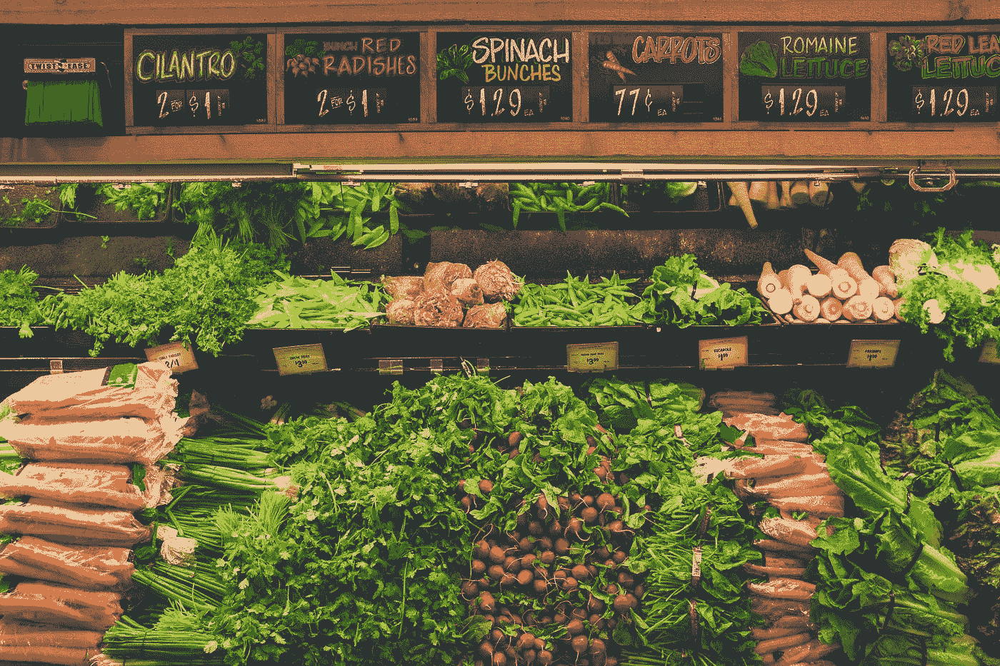

# 用 React 和 JavaScript 创建一个杂货清单应用程序

> 原文：<https://javascript.plainenglish.io/create-a-grocery-list-app-with-react-and-javascript-a4f057643ce1?source=collection_archive---------12----------------------->



Photo by [NeONBRAND](https://unsplash.com/@neonbrand?utm_source=medium&utm_medium=referral) on [Unsplash](https://unsplash.com?utm_source=medium&utm_medium=referral)

React 是一个易于使用的 JavaScript 框架，允许我们创建前端应用程序。

在本文中，我们将了解如何使用 React 和 JavaScript 创建一个购物清单应用程序。

# 创建项目

我们可以使用创建反应应用程序来创建反应项目。

要安装它，我们运行:

```
npx create-react-app grocery-list
```

与 NPM 一起创建我们的反应项目。

我们需要`uuid`来让我们轻松地为我们的待办事项创建唯一的 id。

要添加它，我们运行:

```
npm i uuidv4
```

# 创建杂货清单应用程序

为了创建杂货清单应用程序，我们写道:

```
import { useState } from "react";
import { v4 as uuidv4 } from "uuid";export default function App() {
  const [item, setItem] = useState("");
  const [items, setItems] = useState([]);
  const add = (e) => {
    e.preventDefault();
    if (!item) {
      return;
    }
    setItems((items) => [
      ...items,
      {
        id: uuidv4(),
        item
      }
    ]);
  }; const remove = (index) => {
    setItems((items) => items.filter((_, i) => i !== index));
  }; return (
    <div className="App">
      <form onSubmit={add}>
        <fieldset>
          <label>item</label>
          <input value={item} onChange={(e) => setItem(e.target.value)} />
        </fieldset>
        <button type="submit">add item</button>
      </form>
      {items.map((item, index) => {
        return (
          <div key={item.id}>
            <p>{item.item}</p>
            <button onClick={() => remove(index)}>remove</button>
          </div>
        );
      })}
    </div>
  );
}
```

我们用`useState`钩创造了`item`和`items`状态。

`item`有目文字。

`items`有物品数组。

然后我们添加`add`方法，该方法允许我们向`items`数组添加一个项目。

在其中，我们调用`e.preventDefault()`进行客户端提交。

然后检查是否设置了`item`。

如果是，那么我们通过回调调用`setItems`返回`items`数组，并在数组末尾添加新项。

`remove`方法通过回调调用`setItems`返回没有给定`index`项的`items`数组。

在`return`语句中，我们有一个带有`onSubmit`道具的表单，叫做`add`。

输入元件有`vbalue`和`onChange`支柱，使其成为受控输入。

我们将`item`值设置为`e.target.value`。

然后我们将`items`数组渲染成 div，里面有`item.item`文本。

当我们点击按钮时，它会调用`remove`。

# 结论

我们可以用 React 和 JavaScript 轻松创建一个购物清单应用程序。

*多内容见于* [***中***](https://plainenglish.io/)