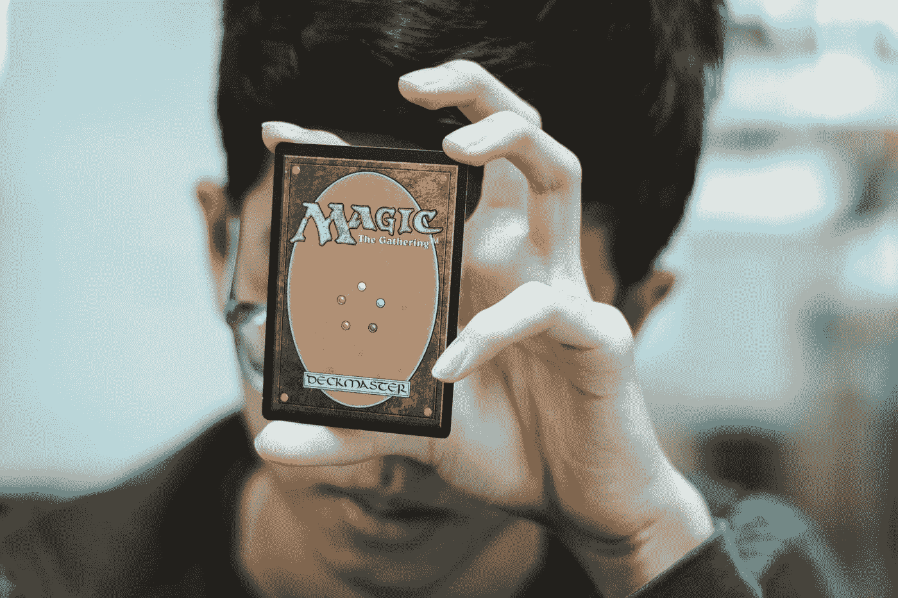

# 用 Vue 3 和 JavaScript 创建一个高低牌游戏

> 原文：<https://javascript.plainenglish.io/create-a-hi-low-card-game-with-vue-3-and-javascript-8521dcfac320?source=collection_archive---------16----------------------->



Photo by [Wayne Low](https://unsplash.com/@wayneshin?utm_source=medium&utm_medium=referral) on [Unsplash](https://unsplash.com?utm_source=medium&utm_medium=referral)

Vue 3 是易于使用的 Vue JavaScript 框架的最新版本，让我们可以创建前端应用程序。

在本文中，我们将看看如何用 Vue 3 和 JavaScript 创建一个高低牌游戏。

# 创建项目

我们可以用 Vue CLI 创建 Vue 项目。

要安装它，我们运行:

```
npm install -g @vue/cli
```

与 NPM 或:

```
yarn global add @vue/cli
```

用纱线。

然后我们运行:

```
vue create hi-low-game
```

并选择所有默认选项来创建项目。

# 创建高低牌游戏

为了创建高低游戏，我们编写:

```
<template>
  <form @submit.prevent="draw">
    <select v-model="guess">
      <option>lower</option>
      <option>higher</option>
    </select>
    <button type="submit">guess</button>
  </form>
  <p>score: {{ score }}</p>
  <p>last drawn card</p>
  
  <p>currently drawrn card</p>
  
</template><script>
const suits = ["diamonds", "clubs", "hearts", "spades"];
const values = ["ace", 2, 3, 4, 5, 6, 7, 8, 9, 10];
const cards = [];
for (const s of suits) {
  for (const v of values) {
    cards.push(`${s}_${v}`);
  }
}
export default {
  name: "App",
  data() {
    return {
      score: 0,
      cards: [...cards].sort(() => Math.random() - 0.5),
      drawnCards: [],
      guess: "lower",
    };
  },
  methods: {
    draw() {
      const drawnCard = this.cards.pop();
      this.drawnCards.push(drawnCard);
      const indexLastCard = cards.indexOf(
        this.drawnCards[this.drawnCards.length - 2]
      );
      const indexDrawnCard = cards.indexOf(
        this.drawnCards[this.drawnCards.length - 1]
      );
      if (
        (indexLastCard < indexDrawnCard && this.guess === "higher") ||
        (indexLastCard > indexDrawnCard && this.guess === "lower")
      ) {
        this.score++;
      }
    },
  },
};
</script>
```

在模板中，我们有一个带有选择下拉菜单的表单元素，让我们选择下一张牌是高于还是低于上一张抽取的牌。

`@submit`指令让我们监听`submit`事件，当我们点击一个`type`设置为`submit`的按钮时就会触发该事件。

`prevent`修饰符让我们阻止服务器端提交，而是进行客户端提交。

表单下方显示`score`。

我们在下面显示上一张抽中的牌和当前抽中的牌的图片。

然后，我们通过组合来自`suits`和`values`数组的值，按照它们的大小顺序创建`cards`数组。

在`data`方法中，。我们在返回的对象中有反应属性。

`score`已得分。

`cards`有一个和`sort`混洗的`cards`数组的副本。

`guess`有可能是`'lower'`或`'higher'`的猜测。

在`draw`方法中，我们用`pop`取卡。

然后我们把它推进`drawnCards`。

然后我们从原始的`card`数组中得到每张卡片的索引，这个数组是按照它们的大小排序的。

最后，我们有一个`if`模块，比较最后一张和当前抽的牌的索引和猜测。

如果它们符合条件，则`score`增加 1。

# 结论

我们可以用 Vue 3 和 JavaScript 轻松创建一个高低牌游戏。

*更多内容请看*[***plain English . io***](https://plainenglish.io/)