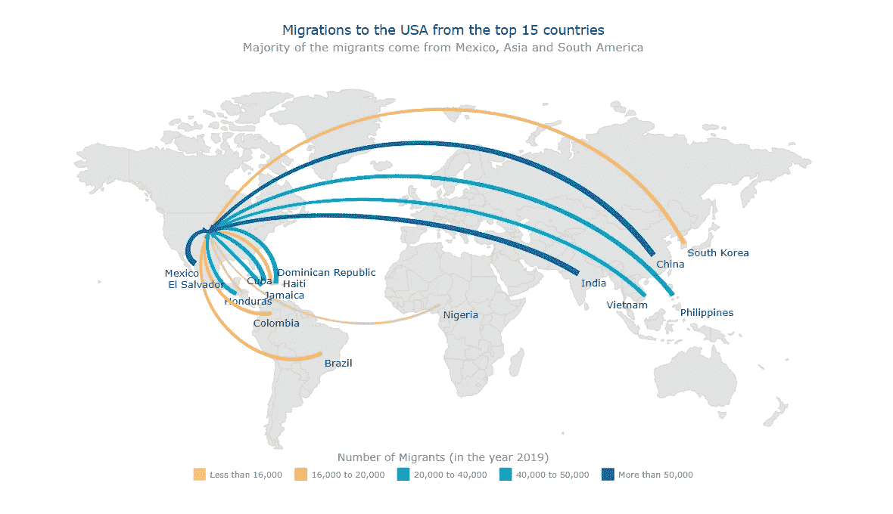

# 通过 4 个简单的步骤创建一个 JavaScript 流程图

> 原文：<https://javascript.plainenglish.io/create-a-javascript-flow-map-in-4-easy-steps-424f9a80b628?source=collection_archive---------22----------------------->

## 演示如何创建交互式 JavaScript 流图的分步教程。通过向美国移民的可视化数据来说明。


使用 JavaScript 为 Web 创建交互式流程图似乎很复杂。但其实不是！这个简单易懂的教程将向你展示如何不用太多的努力就能构建漂亮的 JS 流程图。

在疫情的困难时期，人们对世界各地的移民身份感到困惑和担忧。我决定看看美国的移民数据，美国的移民比世界上任何其他国家都多。在这里，我探讨了这些移民来自哪里，并代表了 2019 年向美国贡献最多移民的前 15 个国家。

流动地图似乎是展示移民从不同国家流入美国的最佳方式。在继续之前，让我给你一个关于流程图及其用途的简单想法。

# 什么是流程图？

[流程图](https://www.anychart.com/chartopedia/chart-type/flow-map/)从地理上可视化对象的移动，例如，从一个位置到另一个位置的人员或货物及其数量。

流向图是一种连接图，它通过直线或曲线连接地图上的点，并带有指示流向的箭头或标记来绘制。一般来说，流量的大小用线条的粗细来表示。

这些地图中连接器的起点和终点是由纬度和经度参数定义的，因此有必要为每个连接器设置这些参数。注意，应该首先定义点的纬度，然后定义每个点的经度。

例如，[这是](https://codepen.io/shacheeswadia/pen/abJJxvx)我将在本教程结束时创建的流程图。[现在也可以在 [AnyChart 游乐场](https://playground.anychart.com/a8W1R42d/)上找到。]


# 使用 JavaScript 创建流程图

有很多好的 [JavaScript 图表库](https://en.wikipedia.org/wiki/Comparison_of_JavaScript_charting_libraries)可以用来创建引人注目的数据可视化。它们中的许多都提供了构建地图的功能，并且各有所长。因此您可以使用最适合您的项目需求的库。

在本教程中，我使用的是 [AnyChart](https://www.anychart.com/) 。它看起来最适合在这里用现成的流程图选项和深入的[文档](https://docs.anychart.com/)来理解流程。

流程图比条形图或饼图等基本图表稍微复杂一些，但我会带您浏览代码行，使其更容易理解。一些关于 HTML 和 JavaScript 的背景知识会帮助你更快地理解，但这并不太难。看看如何通过 4 个简单的步骤创建一个漂亮的交互式 JavaScript 流图。

## 1.创建 HTML 页面

第一步是创建一个空白的 HTML 页面来保存交互流程图。向该页面添加一个具有唯一 id 的`div`元素，稍后将引用该元素。

我将 div 的宽度和高度设置为 100%,以便地图显示在整个屏幕上。这可以根据需求和偏好进行修改。

```
<html>
  <head>
    <title>JavaScript Flow Map</title>
    <style type="text/css">      
      html, body, #container { 
        width: 100%; height: 100%; margin: 0; padding: 0; 
      } 
    </style>
  </head>
  <body>
    <div id="container"></div>
  </body>
</html>
```

## 2.添加必要的脚本

要使用图表库来构建数据可视化，您需要链接您正在使用的库的适当 JS 脚本。所有这些脚本文件都包含在 HTML 页面中。

为了创建 JS 流程图，我将添加 AnyChart 的' [core](https://docs.anychart.com/Quick_Start/Modules#core) 和' [geo maps](https://docs.anychart.com/Quick_Start/Modules#geo_maps) 模块。

由于地图是整个世界的，我从图书馆的地图收藏中链接了包含世界地理数据的文件，这些地图也可以在图书馆的 [CDN](https://cdn.anychart.com/) 上找到。

此外，我将使用另一个 JavaScript 库— [Proj4js](http://proj4js.org/) —简而言之，它负责绘制各个地理区域的坐标。

```
<html>
  <head>
    <title>JavaScript Flow Map</title>
    <script src="https://cdn.anychart.com/releases/8.10.0/js/anychart-core.min.js"></script>
    <script src="https://cdn.anychart.com/releases/8.10.0/js/anychart-map.min.js"></script> <script src="https://cdn.anychart.com/geodata/latest/custom/world/world.js"></script>
    <script src="https://cdnjs.cloudflare.com/ajax/libs/proj4js/2.3.15/proj4.js"></script> <style type="text/css">      
      html, body, #container { 
        width: 100%; height: 100%; margin: 0; padding: 0; 
      } 
    </style>
  </head>
  <body>  
    <div id="container"></div>
    <script>
      ***// All the code for the JS flow map will come here***
    </script>
  </body>
</html>
```

## 3.连接数据

对于地图，数据需要显示纬度和经度坐标以及其他信息。我通过整理来自维基百科的移民信息并添加来自一个名为 Latlong 的网站的坐标创建了这个数据集。

对于流程图，我需要源国家和目的国家的经纬度。这里，所有数据点的目的地国家都是美国。要查看数据集的外观，您可以在这里找到文件。

为了加载数据文件，我将在 HTML 页面的`<head>`部分包含 AnyChart 的[数据适配器模块](https://docs.anychart.com/Quick_Start/Modules#data_adapter)[并利用 HTML 页面主体中`<script>`标签内的`loadJsonFile()`方法加载带有用于流图可视化的 JSON 数据的文件]。

```
<html>
  <head>
    <title>JavaScript Flow Map</title>
    <script src="https://cdn.anychart.com/releases/8.10.0/js/anychart-core.min.js"></script>
    <script src="https://cdn.anychart.com/releases/8.10.0/js/anychart-map.min.js"></script> <script src="https://cdn.anychart.com/geodata/latest/custom/world/world.js"></script>
    <script src="https://cdnjs.cloudflare.com/ajax/libs/proj4js/2.3.15/proj4.js"></script> <script src="https://cdn.anychart.com/releases/8.10.0/js/anychart-data-adapter.min.js"></script> <style type="text/css">      
      html, body, #container { 
        width: 100%; height: 100%; margin: 0; padding: 0; 
      } 
    </style>
  </head>
  <body>  
    <div id="container"></div>
    <script>anychart.data.loadJsonFile('https://gist.githubusercontent.com/shacheeswadia/a20ba5b62cef306ccc1a8e8857e5316a/raw/0337b16fa8dc4de97263bc0a4ededf935a529c35/migration-data.json', function (data) { ***// The JS flow map's code will come here***}); </script>
  </body>
</html>
```

## 4.写 JS 代码画流程图

首先，我将把所有代码放在`anychart.onDocumentReady()`函数中，这将确保在执行任何操作之前页面被完全加载。接下来，我将使用`anychart.data.loadJsonFile()`函数加载数据。

现在，我使用连接器函数创建流地图，因为这是一种连接器地图，然后设置地理数据和设置，以确保世界上的所有区域都清晰可见。

```
anychart.onDocumentReady(function () {anychart.data.loadJsonFile('https://gist.githubusercontent.com/shacheeswadia/a20ba5b62cef306ccc1a8e8857e5316a/raw/0337b16fa8dc4de97263bc0a4ededf935a529c35/migration-data.json', function (data) { ***// сreate a connector map chart instance***  var map = anychart.connector(); ***// include the world map geodata***  map.geoData('anychart.maps.world'); ***// darken all regions***  map
   .unboundRegions()
   .enabled(true)
   .fill('#E1E1E1')
   .stroke('#D2D2D2');})});
```

我给图表添加了一个标题，并允许重叠，这样所有的数据点及其标签都可以在地图上看到，即使它们重叠了。

```
***// set the map chart title*** map
  .title('Migrations to the USA from the top 15 countries');***// display all labels even if there is an overlap*** map 
  .overlapMode("allow-overlap");
```

现在是创建代表各种连接的连接器系列的主要部分。

为此，我创建了一个以数据为参数的助手函数。在函数中，我创建了将形成连接线的序列，并在 100%位置添加了箭头标记，这是目的地，因为我们的流是从各个来源国到目的地国—美国。

然后，我添加显示来源国家名称的标签。

```
***// a helper function to create the series
// that will form the connector lines***
var createSeries = function (data) { ***// create and customize the connector series***
  var connectorSeries = map
    .connector(data); connectorSeries
    .markers()
    .position('100%')
    .size(10); ***// set the labels for the source countries***  connectorSeries
    .labels()
    .enabled(true)
    .format(function () {
      return this.getData('from');
    });};
```

我现在设置数据，并调用我用该数据集作为参数创建的函数。最后一步是设置容器来引用之前添加的 div 并绘制地图。

```
***// create a dataset from the data*** var dataSet = anychart.data.set(data).mapAs();createSeries(dataSet);***// set the container*** map.container('container');***// draw the map*** map.draw();
```

瞧啊！一个漂亮的、功能性的、基于 JavaScript 的流程图就完成了！创建这样一个交互式数据可视化并不困难，不是吗？


> ***看看这个初始版本上的***[***CodePen***](https://codepen.io/shacheeswadia/pen/gOmwpXP)***【或者*** [***游乐场***](https://playground.anychart.com/yR1yOY6X/) ***】。***

# 定制 JS 流程图

刚刚使用 JavaScript 构建的现有流程图很好地展示了大多数移民来自哪里。但是没有显示每个国家的移民数量。因此，我将自定义地图来显示这一点，并使用一些额外的代码使地图更具洞察力。我还会改进视觉审美，做一些其他的小改动。

## A.设置连接器的颜色和大小以及图例

我决定用连接线的粗细和调色板来表示从每个国家流向美国的移民数量。没有必要两者都做，因为任何一个指标都可以使用，但我喜欢当两者都存在时，洞察力更容易阅读。

我修改了助手函数，使其包含名称和颜色参数以及数据。我将使用名称来标识连接器系列并管理线条的粗细，而颜色变量将指示我将在为每个系列调用函数时指定的颜色。

然后，我将名称和颜色添加到连接器系列，并添加悬停在线条和标记上的设置。

接下来，我根据系列的名称设置线条的粗细。这种命名是基于迁移者的数量，一旦函数被调用，这将变得更加清楚。

因为连接器系列根据数据有不同的颜色，所以我添加了一个颜色图例。

如果这一切听起来很复杂，不要不知所措。一旦你看了代码和注释以及每一个片段，它会更有意义。

```
***// a helper function to create the series
// that will form the connector lines***
var createSeries = function (name, data, color) { ***// create and customize the connector series***  var connectorSeries = map
    .connector(data)
    .name(name)
    .fill(color)
    .stroke({
      color: color,
      thickness: 2
    });

 ***// change the coloring of the connector line in the hovered state***  connectorSeries
    .hovered()
    .stroke('1.5 #212121')
    .fill('#212121'); ***// configure the arrow marker***  connectorSeries
    .markers()
    .position('100%')
    .fill(color)
    .stroke({
      color: color
    })
    .size(8); ***// configure the arrow marker in the hovered state***  connectorSeries
    .hovered()
    .markers()
    .position('100%')
    .size(10)
    .fill('#212121')
    .stroke('2 #455a64'); ***// set the labels for the source countries***  connectorSeries
    .labels()
    .enabled(true)
    .format(function () {
      return this.getData('from');
    }); ***// set the thickness of the connector line based on the series***  if (name === 'More than 50,000') {
    connectorSeries.startSize(5).endSize(2);
  } else if (name === '40,000 to 50,000') {
    connectorSeries.startSize(3.5).endSize(1.5);
  } else if (name === '20,000 to 40,000') {
    connectorSeries.startSize(3).endSize(1);
  } else if (name === '16,000 to 20,000') {
    connectorSeries.startSize(2).endSize(0.5);
  } else {
    connectorSeries.startSize(1).endSize(0);
  } ***// configure the settings for the legend items***  connectorSeries
    .legendItem()
    .iconType('square')
    .iconFill(color)
    .iconStroke(false);};
```

在继续之前，我将创建另一个助手函数，它是一个过滤函数，用于分离每个系列中的数据。我将在代码的最后添加这个函数。

```
***// a helper function to bind the data field to the local var.*** function filterFunction(val1, val2) {
  if (val2) {
    return function (fieldVal) {
      return val1 <= fieldVal && fieldVal < val2;
    };
  }
  return function (fieldVal) {
    return val1 <= fieldVal;
  };
}
```

现在，我根据全部移民数据创建 5 个不同的序列，为每个序列指定一个唯一的名称，根据数据集中的合计字段为每个序列筛选数据，并将唯一的颜色值作为第三个参数。这将根据总迁移数据创建具有不同厚度和颜色的 5 个连接器系列组。

```
***// create five series filtering the data
// by the absolute values of the migration numbers***
createSeries(
  'Less than 16,000',
  dataSet.filter('total', filterFunction(0, 16000)),
  '#fed693'
);
createSeries(
  '16,000 to 20,000',
  dataSet.filter('total', filterFunction(16000, 20000)),
  '#f5ad52'
);
createSeries(
  '20,000 to 40,000',
  dataSet.filter('total', filterFunction(20000, 40000)),
  '#3fb8c5'
);
createSeries(
  '40,000 to 50,000',
   dataSet.filter('total', filterFunction(40000, 50000)),
   '#1792c0'
);
createSeries(
  'More than 50,000',
  dataSet.filter('total', filterFunction(50000, 1000000)),
  '#1c5eaa'
);
```

因为我添加了图例，所以我为地图启用了它，并为图例添加了标题。

```
***// set up the legend for the sample*** map
  .legend()
  .enabled(true)
  .position('center')
  .padding([20, 0, 20, 0])
  .fontSize(10);map
  .legend()
  .title()
  .enabled(true)
  .fontSize(13)
  .padding([0, 0, 5, 0])
  .text('Number of Migrants (in the year 2019)');
```

请注意，图例是交互式的。因此，您可以将鼠标悬停在图例的每个元素上，相应的系列组将突出显示。您还可以单击图例元素来添加或删除该特定系列组。这都是 JS 图表库的内置功能。印象深刻，对吧？

> ***在这里看看这个中间定制版的流程图，查看一下***[***CodePen***](https://codepen.io/shacheeswadia/pen/qBrqVRe)***【或者*** [***游乐场***](https://playground.anychart.com/3l10CsJB/) ***上的全部代码。***


## B.改进工具提示信息

JavaScript 流图的默认工具提示显示了源和目的地的纬度和经度。这条信息对我们没有任何用处。因此，我定制了工具提示来显示国家的名称和来自该国家的移民总数。

我使用 HTML 作为工具提示，使我能够格式化文本。这使得工具提示更具信息性和吸引力。

```
***// configure the tooltip setting for the series*** connectorSeries
  .tooltip()
  .useHtml(true)
  .format(function () {
    return (
      '<h4 style="font-size:14px; font-weight:400; margin: 0.25rem 0;">From:<b> ' + this.getData('from') + '</b></h4>' +
      '<h4 style="font-size:14px; font-weight:400; margin: 0.25rem 0;">Total Migrants::<b>' + this.getData('total').toLocaleString() + '</b></h4>'
    );
  });
```

## C.增强标题和标签

最后，我做了一些简单的修改，以增强地图的美感，并为标题添加一些见解。

我格式化了标题，并再次使用 HTML 添加了一个副标题，以使文本的样式可定制。

```
***// set the map chart title***
map
  .title()
  .enabled(true)
  .useHtml(true)
  .padding([0, 0, 40, 0])
  .text(
    '<span style="color:#212121;">Migrations to the USA from the top 15 countries</span><br/>' +
    '<span style="font-size: 14px;">Majority of the migrants come from Mexico, Asia and South America</span>'
  );
```

最后，我将地图图例移到底部，并将标签颜色变暗以使它们更加突出。

```
map
  .legend()
  .position('bottom')
```

搞定了。一张精美的互动 JS 流程图，随时可以说明移民美国的数据。



> ***最后完成版本的全部代码都在***[***CodePen***](https://codepen.io/shacheeswadia/pen/abJJxvx)***【还有*** [***游乐场***](https://playground.anychart.com/a8W1R42d/) ***】***

# 结论

用 JavaScript 构建交互式地图可能很困难，但是使用 JS 图表库可以使创建这种可视化变得更加简单快捷。any chart 中有许多可用的图表类型，您可以查看这里的[或查看其他的](https://docs.anychart.com/Quick_Start/Supported_Charts_Types) [JavaScript 图表库](https://en.wikipedia.org/wiki/Comparison_of_JavaScript_charting_libraries)以找到更多关于它们的信息。

我希望本教程已经揭开了为您创建流程图的神秘面纱，并让您对使用 JavaScript 库探索更多图表感到兴奋。无论你是本地人还是移民，家是每个人都更快乐的地方，JS 图表库是图表创建更容易的地方！

请提出任何问题或让我知道你的任何建议。

***经沙奇·斯瓦迪亚许可出版。原载于***[***code mentor***](https://www.codementor.io/@shacheeswadia/building-an-interactive-flow-map-in-javascript-1j7az1a58r)***2021 年 6 月 28 日标题为“用 JavaScript 构建交互式流图”。***

***在*** [***上查找更多关于血流图的信息***](https://www.anychart.com/chartopedia/chart-type/flow-map/) ***。不要错过其他***[***JavaScript 图表教程***](https://www.anychart.com/blog/category/javascript-chart-tutorials/) ***。***

***如果您已经准备好为我们的博客做一个很酷的客座博文，请不要犹豫*** [***联系***](https://www.anychart.com/support/) ***。***

*原为发表于*[*https://www.anychart.com*](https://www.anychart.com/blog/2021/07/13/flow-map-js/)*2021 年 7 月 13 日。*

*更多内容参见* [***浅显易懂***](http://plainenglish.io/)