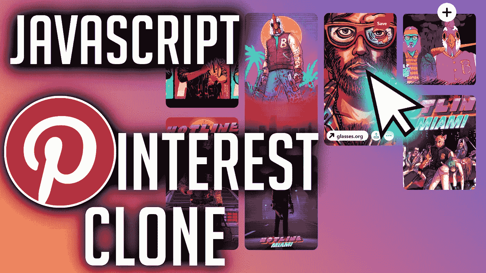
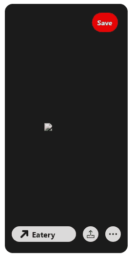
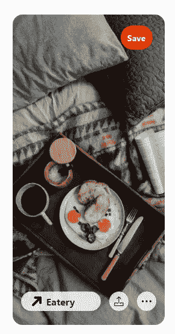
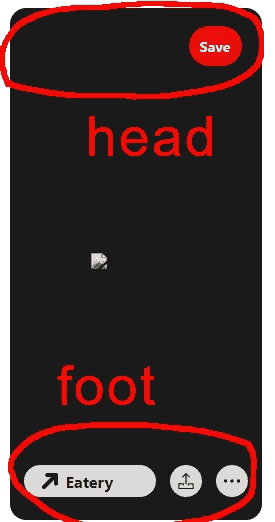
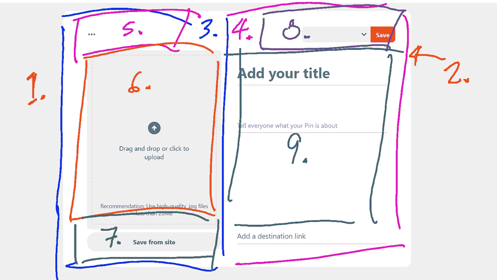
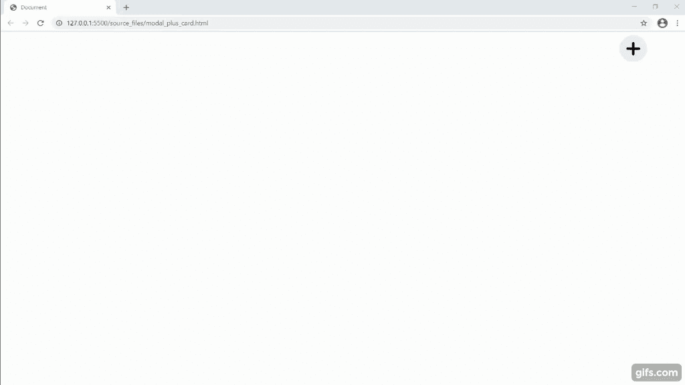
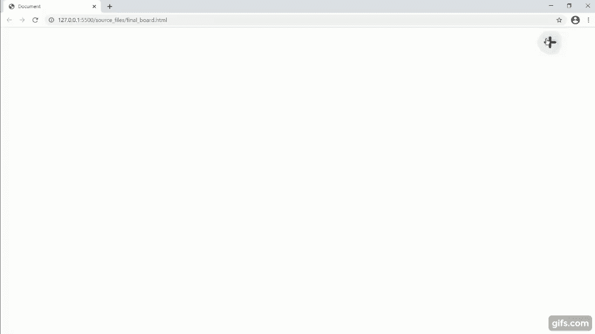

# 用 JavaScript 创建 Pinterest 克隆

> 原文：<https://javascript.plainenglish.io/create-a-javascript-pinterest-clone-68b8ca786b66?source=collection_archive---------6----------------------->

## 仅使用 HTML、CSS 和 JavaScript



## 我们将逐步建立我们的模型。

1.创建单个 **Pinterest Pin** 的实体模型。
2。创建一个 Pinterest " **的实体模型，添加一个 Pin 屏幕**。
3。合并以上；使用**添加 Pin 屏幕**生成一个 **Pinterest Pin** 。
4。将我们在**步骤 3** 中的合并逻辑转移到我们的 **Pinterest 布局**中。

# “Pinterest Pin”模型

## 每个销由 3 部分组成。

1. **Pin 标题** —用户不会看到这个；您可以在后端使用这种方法将 Pin 存储在数据库
2 中。**引脚模式** —这是每张卡的覆盖；这对于本教程来说没有作用，只是装饰性的



3.**大头针图像** —用户上传的实际图像



## 每个引脚都有一个“页眉”和“页脚”。



```
<div class=”card”>
 <div class=”pin_title”></div>
 <div class=”pin_modal”>
 <div class=”modal_head”>
 </div><div class=”modal_foot”>
 </div>
 </div><div class=”pin_image”>
 
 </div>
</div>
```

# “添加一个 Pin”模式实体模型

## 该模型由 9 个部分组成。

1.**模态叠加** —透明黑色背景
2。**添加 Pin 容器** —屏幕主界面
3。**左侧** —我们界面的左半部分
4。**右侧** —我们界面的右半部
5。**左侧标题** —一个简单的按钮，用于选择
6。**左侧身体** —用户的图像显示在这里
7。**左侧页脚** —从网络上传图片的选项
8。**右侧管座** —选择引脚尺寸(小、中、大)
9。**右侧体**——在此输入关于销的信息



```
<div class=”add_pin_modal”>
 <div class=”add_pin_container”>
 <div class=”side” id=”left_side”>
 <div class=”section1">
 </div><div class=”section2">
 </div><div class=”section3">
 </div>
 </div><div class=”side” id=”right_side”>
 <div class=”section1">
 </div><div class=”section2">
 </div>
 </div>
 </div>
</div>
```

# 合并我们的 Pin 和“添加 Pin 屏幕”。

## 当我们单击“保存”时，我们会创建一个 Pin。

```
document.querySelector(‘#save_pin’).addEventListener(‘click’, () => {
 const new_pin_data = {
 author: ‘Jack’,
 board: ‘default’,
 title: document.querySelector(‘#pin_title’).value,
 description: document.querySelector(‘#pin_description’).value,
 destination: document.querySelector(‘#pin_destination’).value,
 img_blob: pin_image_blob,
 pin_size: document.querySelector(‘#pin_size’).value
 }create_pin(new_pin_data);
});
```



# 最终的 Pinterest 版

## 我们将从不同的教程中获取我们的 Pinterest 布局。

在之前的教程中，我们使用 CSS 网格创建了 Pinterest 布局。

我们将导入该代码，并使用该布局作为这个项目的 **pin_container** 。

你可以在这里找到教程。

这个合并非常简单。这里没有新的 HTML。

主要的变化来自于我们的 CSS 和 JavaScript。

在我们的 CSS 中，我们创建了三个新的类定义；小、中和大引脚选项。

```
.card_large {
 grid-row-end: span var( — card_large);
}.card_medium {
 grid-row-end: span var( — card_medium);
}.card_small {
 grid-row-end: span var( — card_small);
}
```

然后基于用户选择的**引脚尺寸**，我们在将**引脚**附加到我们的**引脚 _ 容器**之前，将该类别添加到**引脚。**

```
new_pin.classList.add(`card_${pin_details.pin_size}`);
```



## 这个项目有更多的细微差别。

你可以从这里得到源文件[，你也可以跟随下面的视频教程。](https://github.com/an-object-is-a/js-pinterest-clone)

如果你想要更深入的指导，查看我在 YouTube 上的完整视频教程， [**一个物体是一个**](https://www.youtube.com/c/anobjectisa) 。

一定要在 [**Instagram**](https://www.instagram.com/an_object_is_a/) 和 [**Twitter**](https://twitter.com/anobjectisa1) 上关注我们，及时了解我们最新的 **Web 开发教程**。

## 使用 HTML、CSS 和 JavaScript 创建 Pinterest 克隆