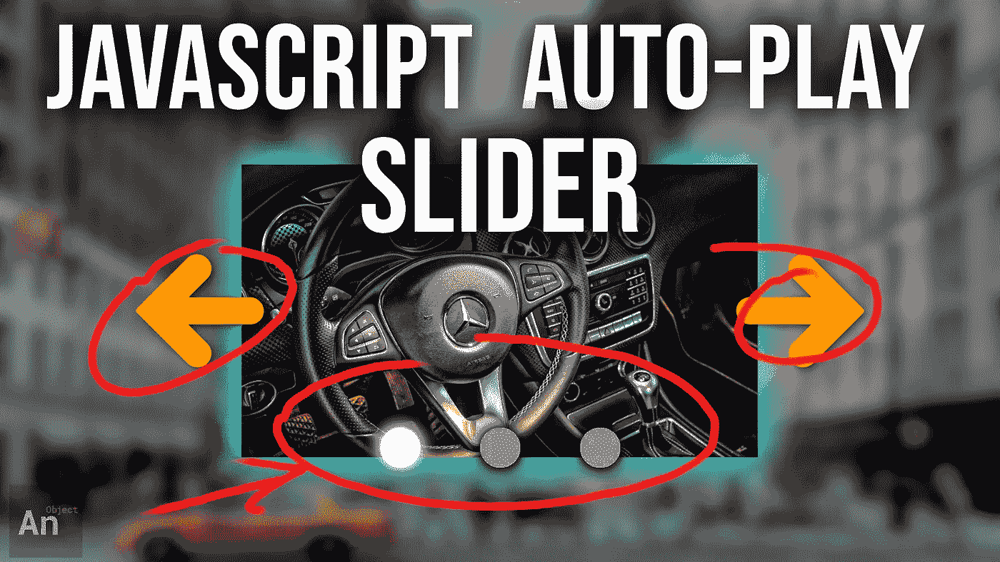
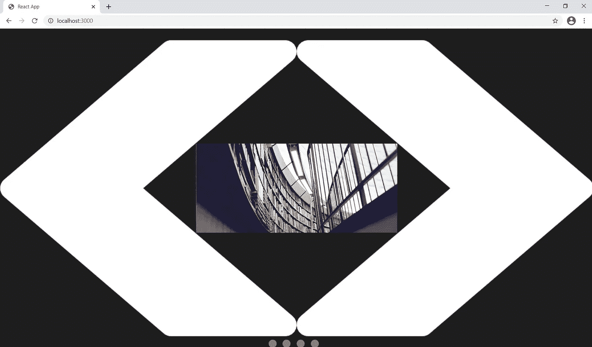
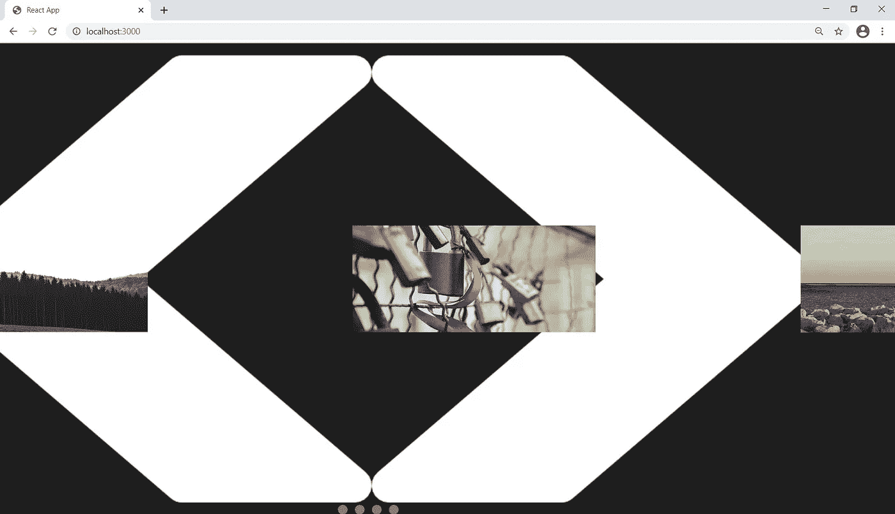
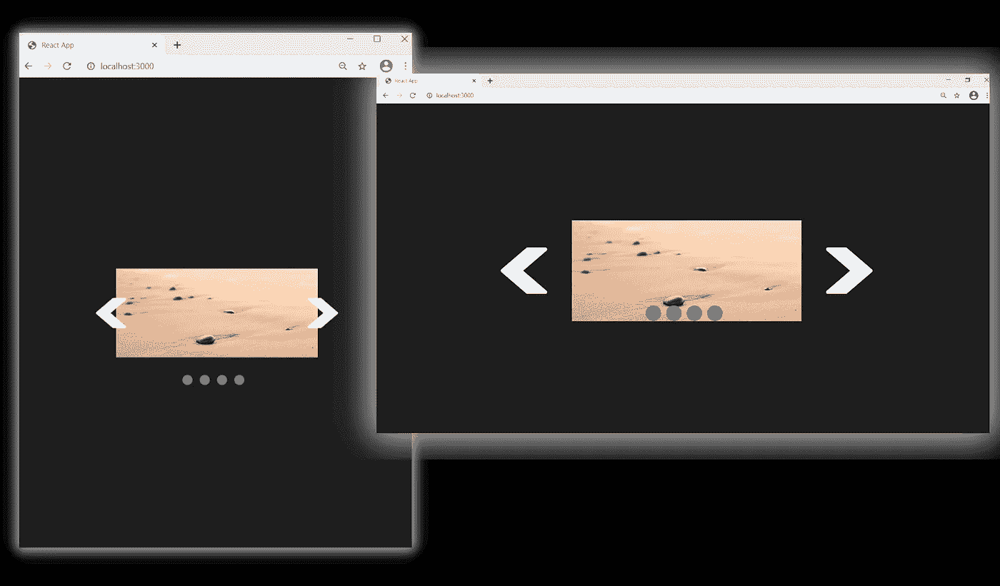
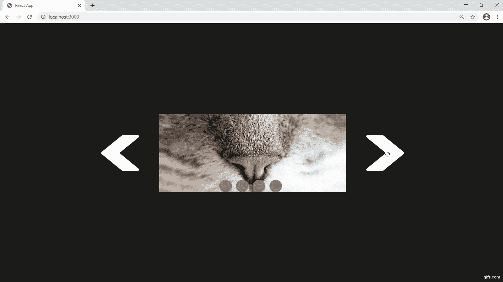
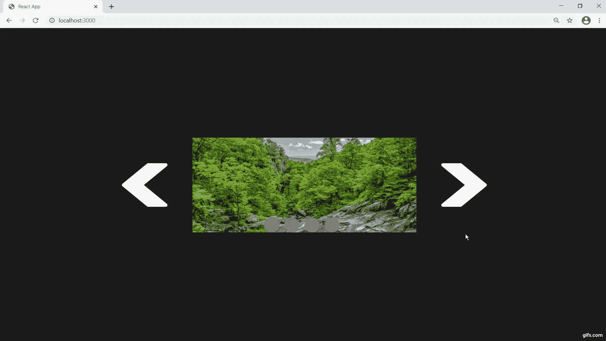

# 创建 JavaScript 幻灯片

> 原文：<https://javascript.plainenglish.io/create-a-javascript-slideshow-a2d36b95f7b7?source=collection_archive---------8----------------------->

## 反应灵敏、自动播放和手动导航

我们将构建一个 JavaScript 图像滑块，它具有自动播放功能和手动导航按钮。我们不会使用任何外部库；所有原生 HTML、CSS 和 JS。



我们将从把所有的元素放在屏幕上开始。我们需要两个组件: **Deck.js** 和 **Card.js.**

**我们有 6 个元素需要处理:**

*   在**deck . js**1。一个 **img** ，我们将使用它作为向右移动(IMG)
    2 的按钮。一个 **img** ，我们将使用它作为向左移动(IMG)
    3 的按钮。一个**观察口** (DIV)
    4。一个**图片容器** (DIV)
    5。一个 **DIV** 来装我们的**单选**按钮(DIV)
*   在 **Card.js** 中
    6。一个“**卡**”，我们将使用它来保存图像(DIV)
    7。实际**形象** (IMG)


现在我们需要在屏幕上居中显示所有内容。我们将使用**绝对位置**和**变换**的组合。



现在一切都居中了，我们需要从左到右排列卡片。

我们编写了一个简单的函数来确定我们的卡片组中的**中间的卡片**，并将中间左边的卡片移到左边，将中间右边的卡片移到右边。

```
function order_cards() {
  let counter_for_right = 1,
      counter_for_left = middle_card_by_index; for (let i = 0; i < images.children.length; i++) {
        images.children[i].style.transitionDuration = '0.0s'; if (i < middle_card_by_index) {
      images.children[i].style.left = `-${(counter_for_left * 
                                 new_width) - (new_width / 2)}px`;
      counter_for_left--;
    } else if (i > middle_card_by_index) {
      images.children[i].style.left = `${(counter_for_right * 
                                 new_width) + (new_width / 2)}px`;
      counter_for_right++;
    } else {
      images.children[i].style.left = `${new_width / 2}px`;
    }
  }
}
```



为了让我们的传送带响应，我们需要根据**百分比**而不是硬像素单位来调整**视口**的大小。

所以我们将只选择 **50%** 并根据用户浏览器窗口的宽度计算一个硬**像素**计数；然后我们将在**调整窗口事件监听器**中运行这段代码。

```
window.addEventListener('resize', () => {
  img_width_as_percentage = 50;
  img_width_as_percentage = window.innerWidth < 768 ? 100 : 
                            img_width_as_percentage; new_width =
        /Android|webOS|iPhone|iPad|iPod|BlackBerry|IEMobile|Opera 
          Mini/i.test(navigator.userAgent) ?
            (img_width_as_percentage / 100) * window.screen.width :
            (img_width_as_percentage / 100) * window.innerWidth; view_port.style.width = `${new_width}px`; order_cards();
});
```

我们还根据视窗和窗口宽度来调整左右按钮和“单选”按钮的大小。

现在我们有了调整大小的代码，每次我们调整浏览器窗口的大小时，我们的旋转木马也会调整大小。



## 我们手头有 3 个大任务

1.  按钮导航
2.  **无线电**导航
3.  自动播放功能

## 所有导航的基础就是这段代码

```
for (let i = 0; i < images.children.length; i++) {
  const updated_position = last_positions[i] + /*some difference*/; images.children[i].style.left = `${updated_position}px`;
  last_positions[i] = updated_position;
}
```

它说的是:取所有图像的当前位置。它们在 X 轴的什么位置？添加一些**差异**，这将移动他们到一个新的位置。

我们有一个 **last_positions** 数组来跟踪我们的图像在屏幕上的位置。

# 让我们编写按钮导航的代码

我们将图像向左或向右移动**一整张卡宽**。
这就让我们的**差**简单的等于一张牌的宽度。

```
for (let i = 0; i < images.children.length; i++) {
  const updated_position = last_positions[i] - new_width; images.children[i].style.left = `${updated_position}px`;
  last_positions[i] = updated_position;
}
```



# 让我们给无线电导航编码

我们计算用户点击了哪个"**单选按钮**。

做一点计算来决定向左或向右移动多少像素。
那就是我们的**区别**。

```
let new_card = null;for (let i = 0; i < images.children.length; i++) {
  if (event.target === selection_buttons_container.children[i]) {   
    new_card = i; 
  }for (let i = 0; i < images.children.length; i++) {
  const updated_position = last_positions[i] + ((current_card - 
                 new_card) * new_width); images.children[i].style.left = `${updated_position}px`;
  last_positions[i] = updated_position;
}
```



# 让我们来处理自动播放

只需将我们的 **next** 按钮导航逻辑放在一个 **setInterval()** 函数中。

```
autoplay_timeout_id = setTimeout(() => {
  autoplay_interval_id = setInterval(() => {
    for (let i = 0; i < images.children.length; i++) {
      const updated_position = last_positions[i] - new_width; images.children[i].style.left = `${updated_position}px`;
      last_positions[i] = updated_position;
    } current_card = (current_card === number_of_cards_by_index) ?
                                          0 : ++current_card; handle_boundaries();
    update_selection();
  }, 1100);
}, 1500);
```


这个项目有更多的细微差别。你可以在这里得到源文件[，你也可以跟随下面的视频教程。](https://github.com/an-object-is-a/reactjs-autoplay-slideshow)

如果你想要更深入的指导，请查看我在 YouTube 上的完整视频教程， [**一个对象是一个**](https://www.youtube.com/c/anobjectisa) 。

一定要在 [**Instagram**](https://www.instagram.com/an_object_is_a/) 和 [**Twitter**](https://twitter.com/anobjectisa1) 上关注我们，跟上我们最新的 **Web 开发教程**。

## JavaScript 幻灯片|响应迅速，自动播放，带手动导航按钮