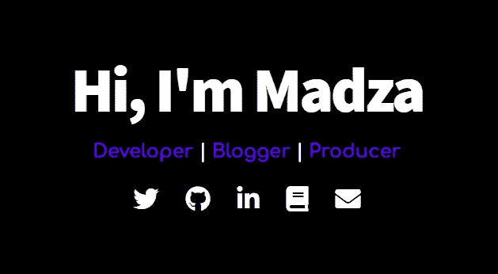
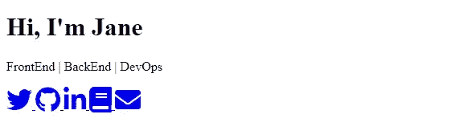
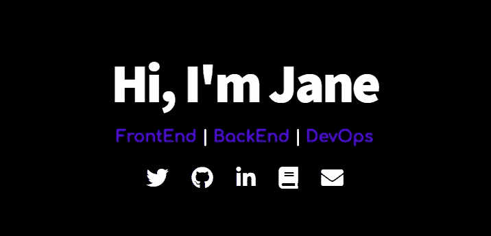
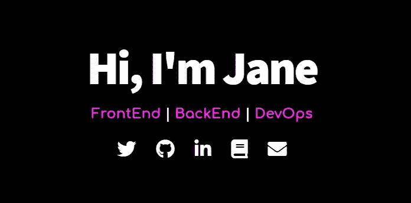
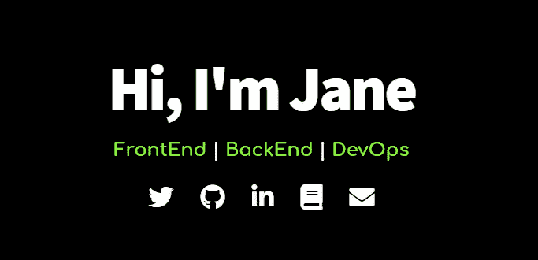

# 创建少于 100 行的登录页面

> 原文：<https://javascript.plainenglish.io/create-a-landing-page-with-less-than-100-lines-58e64f0bb664?source=collection_archive---------19----------------------->

## (包括 CSS)🎨🎉



最近，我买了一个[个人域名](https://madza.dev)，并决定建立一个快速登陆页面，在我处理我的投资组合时不要让它空着。我想你们中的一些人可能会发现它很有用，所以我决定做一个关于它的教程。

# 超文本标记语言

首先创建一个新的`index.html`文件，并通过键入“！”启动一个样板文件并按下“Tab”键。在标题标签中键入您网站的名称。它将显示在浏览器选项卡中。

```
<!DOCTYPE html>
<html lang="en">
<head>
   <meta charset="UTF-8">
   <meta name="viewport" content="width=device-width, initial-scale=1.0">
   <title>My Awesome Landing Page</title>
</head>
<body>

</body>
</html>
```

然后创建 div 来包装页面并使内容居中。添加一个介绍你的标题和一段你的技能。我还在分隔符上使用了 span 元素来设计它们的样式。

```
<div class="page-wrapper">
      <div class="content-wrapper">
        <h1>Hi, I'm Jane</h1>
        <p>
          FrontEnd <span class="divider"> | </span> BackEnd
          <span class="divider"> | </span> DevOps
        </p>
      </div>
 </div>
```

接下来，创建一个新的图标文件夹。你可以在[字体牛逼](https://fontawesome.com/)上找到牛逼图标。访问他们的网站，并输入电子邮件接收包。将其解压缩并添加到图标文件夹中。最后链接到包中的`all.css`文件。

```
<link rel="stylesheet" href="icons/font-awesome/css/all.css" />
```

在链接中添加你的图标，并为你将要使用的特定图标使用合适的字体语法(见他们的[文档](https://fontawesome.com/how-to-use/on-the-web/referencing-icons/basic-use))。

```
<a href="https://twitter.com/jane">
  <i class="icon fab fa-twitter fa-2x"></i>
</a>
<a href="https://github.com/jane">
   <i class="icon fab fa-github fa-2x"></i>
</a>
<a href="https://www.linkedin.com/in/jane/">
   <i class="icon fab fa-linkedin-in fa-2x"></i>
</a>
<a href="https://blog.jane.dev">
   <i class="icon fas fa-book fa-2x"></i>
</a>
<a href="mailto:hi@jane.dev">
   <i class="icon fas fa-envelope fa-2x"></i>
</a>
```

加价到此为止。如果你跟着它走，它现在应该是这样的。由于“a”标签的默认颜色，图标是蓝色的。看起来很复古！



# 半铸钢ˌ钢性铸铁(Cast Semi-Steel)

让我们把一切都变得更漂亮！

首先，为 styles 创建一个新文件夹，在其中添加一个新文件`main.css`，并在`index.html`头部分链接到它。

```
<link rel="stylesheet" href="styles/main.css" />
```

之后，导入你将要使用的字体。我决定用 [Comfortaa](https://fonts.google.com/specimen/Comfortaa?query=comfortaa) 和 [Source Sans Pro](https://fonts.google.com/specimen/Source+Sans+Pro?query=source+sa) 。访问[谷歌字体](https://fonts.google.com/)并选择你想要的字体，将它们导入到`main.css`文件的顶部。

```
@import url("https://fonts.googleapis.com/css2?family=Comfortaa:wght@700&family=Source+Sans+Pro:wght@900&display=swap");
```

然后对默认样式进行简单的重置，为你的登陆页面设置背景色，并使用 CSS GRID 居中元素。

```
* {
  margin: 0;
  text-decoration: none;
}

html,
body {
  height: 100%;
  display: grid;
  place-items: center;
  background-color: black;
}

.page-wrapper {
  display: grid;
  place-items: center;
  text-align: center;
}
```

现在样式的文本。设置字体的颜色，字体系列，调整字母间距，并在需要的地方添加边距，以便看起来更好。

```
h1 {
  color: white;
  font-family: "Source Sans Pro", sans-serif;
  font-size: 5em;
  letter-spacing: -0.04em;
}

p {
  color: rgb(98, 0, 255);
  font-family: "Comfortaa", cursive;
  font-size: 1.5em;
  margin: 15px 0;
}

.divider {
  color: white;
}
```

最后，你必须设计图标。根据你的背景颜色，设置图标的颜色和大小。对于交互性，您可以在悬停时添加光标变化和图标背景颜色变化。

```
.icon {
  color: white;
  padding: 15px;
  border-radius: 50%;
}

.icon:hover {
  cursor: pointer;
  background-color: rgb(22, 22, 22);
}
```

此外，确保你为你的网站创建了你的 favicon。您会在页面标题前的浏览器选项卡上看到它。为此，我推荐 [favicon.io](https://favicon.io/) 。将其添加到您的图标目录，并在`index.html`标题中链接到它。

```
<link rel="icon" href="icons/favicon.ico" />
```

干得好！最终结果应该是这样的:



在部署之前，确保在`main.css`中试验不同的设置。设计总是主观的，尽管我会推荐一些对比鲜明的东西:



或者这个:



恭喜你！您已经用不到 100 行代码制作了一个简单的登录页面，没有花哨的 CSS 或 JavaScript 框架。

源代码可以在 [GitHub](https://github.com/madzadev/landing-page) 上找到。如果你喜欢，给它一个⭐奖🎉🥳

写作一直是我的激情所在，帮助别人给我带来了快乐。如果您有任何问题，请随时联系我们！

在 [Twitter](https://twitter.com/madzadev) 、 [LinkedIn](https://www.linkedin.com/in/madzadev/) 和 [DEV](https://dev.to/madza) 上连接我！

订阅我的[博客](https://blog.madza.dev)获取更多文章。

## 进一步阅读

[](https://bit.cloud/blog/composing-reusable-landing-pages-in-components-l4mk36jk) [## 在组件中组合可重用的登录页面

### 最近，我们不得不创建一个登录页面，允许人们请求演示我们的产品。这一页是…

比特云](https://bit.cloud/blog/composing-reusable-landing-pages-in-components-l4mk36jk) 

*更多内容请看*[***plain English . io***](https://plainenglish.io/)*。报名参加我们的* [***免费周报***](http://newsletter.plainenglish.io/) *。关注我们关于*[***Twitter***](https://twitter.com/inPlainEngHQ)[***LinkedIn***](https://www.linkedin.com/company/inplainenglish/)*[***YouTube***](https://www.youtube.com/channel/UCtipWUghju290NWcn8jhyAw)***，以及****[***不和***](https://discord.gg/GtDtUAvyhW) *对成长黑客感兴趣？检查* [***电路***](https://circuit.ooo/) ***。*****