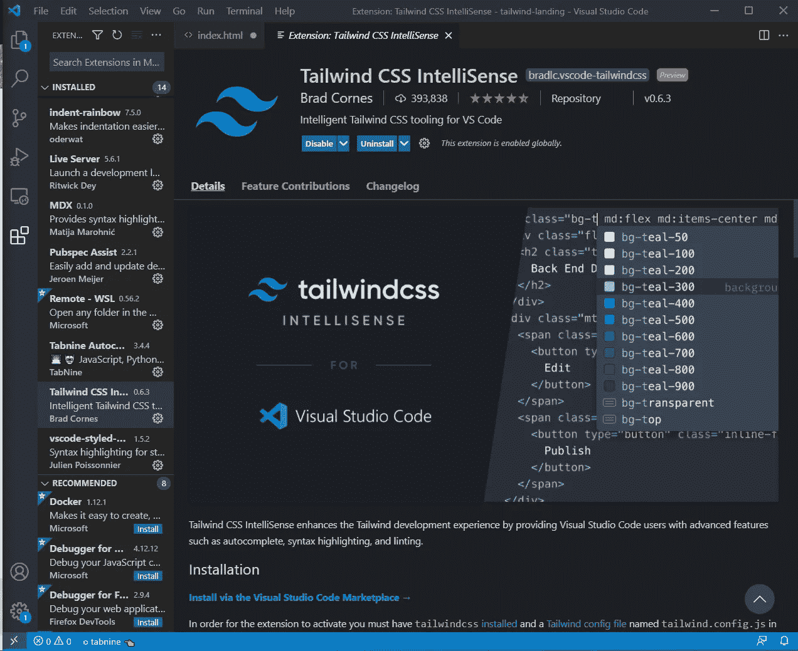
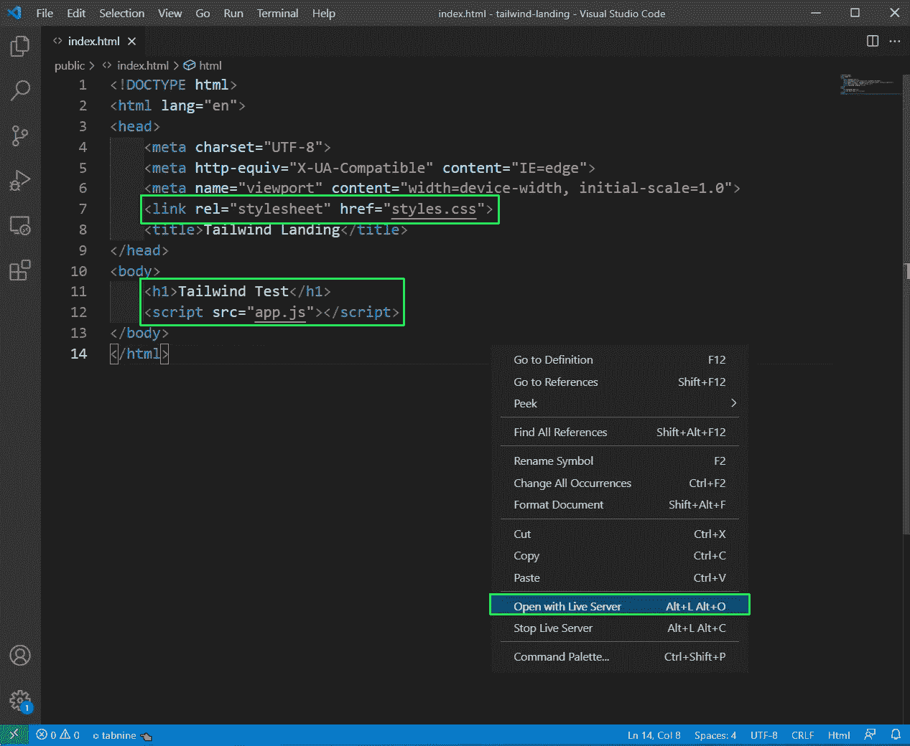

# 用顺风 CSS 创建一个登陆页面

> 原文：<https://javascript.plainenglish.io/create-a-landing-page-with-tailwind-css-db5ab2fa2efa?source=collection_archive---------3----------------------->


Landing Page

在这个项目中，我们将建立一个简单的顺风 CSS 登录页面。我们不打算在这里使用任何像我以前的博客那样的框架。

和往常一样，之前需要做一些安装工作。

先说顺风 CSS。因此，打开终端，切换到所需的目录，并创建一个新目录。

我们需要为 tailwind 安装一些包，所以需要有一个 **package.json** 文件。为此，我们给出命令 **npm init -y** ，用默认选项创建一个空的 **package.json** 文件。

之后，我们在 VS 代码中打开文件夹。


VS Code

现在，自从从版本 1 迁移到版本 2 以来，Tailwind 的安装过程发生了很大的变化。所以，获得最新信息的最好地方是顺风网站。根据安装说明，我们需要使用 npm 安装以下依赖项。

```
npm install -D tailwindcss@latest postcss@latest autoprefixer@latest
```

现在，我们还必须通过运行下面的命令来初始化配置文件。

```
npx tailwindcss init
```

接下来，我们将创建项目的基本结构。我们正在根目录中创建两个文件夹— **public** 和 **src —** 。在**公共**文件夹中，我们有 **app.js** 、**index.html、**和 **styles.css** 文件。

在 **src** 文件夹中，我们有 **styles.css** 文件。我们在 **public** 文件夹中还有一个 **images** 文件夹，里面有一张背景图片。您可以使用任何图像，但要确保，它是一个中心字符的黑暗图像。


Basic Structure

现在，根据顺风安装，我们需要将这些添加到 **src** 文件夹中的 **styles.css** 文件中:

```
@tailwind base;
@tailwind components;
@tailwind utilities;
```

现在，我们需要一个脚本来在我们的项目中安装顺风类。为此，在 **package.json** 文件中添加一个 **build-css** 脚本。它从 **src styles.css** 中获取命令，并将它们放入 **public styles.css** 文件中。


package.json

现在，从终端运行命令 **npm run build-css** ，如果一切正常，我们将看到下面的屏幕。


npm

现在，如果我们去 **public** 文件夹中我们的 **styles.css** ，我们会发现里面有很多 css 样式。现在，这就是我们需要的所有顺风 CSS。


styles.css

最后，我们完成了顺风装置，将从我们项目的**index.html**开始。

但在此之前，确保你有两个扩展，安装在你的 VS 代码中 Ritwick Dey 的 **Live Server** 和 Brad Cornes 的 **Tailwind CSS IntelliSense** 。



Tailwind CSS

现在，在 index.html 的**文件中添加基本代码！和标签。之后还要添加样式表和 JavaScript 文件的链接。我们还添加了一个 h1 文本，用于测试。**

之后，点击右键，然后点击**打开与现场服务器**链接。



Live Server

现在，代码将在[http://127 . 0 . 0 . 1:5500/public/index . HTML](http://127.0.0.1:5500/public/index.html)中打开，这是处理任何 HTML-CSS-JavaScript 项目的最佳方式，因为我们可以获得实时更新功能。


index.html

现在，我们将开始真正的代码，并将添加一个导航，其中我们将添加一个锚标记。anchor 标记有一个 pl-6 类，根据文档，它给出了 1.5rem 的左填充。


pl-6

接下来，我们将在文件中添加更多的 HTML。我们正在使用的两种更重要的样式是 px-4 和 p-4。它们的含义如下所示。

```
p-4 - padding: 1rem;
px-4 - padding-left: 1rem;
       padding-right: 1rem;
```


More Styles

现在，localhost 看起来像桌面视图中的下图。


Desktop view

接下来，我们将所有的风格添加到我们的导航。这些元素的含义如下。

```
**flex** - makes children flex items
**justify-between** - justify-content: space-between;
**items-center** - align-items: center;
**h-16** - height: 4rem;
**bg-gradient-to-r** - background-image: linear-gradient(to right, var(--tw-gradient-stops));
**from-yellow-700** - Abovve gradient start value
**to-yellow-600** - Gradient end value
**text-white** - text color white
**relative** - position: relative;
```


navbar

现在，对于移动视图，我们想要显示一个移动条。我们可以从 [https://heroicons.dev](https://heroicons.dev) 得到好看的图标。所以，去那里搜索“菜单”。你只需要点击它，SVG 就会被复制到剪贴板。


heroicons

现在，我们已经将 SVG 粘贴到了 bars div 中。另外，在 div 中添加了 md:hidden，所以它不会显示在桌面屏幕上。

同样，我们的菜单 div 是隐藏的。因此，它不会在移动视图中显示，而只会在桌面视图中显示。


index.html

现在，我们的移动视图显示完美。


Mobile view

现在，我们将开始在我们的网站上显示背景图片。为此，在导航下方创建一个 div 来显示图像，这是我们之前存储的。这里，不同的元素意味着:

```
**bg-no-repeat** - background-repeat: no-repeat;
**h-screen** - height: 100vh;
**bg-center** - background-position: center;
**bg-cover** - background-size: cover;
**flex**, **justify-center**, **items-center** - Explained earlier
**background-image** - To give the image
```


flex

现在，图像显示完美。


Background image

现在，我们将在图像中放置一段文字。因此，在 h1 标记中，添加以下样式。我们有三种尺寸的文本，一种用于大屏幕，桌面屏幕，另一种用于移动屏幕。这些风格意味着:。

```
**text-9xl** - font-size: 8rem;
     line-height: 1;
**text-6xl** - font-size: 3.75rem;
     line-height: 1;
**text-4xl** - font-size: 2.25rem;
     line-height: 2.5rem;
**mb-10** - margin-bottom: 2.5rem;
**text-yellow-600**, **hover:text-white duration-300** - self-explanatory
```


h1

我们的文本在桌面视图中显示如下。


localhost

接下来，我们将在 h1 下面添加一个锚标记。它包含单词 Explore 和 arrow 的 SVG，这也是我们从 heroicons.dev 站点获得的。我们还包装了 h1 和 anchor 标签，用 div 将所有内容居中并加粗。

anchor 标签中使用的所有样式都已经在前面使用过了，当我们将鼠标悬停在它上面时，转换会改变比例。


anchor tag

现在，我们的桌面网站已经完成，看起来像:


Desktop site

现在，在移动网站中，我们希望工具栏是可点击的，并显示菜单。这个功能，我们将从 **app.js** 文件中添加。

这里，我们首先将目标放在条形和菜单 id 上。现在，我们在工具条中添加了一个事件监听器，点击它，我们将检查菜单是否包含一个隐藏的类。它首先包含隐藏的类，所以我们删除它，然后添加额外的类来拥有一个 flex 框，带有方向列。else 部分检查隐藏类是否不存在，在这种情况下，它添加它。

我们在 window 上还有另一个事件监听器。创建它是为了在菜单打开时检查用户从移动视图切换到桌面视图的特殊情况。


app.js

现在，我们的登录页面已经完成并完全正常工作。


Site complete

你可以在这里找到相同[的 GitHub 库。](https://github.com/nabendu82/landing-tailwindcss)

*更多内容尽在*[plain English . io](http://plainenglish.io/)