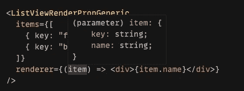

# 在 React with TypeScript 中创建列表视图

> 原文：<https://javascript.plainenglish.io/create-a-list-view-in-react-with-typescript-c598be1d0ff5?source=collection_archive---------2----------------------->

Photo by [Markus Winkler](https://unsplash.com/@markuswinkler?utm_source=medium&utm_medium=referral) on [Unsplash](https://unsplash.com?utm_source=medium&utm_medium=referral)

显示项目列表是 web 开发人员经常做的事情。React 没有一个标准的方法来呈现项目列表，但是有一些模式是值得了解的。我们将在这篇文章中探索其中的一些。

# **子数组**

让我们从在大多数情况下都有效的基本方法开始，即在`children` prop 中传递列表元素。

我用[做出反应。Children.map](https://reactjs.org/docs/react-api.html#reactchildrenmap) 所以我不需要担心`children`是单个项目还是项目数组。注意，`ListView`组件负责列表结构，在这个例子中，它断言语义有效的`ul`和`li`标签排列。下面是一个用法示例

很简单，可读性很强！如果您事先不知道商品的数量，也可以使用这种方法。

只需记住，每当你呈现一个可以重新排序或过滤的列表时，你必须提供[键属性](https://reactjs.org/docs/lists-and-keys.html#keys)(如果你不提供，React 会警告你)。

# 渲染道具

第二种方法更加灵活，但也稍微复杂一些。我说的是[渲染道具](https://reactjs.org/docs/render-props.html)模式。下面是列表代码可能的样子。

也许你已经注意到它不可重用，因为它明确定义了`Item`类型。我们可以做得更好，让我们使用 TypeScript 泛型，这样列表就不会耦合到具体的`Item`接口。

这就好多了，现在它可以处理任何项目数组，只要每个项目都满足`AbstractItem`接口。让我们看看如何使用它。

请注意，TypeScript 适当地涉及了`renderer`函数中的项目类型。

那么为什么渲染道具模式更强大呢？它可以访问原始项目数据，而不像以前的方法那样只能访问 react 节点。这可以有很多用例。例如，我可以提供一个谓词，用于在显示项目之前过滤它们。

客户端可以指定任何接受单个项目并返回布尔值的`filterFn`。

在这个例子中，只有前两个项目将被渲染。

# 摘要

我介绍了一些基本的构建模块，可以对它们进行调整以满足更具体的需求。我希望你会发现它们有用，感谢阅读！