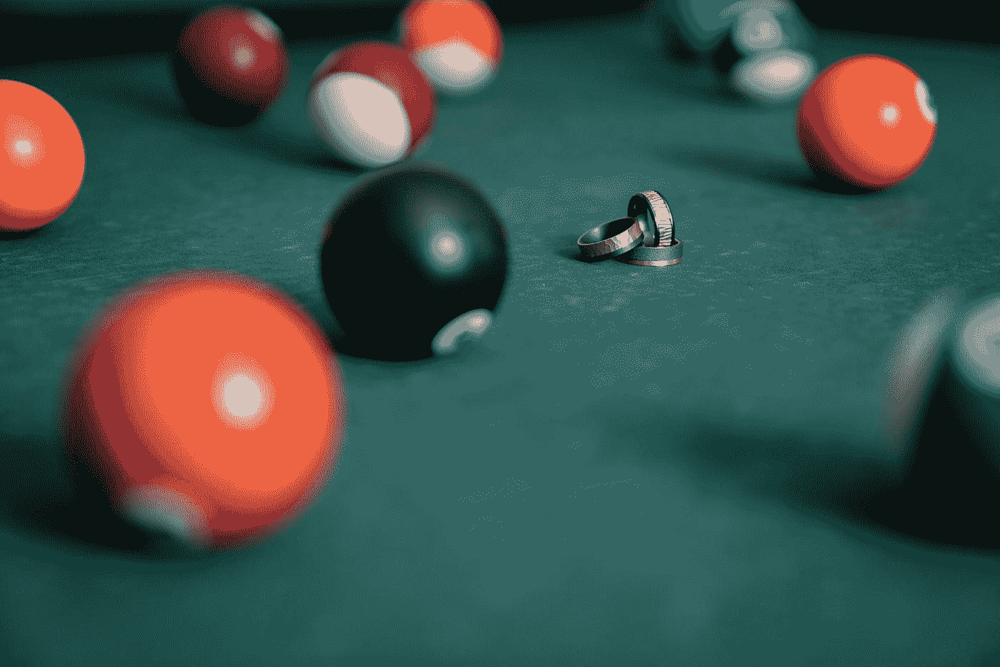

# 用 Vue 3 和 JavaScript 创建一个神奇的 8 球应用程序

> 原文：<https://javascript.plainenglish.io/create-a-magic-8-ball-app-with-vue-3-and-javascript-8f5eeff45ba?source=collection_archive---------21----------------------->



Photo by [Avonlea Jewelry](https://unsplash.com/@avonlea_jewelry?utm_source=medium&utm_medium=referral) on [Unsplash](https://unsplash.com?utm_source=medium&utm_medium=referral)

Vue 3 是易于使用的 Vue JavaScript 框架的最新版本，让我们可以创建前端应用程序。

在本文中，我们将看看如何用 Vue 3 和 JavaScript 创建一个 magic 8 ball 应用程序。

# 创建项目

我们可以用 Vue CLI 创建 Vue 项目。

要安装它，我们运行:

```
npm install -g @vue/cli
```

与 NPM 或:

```
yarn global add @vue/cli
```

用纱线。

然后我们运行:

```
vue create 8-ball
```

并选择所有默认选项来创建项目。

# 创造神奇的 8 球

为了创建 magic 8 ball 应用程序，我们编写:

```
<template>
  <form @submit.prevent="getAnswer">
    <div>
      <label>question</label>
      <input v-model="question" />
    </div>
    <button type="submit">get answer</button>
  </form>
  <div class="circle">
    <p>{{ answer }}</p>
  </div>
</template><script>
const answers = [
  "It is certain",
  "It is decidedly so",
  "Without a doubt",
  "Yes - definitely",
  "You may rely on it",
  "As I see it, yes",
  "Most likely",
  "Outlook good",
  "Yes",
  "Signs point to yes",
  "Don't count on it",
  "My reply is no",
  "My sources say no",
  "Outlook not so good",
  "Very doubtful",
  "Reply hazy, try again",
  "Ask again later",
  "Better not tell you now",
  "Cannot predict now",
  "Concentrate and ask again",
];
export default {
  name: "App",
  data() {
    return {
      question: "",
      answer: "",
    };
  },
  methods: {
    getAnswer() {
      if (!this.question) {
        return;
      }
      const index = Math.floor(Math.random() * answers.length);
      this.answer = answers[index];
    },
  },
};
</script><style scoped>
.circle {
  border: 1px solid black;
  border-radius: 50%;
  width: 150px;
  height: 150px;
  display: flex;
  justify-content: center;
  align-items: center;
}
</style>
```

我们有一个文本输入的形式，让我们输入一个问题到框中。

我们用`v-model`将输入值绑定到`question`反应属性。

我们监听带有`@submit`指令的表单上的`submit`事件。

`prevent`让我们阻止服务器端提交，改为客户端提交。

下面我们有一个 div 类`circle`来创建 8 号球。

我们将它做成一个圆，并将`answer`文本放在`style`标签的中心。

接下来，我们有一个`answers`数组，里面有神奇 8 球的标准答案。

在`data`方法中，我们用`question`和`answer`反应属性的初始值返回一个对象。

`getAnswer`方法让我们通过生成一个随机索引来获得答案，从而从`answers`数组中获得`answer`反应属性的值。

在此之前，我们检查是否输入了`question`。

在`style`标签中，我们通过为圆设置`border-radius`和`border`来使 div 成为一个圆。

我们还将`width`和`height`设置为相同，使其成为一个圆。

`display`被设置为`flex`，所以我们可以使用`justify-content`来水平居中对齐文本。

我们将文本与`align-items`垂直居中对齐。

# 结论

我们可以使用 Vue 3 和 JavaScript 轻松创建一个 magic 8 ball 应用程序。

喜欢这篇文章吗？如果有，通过 [**订阅我们的 YouTube 频道**](https://www.youtube.com/channel/UCtipWUghju290NWcn8jhyAw?sub_confirmation=true) **获取更多类似内容！**

*更内容于* [***通俗地说就是***](https://plainenglish.io/)