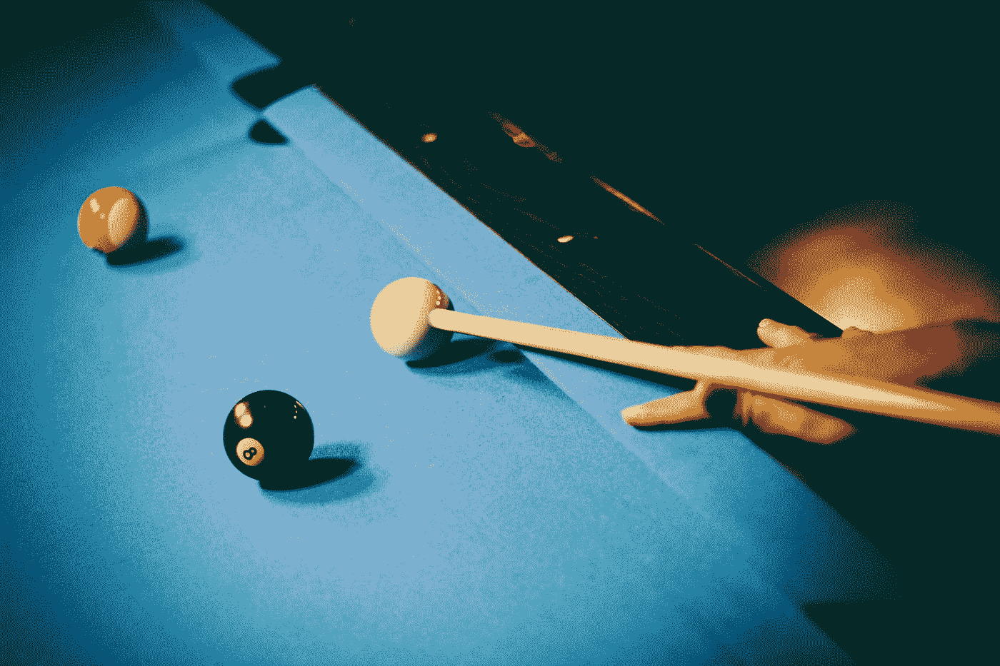

# 用 React 和 JavaScript 创建一个神奇的 8 球

> 原文：<https://javascript.plainenglish.io/create-a-magic-8-ball-with-react-and-javascript-4f6c281dad55?source=collection_archive---------21----------------------->



Photo by [Jonas Thijs](https://unsplash.com/@jonasthijs?utm_source=medium&utm_medium=referral) on [Unsplash](https://unsplash.com?utm_source=medium&utm_medium=referral)

React 是一个易于使用的 JavaScript 框架，让我们可以创建前端应用程序。

在本文中，我们将看看如何用 React 和 JavaScript 创建一个 magic 8 ball 应用程序。

# 创建项目

我们可以用 Create React App 创建 React 项目。

要安装它，我们运行:

```
npx create-react-app magic-8-ball
```

和 NPM 一起创建我们的 React 项目。

# 创建神奇 8 球应用程序

为了创建 magic 8 ball 应用程序，我们编写:

```
import React, { useState } from "react";
const answers = [
  "It is certain",
  "It is decidedly so",
  "Without a doubt",
  "Yes - definitely",
  "You may rely on it",
  "As I see it, yes",
  "Most likely",
  "Outlook good",
  "Yes",
  "Signs point to yes",
  "Don't count on it",
  "My reply is no",
  "My sources say no",
  "Outlook not so good",
  "Very doubtful",
  "Reply hazy, try again",
  "Ask again later",
  "Better not tell you now",
  "Cannot predict now",
  "Concentrate and ask again"
];export default function App() {
  const [question, setQuestion] = useState("");
  const [answer, setAnswer] = useState(""); const getAnswer = (e) => {
    e.preventDefault();
    if (!question) {
      return;
    }
    const index = Math.floor(Math.random() * answers.length);
    setAnswer(answers[index]);
  }; return (
    <div>
      <style>
        {`
          .circle {
            border: 1px solid black;
            border-radius: 50%;
            width: 150px;
            height: 150px;
            display: flex;
            justify-content: center;
            align-items: center;
          }
          `}
      </style>
      <form onSubmit={getAnswer}>
        <div>
          <label>question</label>
          <input
            value={question}
            onChange={(e) => setQuestion(e.target.value)}
          />
        </div>
        <button type="submit">get answer</button>
      </form>
      <div className="circle">
        <p>{answer}</p>
      </div>
    </div>
  );
}
```

我们有一个`answers`数组，其中包含可以选择的答案项。

然后我们定义通过输入设置的`question`状态。

并且通过从`answers`数组中随机选择一个条目来设置`answer`状态。

然后我们给出了输入问题后选择答案的`getAnswer`函数。

我们叫`e.preventDefault()`做客户端提交。

我们检查`question`是否被设置。

如果是，那么我们调用`setAnswer`来设置`answer`。

在那下面，我们有一个输入表单，让我们输入`question`值。

我们获取`value`属性中的值，并用`onChange`属性设置该值。

`e.target.value`有输入值。

`answer`有随机选择的答案。

我们通过将`className`设置为`circle`将答案放在一个圆圈中。

然后我们设置`border-radius`为 50%使 div 成为一个圆。

# 结论

我们可以使用 React 和 JavaScript 轻松创建一个神奇的 8 球应用程序。

*更多内容请看*[***plain English . io***](http://plainenglish.io)