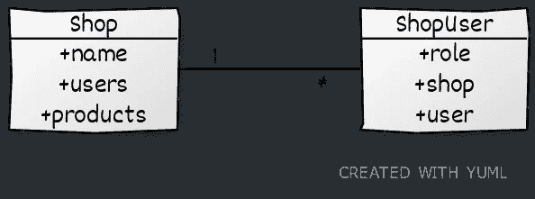

# 用 Plumier 通过 4 个简单的步骤创建一个市场 API

> 原文：<https://javascript.plainenglish.io/create-a-marketplace-api-with-plumier-in-4-simple-steps-6415078a433b?source=collection_archive---------15----------------------->


Marketplace — Photo by [Jaddy Liu](https://unsplash.com/@saintjaddy?utm_source=unsplash&utm_medium=referral&utm_content=creditCopyText) on [Unsplash](https://unsplash.com/s/photos/marketplace?utm_source=unsplash&utm_medium=referral&utm_content=creditCopyText)

API 最重要也是最困难的方面是安全系统，它保证数据不被未授权的用户泄露/访问。如果没有合适的工具，就没有简单的方法来做到这一点，因为大多数授权规范需要密集的编程和测试。

几十年来，我们有一个实用的解决方案，只需通过创建逻辑来保护对 URI 的访问，创建另一个逻辑来限制基于角色的用户输入，创建另一个逻辑来排除一些数据，并在您拥有的每个资源上一遍又一遍地重复这些逻辑，将授权逻辑分散到代码库的每个地方。最终，它增加了代码库的复杂性，同时降低了可读性。

Plumier 提供了工具来完全将授权从控制器中分离出来。授权逻辑可以单独隔离，然后通过配置轻松应用于安全路由、查询字符串、请求/响应主体属性等。反过来，创建具有复杂授权的 API 会变得更加简单和容易。这个故事将向您展示如何使用 Plumier 创建一个具有复杂授权逻辑的 Marketplace API，通过遵循一些步骤来使开发过程变得平稳和容易。

## 一言以蔽之

对于不熟悉的你来说， [Plumier](https://plumierjs.com/) 是一个专注于生产力的 TypeScript 后端框架，它有一个专用的反射库来帮助你愉快地创建一个健壮、安全、快速的 API。

这个故事使用了一些更加华丽的特性，为了避免混淆，你需要理解一些术语。如果你访问过 Plumier [登陆页面](https://plumierjs.com/)，你可以跳过这一部分。

**第一类实体**:是一个 ORM 实体(TypeORM ),通过通用控制器提升对框架组件的控制，如授权、验证和生成的路由。这是一种基于 ORM 实体创建具有 CRUD 功能的 API 的即时方法。

上面的例子生成成下面的六条路线

```
POST   /items       accessible by Supervisor and Staff
GET    /items?      accessible by any login user
GET    /items/{id}  accessible by any login user
POST   /items/{id}  accessible by Supervisor and Staff
PUT    /items/{id}  accessible by Supervisor and Staff
DELETE /items/{id}  accessible by Supervisor and Staff
```

第一类实体背后没有魔法，它只是利用反射和通用控制器在后台自动创建一个控制器。你可以在这里阅读关于这个功能[的完整故事。](/70f2f53bb2a8)

**嵌套的第一类实体**:是生成 Restful 嵌套路线`parents/{pid}/children`的父子特定的第一类实体。嵌套的第一类实体，最适合用于根据父 ID 缩小结果范围或根据父 ID 限制对资源的访问。

在第 8 行，我们定义了一对多关系的通用控制器装饰器。上面的示例生成为下面的六个嵌套路线。

```
POST   /posts/{pid}/comments      insert new 
GET    /posts/{pid}/comments 
GET    /posts/{pid}/comments/{id}  
POST   /posts/{pid}/comments/{id}
PUT    /posts/{pid}/comments/{id}
DELETE /posts/{pid}/comments/{id}
```

用于根据特定帖子 ID `pid`缩小评论结果的 API。并根据帖子 ID 保护添加、修改、删除、获取等操作。

**不支持深度路线嵌套**:记住我们只支持两级嵌套，因为这通常就足够了。例如，不要有被`oid`缩小的`/users/{uid}/orders/{oid}/items`，这意味着`/orders/{oid}/items`就足够了。

**授权策略**:这是从配置中分离授权逻辑的功能。此外，它可以应用于使用配置的控制器的任何部分，例如在动作上保护路由，在参数上保护查询字符串，在模型属性上保护请求/响应主体属性等。阅读 Plumier 文档中关于[授权策略](https://plumierjs.com/security)的更多信息。

**实体授权策略(Entity Policy)** :这是一种专门的授权策略，最适合用于保护一级实体。实体策略提供了上下文 ID，它是当前被访问资源的 ID。有了这个上下文 ID，基于存储在数据库表中的数据动态保护资源就相对容易了。在 Plumier 文档中阅读更多关于[实体授权策略](https://plumierjs.com/generic-controller#entity-authorization-policy)的信息。

## 市场 API 规范

在这个例子中，我们将创建市场 API 的核心特性。这些 API 被分成具有以下规范的功能组。

1.  **用户管理**:任何人都可以使用电子邮件、密码和姓名自由注册。受限用户只能修改和删除自己的用户数据。电子邮件仅限于在 API 响应上的任何地方对用户可见。只有管理员可以访问的用户列表。
2.  **店铺管理**:任何注册用户都可以创建店铺。默认情况下，创建商店的用户被指定为商店所有者。用户可以根据自己的喜好创建多个商店。只有店主可以修改和删除店铺数据。任何登录用户应该能够看到所有商店的列表。
3.  **店铺用户管理**:店主可以给店铺添加更多的用户作为员工。商店职员对商店的进出是有限制的。非商店用户无法访问商店用户列表。
4.  **店铺产品管理**:店主和店员可以添加新的、修改和删除产品。该产品包含多个图像。产品底价只对店主和店员可见，对其他用户不可见。
5.  **图像管理**:所有用户都可以上传图像，但最大允许大小为 5 MB。只有管理员才能访问的所有图像的列表。
6.  **用户送货地址管理**:所有用户可以有多个送货地址。只有数据的所有者可以查看、修改和删除送货地址。
7.  **产品列表**:所有用户能够看到所有产品，产品包含价格、图片和合适的店铺等信息。用户可以稍后将产品添加到他们的购物车中。
8.  **购物车**:所有用户都有一个购物车。购物车会自动创建并保持打开状态，直到关闭(签出)。来自多个商店的产品可以添加到购物车中。当添加相同的产品时，它会自动合并并增加数量。购物车商品可以修改和删除。购物车中的商品根据商店进行分组。已关闭的购物车既不能修改也不能删除。结帐过程完成后，会创建一个新的购物车。
9.  **店铺订单管理**:显示与店铺相关的用户订单列表。只有店主和店员才能进入。秩序是不可改变的，除了国家。商店的可用状态值为`Prepared`和`Sent`。
10.  **用户订单管理**:显示用户订单列表。只有数据的所有者可以访问。用户只能设置订单的状态值。用户可用的状态值有`Received`和`Issue`。

作为参考，下面是 Marketplace API 使用的数据库表的实体关系图。


Marketplace API Entity Relationship Diagram (ERD)

## 源代码

这个项目的源代码可以在这个[库](https://github.com/plumier/examples/tree/master/08-complete-example/marketplace-api)中找到。这个项目使用 Plumier `rest-api-typeorm`创建[项目启动器](https://github.com/plumier/starters)。

project starter 附带了身份验证和用户管理以及一些默认的授权设置。你可以随意修改源代码。

## 开发步骤

为了利用 Plumier 的特性，最好将下面的开发步骤作为最佳实践。

*   **步骤 1** :从规范中识别并列出所有用户角色和授权策略。
*   步骤 2 :检查是否可以使用第一类实体或嵌套的第一类实体来实现。如果是 CRUD 功能或 C、R、U、D 功能之一，检查每个功能规范。不要忘记检查第一个类实体提供的 API 是否适合 UI 工作流。
*   **步骤 3** :使用步骤 1 中定义的用户角色或策略，对每个动作 C、R、U 和 D 配置授权。并对实体属性上的每个请求/响应主体属性设置授权限制。
*   **第 4 步**:第 3 步应用的程序授权逻辑

步骤 1 只需要一次，步骤 2、3 和 4 需要在每个规格上重复。

## 用户角色和授权策略

这一步需要能够明确授权策略的名称。通过更早地识别用户角色和授权策略，我们可以清晰地创建授权逻辑。

基于上面描述的市场 API 规范，我们可以提取其中涉及的用户角色和策略。

1.  `Admin`和`User`我们得到了项目启动者的内置。这些角色在应用程序范围的角色系统中区分用户。此外，我们可以为 Marketplace API 创建一个单独的管理 API。但是我们将在下一个故事中讨论这个问题。
2.  `ShopOwner`和`ShopStaff`是特定于店铺的角色，限制对店铺相关 API 的访问，如店铺数据修改、添加新产品、修改为产品等。
3.  `ResourceOwner`该策略用于将访问权限仅限于资源所有者。

## 程序产品列表

我们从最简单的开始开发，产品列表是 CRUD 功能的其余部分。这个功能可以使用第一类实体实现，只使用 R，忽略 C、U 和 D 功能，如下所示。

上面的代码显示了我们使用第一类实体只是为了获得更多的功能，而忽略了所有其他的方法。由于所有登录用户都可以访问产品列表，因此不需要进一步的授权编程来保护产品列表。

如果您运行该项目并导航到 Swagger `localhost:8000/swagger`，您将获得产品列表，其中包含一些很酷的功能，如投影、过滤和排序，如下所示。点击阅读更多关于此功能的信息[。](https://plumierjs.com/query-parser)


Product List Filter, Order and Projection

## 程序商店管理

接下来容易的部分是用户管理和店铺管理。我们有项目启动者内置的用户管理，所以这里我们只关注商店管理。车间管理规范如下。

> 任何注册用户都可以创建商店。默认情况下，创建商店的用户被指定为商店所有者。用户可以创建他们喜欢的多个商店。只有店主可以修改和删除店铺数据。任何登录用户应该能够看到所有商店的列表。

上面的规范清楚地说明了有一个带有一些授权限制的 CRUD 功能，它可以用下面的第一类实体来实现。

以上代码涵盖了所有的店铺管理规范。请记住，默认情况下，任何登录用户都可以访问生成的路由。因此规范:*任何注册用户可以创建一个商店*和*任何登录用户应该能够看到所有商店的列表。*已经默认覆盖，无需进一步配置。

第一类实体可以有在实体保存到数据库之前或之后执行的脚本。我们使用这个特性自动将当前登录用户指定为商店的所有者。点击阅读更多关于此功能的信息[。](https://plumierjs.com/generic-controller#request-hook)

如果您保存上面的代码并在`npm run debug`之前运行项目，您将从路径分析中获得这些错误消息。


Plumier Route Analysis Report

上图显示`ShopOwner`策略缺失，我们还没有触及任何授权的逻辑。我们进行第 4 步来修复它。为了对与商店实体相关的`ShopOwner`逻辑进行编程，我们需要理解商店和用户表之间的关联，如下图 ERD 所示。


Relation Between User and Shop

为了保护商店，我们需要在`ShopUser`表中获取当前登录用户的角色。因此，根据提供的当前访问商店的上下文 ID，我们可以很容易地检查用户是否授权。

我们为名为`ShopOwner`的店铺实体注册了实体保单。实体策略返回布尔值，`true`授权用户，否则`false`。上面代码的逻辑非常简单明了。我们使用商店上下文 ID(`id`参数)和当前登录用户 ID(`user?.userId`)从`ShopUser`表中获取用户角色，然后检查角色是否为`ShopOwner`。就是这样！这个逻辑足以保护所有用`@authorize` decorator 保护的第一类实体方面。

请记住，授权策略必须是快速和轻量级的，使用短生命周期缓存来缓存查询是最佳实践。

## 程序商店用户管理

现在我们已经准备好使用嵌套的第一类实体来处理更高级的功能。如前所述，嵌套的第一类实体最适合用于具有父子行为的功能。

由于上面的大多数规范可以使用嵌套的第一类实体来解决，因此我们将只关注商店用户管理，对于其他规范，如商店产品管理、商店订单管理、用户送货地址管理、用户订单管理。这些功能的开发过程大部分都是相同的，在本文中不做讨论。



Shop — Shop User ERD

店铺用户管理有如下图的亲子行为。

*   用户列表根据父 id 缩小，在本例中是商店 id。例如`GET /api/shops/123/users`，列出与商店`123`相关的所有用户。
*   要添加新用户，需要根据店铺 ID 限制用户访问。例如`POST /api/shops/123/users`限制用户进入`123`商店。使用这个实体策略可以根据商店 ID 提供上下文 ID。

此功能用于与一些用户共享对商店的访问。如果你看过 GitHub 组织成员页面，你可能会明白这个想法。


GitHub Organization Members Page

让我们假设上面的 UI 是商店用户 UI。上面的 UI 是`ShopUser`表的一个 CRUD 功能。

*   邀请用户按钮将调用只有店主才能访问的`POST /api/shops/{shopId}/users`
*   改变用户角色将调用`PATCH /api/shops/{shopId}/users/{id}`,只有店主可以访问
*   删除用户将调用`DELETE /api/shops/{shopId}/users/{id}`，只有店主可以访问
*   用户列表将调用`GET /api/shops/{shopId}/users`，只有店主和店员可以访问。但是由于结果是`ShopUser`对象，我们需要提供一个[自定义转换器](https://plumierjs.com/generic-controller#transform-response)来将`ShopUser`转换成`User`。

嵌套的第一类实体需要一对多关系和反向关系才能正常工作。请参见下面代码片段的注释以获得更好的解释。

上面的代码相当简单明了，`mutators()`是一个方法查询来配置`POST`、`PUT`、`PATCH`、`DELETE`授权给店主。而`accessors()`则是针对`GET`方法(获得多和凭 id 获得)授权的店主和店员。正如你所看到的，我们还对`ShopUser`表属性应用了一些必需的验证，以使用户输入的 API 更加健壮。

如前所述，由于`GET /api/shops/{pid}/users`的结果是 ShopUser 实体，我们添加了额外的逻辑将其转换成新的形式`ShopUserDto`。实际上，如果您不介意嵌套的结果，也可以在没有转换器的情况下使用它，因为默认情况下嵌套的`user`和`shop`属性将被填充到响应中。

接下来，我们进入第 4 步，对授权逻辑进行编程。如果你检查路径分析，你会得到一些错误如下。


我们的新路线是从 21 号线到 26 号线。您可以看到 Plumier 告诉了我们特定于`ShopUser`实体的缺失实体策略`ShopOwner`和`ShopStaff`。注意，在第 21 行和第 22 行上，对于`GET`方法和`POST`方法，它使用我们来自商店实体的最后一个实体策略，它使用`pid`作为上下文 ID，因为它没有`id`参数。

Entity Policies for ShopUser Entity

实体策略注册可以针对多个策略进行链接。上面的代码显示了我们用`ShopOwner`和`ShopStaff`策略为 ShopUser 实体注册了实体策略。隔离的逻辑只与商店用户相关，因为上下文 ID 是当前被访问的商店用户的 ID。

## 程序商店产品管理

店铺产品管理的开发过程大多与店铺用户管理相同。它可以完全使用嵌套的第一类实体来实现。但是商店产品管理需要更多的处理，因为它关系到形象。


Shop — Product ERD

带有图片上传工作流程的创建产品对话框的用户界面与下面脸书的创建文章对话框基本相同。


Facebook Create Post Dialog

图像上传功能(箭头所示)使用一个单独的 API，在用户选择图像并返回 id 后调用该 API。对话框本身使用另一个 API 来保存带有图片 id 的帖子。在我们的添加产品对话框中，我们将使用相同的技术。

*   使用`POST /api/images/upload`上传图像，将记录保存到包含图像文件属性的`Image`表中，并返回图像记录的 ID。这个 API 是使用自定义控制器手动创建的。
*   添加产品对话框调用`POST /shops/{pid}/products`来保存创建的产品。与图像表有多对多关系的`images`属性可以用图像上传 API 返回的图像 ID 来填充。

图片上传需要使用控制器手动编程，这非常简单。你可以从官方的 Plumier 例子[这里](https://github.com/plumier/examples/tree/master/07-serve-static-and-file-upload)查看。

商店产品管理可以完全使用嵌套的第一类实体来实现，并且不需要更多的工作。如果您在 Swagger UI 上看到适当的路径，您将看到多对多关系`images`属性接收数字(图像记录的 id)而不是对象本身。


## 计划购物车

购物车和购物车 item 涉及两个表`Cart`和`CartItem`。我们将使用第一类实体和嵌套的第一类实体来开发它们。为了使 API 规范与 UI 工作流相匹配，下面将解释 UI 如何使用购物车 API。


在继续编写代码之前，下面解释一下 UI 如何使用购物车 API。

*   UI 使用返回当前打开的购物车的 ID 的`GET /api/carts/open`请求打开的购物车。在内部，API 将检查购物车状态，如果没有发现打开的购物车，它将创建一个新的购物车。该 API 行为不同于任何第一类实体动作行为，因此我们在自定义控制器中实现该 API。
*   UI 使用`GET /api/carts/{pid}/items`作为购物车商品列表，其中`pid`是从`/open` API 获得的当前购物车 ID。该列表包含产品信息、商店信息、数量和小计。我们需要提供一个转换器来计算该项目的小计。
*   UI 使用“添加到购物车”按钮上的`POST /api/carts/{pid}/items`。该 API 将一个商品添加到购物车商品中，如果已经添加了该商品，则合并该商品的数量。该 API 行为不同于第一类实体`POST`行为，因此我们在自定义控制器中实现该 API。
*   此外，购物车 API 可以使用购物车条目的`PATCH`和`DELETE`方法来修改和删除购物车条目。
*   UI 可以使用`PATCH /api/carts/{id}`修改购物车(例如分配送货地址)。此 API 受限只能由资源所有者修改，并且购物车状态必须为打开。
*   UI 使用`POST /api/carts/checkout`结账购物车。该方法将当前购物车状态设置为 Close，并将所有商品复制到 Order 表和 Order Item 表中。这个 API 是使用自定义控制器手动创建的。

因此，基于上述详细的规范分解，我们实现了如下购物车。

*   使用购物车的第一类实体，但只使用`PATCH`和`GET One`方法，忽略`POST`、`PUT`、`DELETE`、`GET Many`。
*   为`/open`和`/checkout`单体使用自定义控制器。
*   对购物车商品使用嵌套的第一类实体，忽略`POST`方法。
*   使用自定义控制器获取购物车物品的`POST`方法。

你可以从源代码[这里](https://github.com/plumier/examples/tree/master/08-complete-example/marketplace-api/src/api/carts)和[这里](https://github.com/plumier/examples/tree/master/08-complete-example/marketplace-api/src/api/carts-items)查看实现。

下一件重要的事情是，用户不应该能够访问/修改关闭的购物车和购物车物品。我们将这个逻辑添加到用于保护购物车和购物车商品的`ResourceOwner`策略中。您可以从源代码中查看实现。

## 遗言

就是这样！这应该涵盖了所有的核心市场 API 规范。有了第一类实体，创建具有复杂授权系统的应用程序就相对容易了。如果你遵循上面解释的四个步骤，你会发现创建一个 Marketplace API 是非常容易的，并且不需要很长的编程时间，可能不到一周就可以完成。

最后，如果你认为这个故事有帮助，考虑在你的社交媒体上分享这个故事。帮助 Plumier 在社区中获得更多关注。非常感谢！

*更多内容看*[***plain English . io***](http://plainenglish.io/)