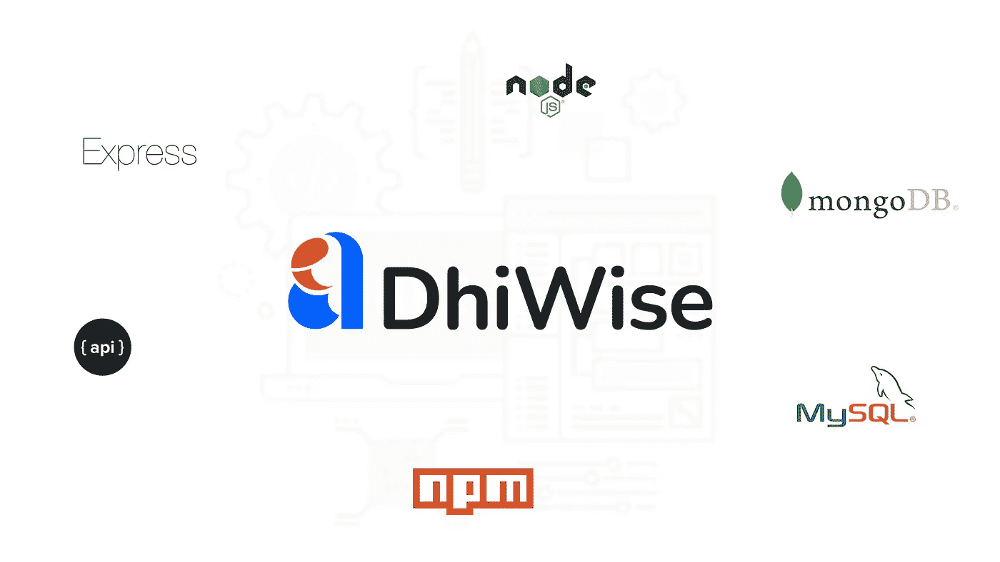

# 在 5 分钟内创建一个 Node.js 应用程序

> 原文：<https://javascript.plainenglish.io/create-a-node-js-application-in-5-minutes-67f4a0ca88a?source=collection_archive---------3----------------------->

## 如何用 DhiWise 快速创建 Node.js app



启动一个新的 Express 应用程序需要一定量的样板代码，包括启动一个新的服务器实例、配置视图引擎和设置错误处理。

有各种各样的 starter 项目和样板文件，在几分钟内就可以为您提供 Node JS、Express 和 Mongoose 样板文件项目。

# 什么是样板文件？

样板文件是用来描述代码段的术语，这些代码段可以包含在许多地方，只需很少或不需要修改。当提到被认为冗长的语言时，即程序员必须写很多代码来做最少的工作时，它更常用。样板代码是一段可以反复使用的代码，或者我们可以说，一段可重用的代码。

下面是启动 Node.js 项目时应该考虑的包和平台列表:

1.  [快速发电机](https://www.npmjs.com/package/express-generator)
2.  [快递-样板文件-生成器](http://npmjs.com/package/express-boilerplate-generator)
3.  [快递-app-样板](https://www.npmjs.com/package/express-app-boilerplate)
4.  [DhiWise](https://hubs.la/H0TFtyP0)

# 1.快速发电机

Express 有自己的命令行工具，可以轻松启动新应用，称为 [express-generator](https://expressjs.com/en/starter/generator.html) 。

使用快速生成器启动新项目需要运行几个命令:

```
$ npm install express-generator -g
```

这会将 express 生成器安装为一个全局包，允许您在终端中运行 Express 命令:

## 创建应用程序

```
$ express --view=ejs /tmp/foo && cd /tmp/foo
```

## 安装依赖项

```
$ npm install$ npm start   # and run the project.
```

## 应用程序结构

```
├── app.js
├── bin
│   └── www
├── package.json
├── public
│   ├── images
│   ├── javascripts
│   └── stylesheets
│       └── style.css
├── routes
│   ├── index.js
│   └── users.js
└── views
    ├── error.pug
    ├── index.pug
    └── layout.pug
```

更多详情请参考[快速发电机](https://www.npmjs.com/package/express-generator)。

# 2.快速样板文件生成器

创建一个新的 express 应用程序，作为类似于 express-gen 模块的启动样板文件。除了这个新的应用程序被配置为使用 **TypeScript 而不是普通的 JavaScript** ,并提供了各种选项，如使用的项目结构，对 auth 支持的关注以及加速开发过程的文档。

## 安装依赖项

```
$ npm i -g express-boilerplate-generator
```

## 使用

运行以下任一命令:

```
$ express-gen
# or
$ express-typescript-generator
# or
$ express-ts-gen
```

或者，为了避免安装和使用，请使用以下命令:

```
$ npx express-boilerplate-generator
```

Express-boilerplate-generator 为我们提供了两种选择。

1.[express-server-样板文件](https://github.com/open-devs/express-boilerplate-generator/blob/master/lib/templates/express-server-boilerplate/README.md):这种类型的结构提供了无身份验证的 express server 样板代码，以便在 typedoc &的支持下启动后端开发。

2.[express-server-样板-auth](https://github.com/open-devs/express-boilerplate-generator/blob/master/lib/templates/express-server-boilerplate-auth/README.md) :这种类型的结构提供了 express server 样板代码来启动带有身份验证支持的后端开发。它使用 passport-jwt 和 passport 作为依赖项。

## 应用程序结构

```
├── build.js
├── env
├── package.json
├── tsconfig.json
├── tsconfig.prod.json
├── src
│   ├── daos
│   ├── models
│   └── routes
│   └── service
|   └── index.ts
|   └── LoadEnv.ts 
|   └── Server.ts
├── eslintrc.json
```

详见[快件样板发生器](https://www.npmjs.com/package/express-app-boilerplate)。

# 3.express-app-样板文件

express-app-样板包为使用 Node.js、Express 和 Mongoose 构建 RESTful APIs 提供了样板。

该项目带有许多内置功能，如使用 JWT 的身份验证、请求验证、单元和集成测试、连续集成、docker 支持、API 文档、分页等。

*更多详细信息，请查看下面的功能列表。*

要创建项目，请运行:

```
$ npx express-app-boilerplate <project-name>
```

或者

```
$ npm init express-app-boilerplate <project-name>
```

## 应用程序结构

```
src\
 |--config\         # Environment variables and configuration related things
 |--controllers\    # Route controllers (controller layer)
 |--middlewares\    # Custom express middlewares
 |--models\         # Mongoose models (data layer)
 |--routes\         # Routes
 |--utils\          # Utility classes and functions
 |--app.js          # Application/Node Js Stuff
 |--server.js        # App entry point , Express related Stuff
```

详见[express-app-样板](https://www.npmjs.com/package/express-app-boilerplate)。

# 4.DhiWise

现在，我们有好消息告诉你。 [DhiWise](https://hubs.la/H0T7djs0) 不仅仅提供样板文件，还提供更多。太酷了，对吧！！😎

[DhiWise](https://hubs.la/H0TFtyP0) 为我们提供构建质量节点的平台。JS、Express 和 Mongoose(无 SQL)以及 Node。具有两种不同架构的 JS、Express、Sequelize (SQL)样板应用程序:**模型视图控制器(MVC)** 和**干净代码**。

[DhiWise](https://hubs.la/H0TFtyP0) 用户面板允许用户添加他们的平台(管理、设备、桌面、客户端)、模型、模型权限(CRUD)、身份验证和授权、常数、策略、自定义路由、查询生成器、调度器(CRON)等等，这些都是开发 API 的基本需求。查看 [DhiWise](https://app.dhiwise.com/) 了解更多详情。

对于样板应用程序，DhiWise 遵循完整的**代码可重用性和关注点分离**。这背后的原因是，在开发阶段减少单调的任务。它为数据库服务、请求验证、服务和策略提供了一组功能。

DhiWise 最好的一点是用户可以在模型、常量、权限、策略等发生变化后重新生成他们的项目。因此，如果您的项目需要任何更改，您无需担心。

## 特征

*   **NoSQL 数据库** : [MongoDB](https://www.mongodb.com/) 对象数据建模使用[mongose](https://mongoosejs.com/)。
*   **SQL 数据库:** MySQL、PostgreSQL、MSSQL 对象数据建模使用 [Sequelize](https://sequelize.org/) 。
*   **模型**:支持添加模型、钩子、索引、类型、引用等。
*   **模板引擎**:支持 EJS(嵌入式 JavaScript)模板，用于服务器端渲染 HTML 页面。
*   **认证和授权**:使用 passport-jwt。
*   **伐木** : [摩根](https://github.com/expressjs/morgan)。
*   **邮递员请求集合**:为邮递员集合和 seeders 提供所有 API。
*   **响应消息:**提供带有状态码的结构良好的 JSON 响应消息。
*   **Joi-validation:** HTTP 请求体验证使用 [joi](https://joi.dev/) 。
*   **依赖删除**:允许级联硬删除和软删除。
*   **DB-Service** :仓库型数据库功能服务。
*   社交媒体认证:GitHub、谷歌和 LinkedIn。
*   **错误处理**:集中式错误处理机制。
*   **依赖关系管理**:同 NPM。
*   **环境管理**:开发、质量保证和生产。
*   **CORS** :使用 [cors](https://github.com/expressjs/cors) 启用跨产地资源共享。
*   **林挺**:符合 [ESLint](https://eslint.org/) 和 Airbnb 代码标准。

## 步伐

第一步:进入 [DhiWise](https://hubs.la/H0TFtyP0) 面板。如果您尚未注册，请登录并注册。

步骤 2:添加新项目。添加项目后，您将能够看到三个选项。选择 Node.js 来生成 API，然后选择 create node application。

步骤 3:选择节点应用程序后，您将能够添加项目的基本信息，如项目名称、数据库名称、端口号、API 的平台、用户类型以及特定平台的用户类型的登录访问。

步骤 4:添加节点应用程序的基本信息后，您将移动到项目面板。在左侧面板中，您可以看到模型、模型权限、常量、策略、路由、中间件等等。

第五步:添加完所有你想要的输入后，你可以点击 **Build app** 按钮。您的完整应用程序在一分钟内构建完成。

第 6 步:现在您可以下载源代码并应用您的更改。

## 应用程序结构

```
├── app.js
├── config
├── controllers
|    └── platforms
├── models
├── routes
│   ├── index.js
│   └── platforms
├── postman
├── public
├── middleware
├── services
├── utils
├── jobs
├── views
├── .env
├── .gitignore
├── .eslintrc.js
```

继续编码❤️

## 参考

1.  [快速发电机](https://expressjs.com/en/starter/generator.html)
2.  [快递样板文件生成器](https://www.npmjs.com/package/express-app-boilerplate)
3.  [快速应用样板](https://www.npmjs.com/package/express-app-boilerplate)