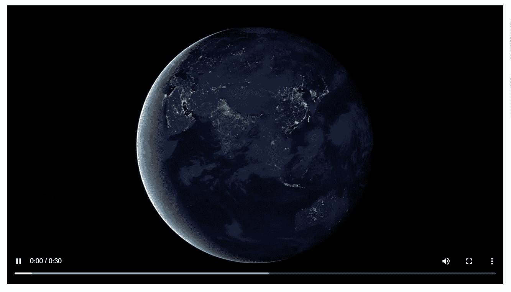

# 创建 Node.js 视频流应用程序

> 原文：<https://javascript.plainenglish.io/create-a-node-js-video-streaming-application-3095cb2aa52c?source=collection_archive---------0----------------------->

大家好，在这篇文章中，我将向大家展示一个非常简单的 Node.js 应用程序来在线播放视频。本文只涉及后端。在下一部分，我将使用 Vue.js 创建前端。



所以，不多说，让我们直接进入这个过程。

> 步骤 1:初始化 npm 配置并安装依赖项

```
npm i express cors 
npm i -D nodemon
```

您的 package.json 文件应该如下所示

> 第 2 步:设置一个基本的 express 服务器开始。

> 第三步:在你的应用程序中添加一个新的 index.html 文件。您的文件 src 必须指向您要继续进行流式处理的服务器端点。

注意:这个 HTML 文件将被你的前端应用程序替换。

> 步骤 4:现在我们需要设置'/video '路径和合适的控制器。另外，作为我们的索引路径，我们还需要发送这个 HTML 文件进行渲染。让我们更新 app.js 文件来完成这些更改。

Routes.js

视频控制器. js

让我们分析一下控制器中发生了什么。

在我们的头中，我们提取出范围(范围是你当前在视频缓冲区中的部分)。如果 range 不存在，我们抛出一个错误，说明没有找到请求的头范围。否则，我们在我们的文件系统中定位文件。(如果您使用数据库存储，请参考网格文件系统)。

然后我们决定每个并发请求要发送的块大小(在上面的例子中是 1mb——math . pow(10，6)或简单的 10**⁶).然后我们需要决定开始和结束变量。start 变量决定了我们正在发送的视频的起点。对于结束变量，我们需要确定(开始+块)或视频大小长度之间的最小值。这是因为(start +chunk)可能会大于视频长度，因此我们无法发送任何内容，这将导致错误。

最后，我们确定实际发送的内容长度。内容长度是开始值和结束值之差。然后，我们使用上面计算的值生成我们的 header 对象。

在最后一部分中，我们发送部分内容响应(206 ),这也是 express 框架的一部分，并使用 fs (Node.js core)模块通过管道将该响应与读取流连接起来。这就是使用 Node JS 服务器传输视频所需的全部内容。

> 我们首先检查范围是否不存在，然后抛出错误。/
> 
> videoPath(第 8 行)是您想要传输的文件的相对路径。
> 
> videoSize(第 9 行)是所选文件的文件大小。
> 
> chunkSize(第 10 行)是您希望为每个集成发送的文件缓冲区。在上面的例子中，它是 1 兆字节。
> 
> start(第 11 行)是视频的开始范围。
> 
> end(第 12 行)是视频的结束范围。
> 
> contentLength(第 13 行)需要从流应用程序发送的视频缓冲区。
> 
> 第(14–19)行然后我们设置标题，将我们所有的配置应用到响应对象。
> 
> (第 20 行)然后我们发送 206 响应指示我们正在发送部分内容响应。
> 
> (第 21–22 行)最后，利用 Fs(在 core node js 中可用)模块，我们创建一个读取流，并通过管道将其发送到我们的响应对象。

在下一部分，我将使用 Vue.js 设计前端。如果你喜欢这篇文章，你会爱上前端集成。您可以关注我以立即获得更新。

*更多内容看* [***说白了. io***](http://plainenglish.io/) ***。*** *报名参加我们的* [***免费每周简讯点击这里***](http://newsletter.plainenglish.io/) ***。***