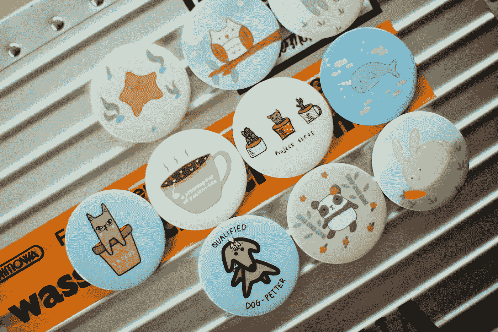

# 用 Vue 3 和 JavaScript 创建一个密码板

> 原文：<https://javascript.plainenglish.io/create-a-pin-pad-with-vue-3-and-javascript-4247131fd5c7?source=collection_archive---------9----------------------->



Photo by [CHUTTERSNAP](https://unsplash.com/@chuttersnap?utm_source=medium&utm_medium=referral) on [Unsplash](https://unsplash.com?utm_source=medium&utm_medium=referral)

Vue 3 是易于使用的 Vue JavaScript 框架的最新版本，让我们可以创建前端应用程序。

在本文中，我们将看看如何用 Vue 3 和 JavaScript 创建一个密码板。

# 创建项目

我们可以用 Vue CLI 创建 Vue 项目。

要安装它，我们运行:

```
npm install -g @vue/cli
```

与 NPM 或:

```
yarn global add @vue/cli
```

用纱线。

然后我们运行:

```
vue create pin-pad
```

并选择所有默认选项来创建项目。

# 创建 PIN Pad

为了创建 PIN pad，我们编写:

```
<template>
  <div>{{ pin }}</div>
  <div>
    <div>
      <button @click="pin += '1'">1</button>
      <button @click="pin += '2'">2</button>
      <button @click="pin += '3'">3</button>
    </div>
    <div>
      <button @click="pin += '4'">4</button>
      <button @click="pin += '5'">5</button>
      <button @click="pin += '6'">6</button>
    </div>
    <div>
      <button @click="pin += '7'">7</button>
      <button @click="pin += '8'">8</button>
      <button @click="pin += '9'">9</button>
    </div>
    <div>
      <button @click="pin = pin.slice(0, pin.length - 1)">&lt;</button>
      <button @click="pin += '0'">0</button>
      <button @click="pin = ''">C</button>
    </div>
  </div>
</template><script>
export default {
  name: "App",
  data() {
    return {
      pin: "",
    };
  },
};
</script>
```

我们在模板的顶部显示`pin`。

然后我们将按钮添加到 div 中。

在数字键中，我们使用了`@click`指令将相应的字符添加到`pin`中。

退格(

And the C key clears the 【 by assigning it to an empty string.

Now when we click on the keys, we see the PIN update.

# Conclusion

We can create our own PIN pad easily with Vue 3 and JavaScript.

*更多内容请看*[***plain English . io***](https://plainenglish.io/)