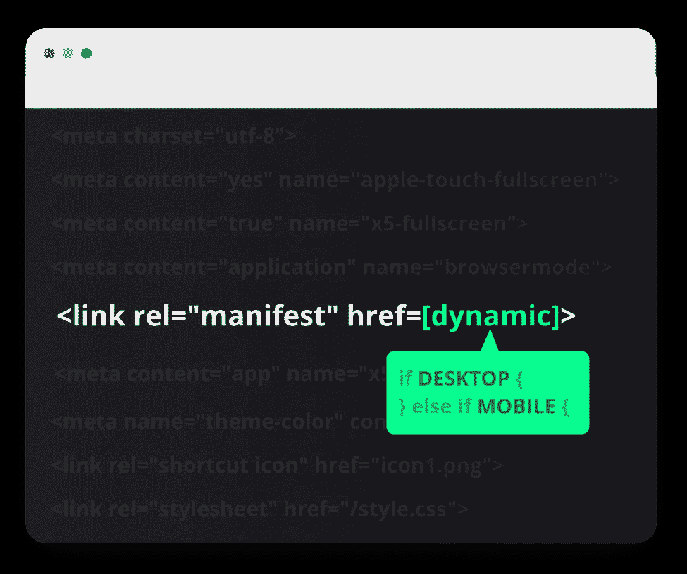

# 动态创建 PWA 应用程序清单

> 原文：<https://javascript.plainenglish.io/create-a-pwa-app-manifest-dynamically-3b3d45340b11?source=collection_archive---------0----------------------->

## 想知道如何在桌面和手机上创建不同图标的应用清单吗？



每个渐进式网络应用都有一个[应用清单](https://developer.mozilla.org/en-US/docs/Web/Manifest)，一个简单的 JSON 文件，包含你的应用的基本信息，即名称、图标、描述等。

如果您只是想在现有的 web 应用程序中添加 PWA 功能， [Progressier](https://progressier.com) 拥有您需要的一切(包括动态应用程序图标选项)。但是如果您想动态创建自己的 web 应用程序清单，请继续阅读。

# 传统的做法

构建第一个 PWA 时，最简单的方法是直接在 HTML 模板的`<head>`部分添加一个到应用清单的链接。

在你网站的任何地方主持`manifest.json`。生成的 JSON 文件应该如下所示:

```
{ 
  "short_name":"Coronavirus", 
  "name":"The Coronavirus App", 
  "background_color":"#ffffff", 
  "theme_color":"#ffffff", 
  "display":"standalone", 
  "orientation":"any", 
  "start_url":"https://coronavirus.app",       
  "scope":"https://coronavirus.app", 
  "icons":[    
    {"src":"/icon512.png","sizes":"512x512","type":"image/png"},
    {"src":"/icon192.png","sizes":"192x192","type":"image/png"},      
    {src":"/icon196.png","sizes":"196x196","type":"image/png"} 
  ] 
}
```

# 为什么你会想换一种方式

虽然上面的方法是处理 web 应用程序清单的一种非常有效的方式，但是在一些合理的情况下，静态文件是不行的，您可能希望动态地生成它:

*   你需要桌面和手机上完全不同的图标
*   您希望在同一个域中托管多个不同的 pwa
*   对于每个登录的用户，PWA 应该看起来不同

可能还有更多有效的例子。要动态生成您的应用程序清单，您有两种选择:当用户请求时，在您的服务器上构建它。或者直接在浏览器中自动生成(我们的首选方法)。

# 服务器端动态应用程序清单生成

不要把这个文件作为静态文件放在您的站点上，而是把到`/manifest.json`的路径做成一个 API，这将允许您根据您的需要以编程的方式生成 JSON 文件的内容。这里有一个使用 Node.js/Express.js:的例子

```
app.get('/manifest.json', async function(req, res){ 
  //for brevity, we're not including the isDesktop function here 
  let iconUrl = isDesktop() ? '/desktop.png' : '/mobile.png'; 
  let manifest = { 
    name: "App name", 
    icons: [{ 
     src: iconUrl, 
     sizes:  "512x512", 
     type:"image/png" 
    }] 
  } 
  res.header('content-type', 'application/json'); 
  return res.status(200).send(JSON.stringify(manifest)); 
});
```

# 客户端动态应用程序清单创建

> 2022 年 6 月更新:客户端动态应用程序清单生成不再是一个可行的选项。所以不要做以下的事情。更多见评论。

大多数人不知道`/manifest.json`不一定是实际文件。它与[数据 URL](https://developer.mozilla.org/en-US/docs/Web/HTTP/Basics_of_HTTP/Data_URIs) 配合得很好(尽管有一个缺点——见注释)。

无需从服务器下载额外的文件，这意味着更快的加载速度和更低的服务器成本。由于每次修改 web 应用程序清单的内容时，数据 URL 都会不同，因此您不必担心浏览器不会相应地更新其内容。

在您的客户端代码中，您可以这样创建它:

```
//for brevity, we're not including the isDesktop function here 
let iconUrl = isDesktop() ? '/desktop.png' : '/mobile.png'; 
let manifest = { 
  name: "App name", 
  icons: [{ src: iconUrl, sizes: "512x512", type:"image/png" }] 
}; 
let content = encodeURIComponent(JSON.stringify(manifest)); 
let url = "data:application/manifest+json,"+content; 
let element = document.createElement('link'); 
element.setAttribute('rel', 'manifest'); 
element.setAttribute('href', url); 
document.querySelector('head').appendChild(element);
```

在 [Progressier](https://progressier.com) 上，我们遇到了相当多的复杂用例，用户需要在他们的 Android 主屏幕、Android 闪屏、iPhone 闪屏和安装了 PWA 的 Windows/Mac 上使用完全不同的徽标，因此我们相应地设计了我们的仪表盘。

在幕后，我们使用这些用户设置通过上述方法动态生成他们的应用程序清单。

问题或反馈？下面留言评论！

*更多内容看* [*说白了。报名参加我们的*](http://plainenglish.io/) [*免费每周简讯*](http://newsletter.plainenglish.io/) *。在我们的* [*社区*](https://discord.gg/GtDtUAvyhW) *获得独家写作机会和建议。*