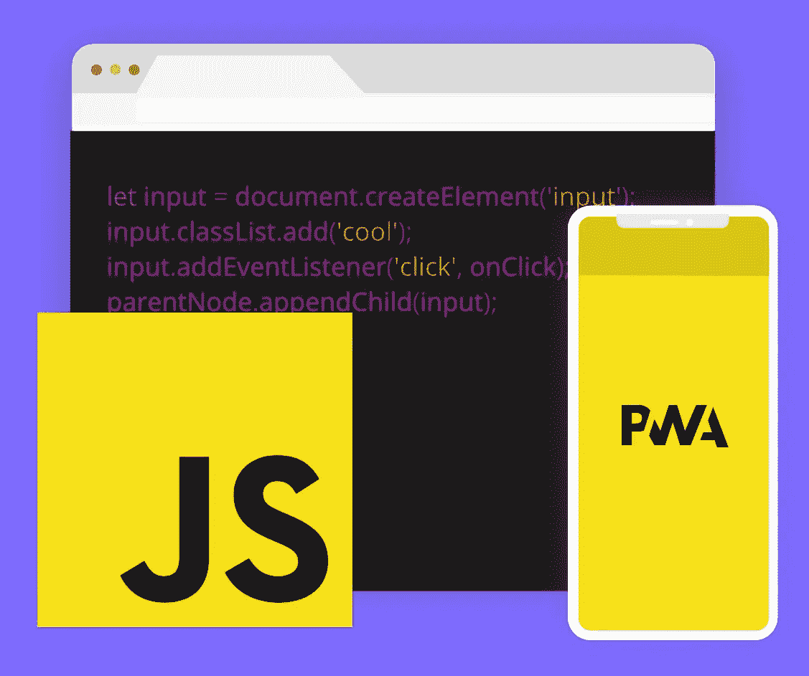
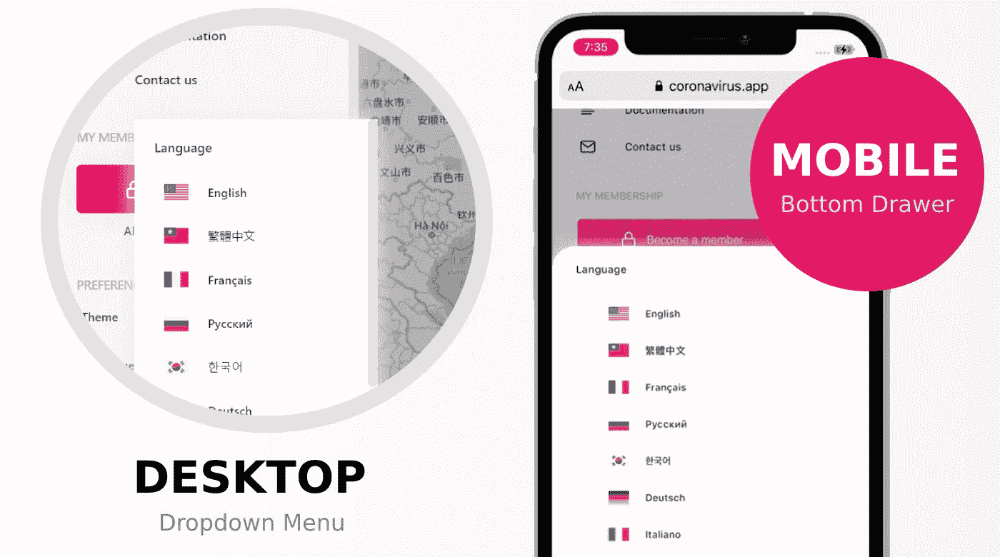
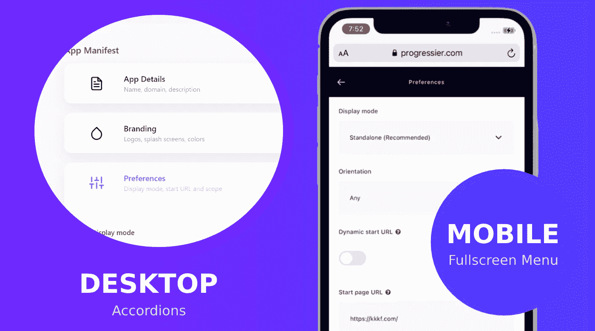

# 使用 Vanilla JS 从头开始创建 PWA

> 原文：<https://javascript.plainenglish.io/create-a-pwa-from-scratch-with-vanilla-javascript-c726c5b2f9e0?source=collection_archive---------2----------------------->

当 COVID 在 2020 年 1 月开始在中国传播时，我决定自己开发冠状病毒应用程序。这个简单的 PWA 已经被超过 1500 万个人用户使用。

我在构建这个应用时遇到的问题启发我创建了 [Progressier](https://progressier.com) ，这是一个 SaaS 平台，它可以将我们称为“Progressive Web App”的整个功能块添加到任何领域，而无需编写任何代码。

在本文中，我将分享一些关于我从零开始使用 Vanilla JS 开发 pwa 的技巧和诀窍。

# 不那么容易…但是值得

PWA 提供了一个诱人的承诺:只需要管理一个代码库，你的应用就可以在所有平台上运行。实际上，这意味着你必须让一个代码库做更多的事情，而不是开发几个独立的原生应用。

大多数时候，利可能大于弊。但它不是黑或白的。开发人员盲目宣传 PWAs 作为原生应用的替代品，只是没有花足够的时间开发 PWAs。原生应用也有自己的位置。

# 不要先考虑台式机，也不要先考虑移动设备

直到十年前，大多数网站都首先针对桌面应用进行了优化。后来有了手机，我们开始让网站有反应。

有了 PWAs，你就不能先考虑桌面了。你可能也不应该考虑移动优先。用 Vanilla JS 创建的 PWA 必须看起来和感觉上像移动设备上的原生应用程序。但它也必须看起来像一个合适的桌面应用程序。

这是两种完全不同的 UI 范例——不仅仅是元素大小的问题。例如，移动用户界面倾向于一次只显示一个交互元素，而桌面用户界面通常同时显示多个交互元素。以下是一些具体的例子:

*A standard dropdown menu on desktop becomes a bottom drawer with an overlay on mobile*

*Desktop accordion items become standalone full screen components on mobile*

*A side panel searchable list on desktop becomes a mobile search bar*

根据经验，创建一个 HTML 元素，并使用 CSS 对其进行样式化。这通常意味着将元素`position`从`relative`更改为`fixed`或`absolute`。

有时候，这是不可能的。当用普通 JS 开发 PWA 时，遇到`z-index`问题并不罕见。当一个元素在移动设备上打开时，它必须出现在它的父容器的兄弟容器之上，而当它没有打开时，父容器必须出现在兄弟容器之下。当这种情况发生时，您必须实现一些技巧来用 JavaScript 动态修改父节点的`z-index`。

当您为 PWA 设计组件时，从功能开始，然后同时设计它们的移动和桌面版本。只有这样才能找出正确的 HTML 结构。

# 抽离

React 或 Vue 等框架的支持者有时认为普通 JS 过于冗长且效率低下。他们还认为，如果你通过抽象浏览器 API 来解决这个问题，你实际上是在创建自己的框架(也称为“重新发明轮子”)。下面是做同样事情的两个代码片段:

我自制的抽象的好处是非常明显的。61 个字符而不是 139 个字符意味着您节省了键入代码的时间，浏览器也节省了从服务器获取代码的时间。每个 HTML 元素占一行，你的代码也变得更容易阅读和组织。

然而这两个函数在语义上是相同的。它们都创建了一个 [DOM 节点](https://developer.mozilla.org/en-US/docs/Web/API/Node)，向其添加了一个类和一个事件监听器，并将其附加到 DOM 中。Vanilla JS 是关于使用默认浏览器 API 的。另一方面，框架固执己见。他们介绍自己对事情应该如何做的先入之见。想想[如何使用 JXS 创建一个混合的 HTML/JavaScript 声明式风格](https://reactjs.org/docs/introducing-jsx.html)。框架创造了不同的范例。在我看来，简化普通 JS 的语法不属于这一类。

十年前，jQuery 很流行，因为它使得跨浏览器的东西更加一致。如今，大多数浏览器 API 都构建得非常好，并且有文档记录，因此您可能不需要任何其他东西。另一个很好的例子是[moment . js](https://momentjs.com/)——处理日期和时间曾经是一件痛苦的事情。现在有了 [Date()](https://developer.mozilla.org/en-US/docs/Web/JavaScript/Reference/Global_Objects/Date) 接口，就简单了。它可以用 JavaScript 实现。

所以使用普通的 JS，但是构建你自己的抽象。尽可能简单地编写、理解、组织和修改你的代码。你肯定需要有条理地让一个用普通 JS 从头创建的 PWA 在它必须支持的所有平台上工作。

# 设计可重用组件

如果没有一个框架来为你构建代码，你必须格外小心，不要把你的项目变成意大利面条式的代码。对我来说效果很好的是创建语义孤岛/组件。一个组件是 JavaScript 函数，它包含了与该组件相关的所有内容:HTML、DOM 节点、事件监听器、CSS、逻辑都在同一个地方。

除了让你的代码更具可读性，它还能让你的产品更容易迭代。当你必须删除一个组件时，你只需要删除整个代码块。你可以确定它不会破坏其他任何东西，并且你的代码库不会包含以前迭代的剩余部分。

你并不真的需要使用框架来构建组件。事实上，你会惊讶地发现使用普通 JS 是多么容易。你甚至也不需要花哨的[类](https://developer.mozilla.org/en-US/docs/Web/JavaScript/Reference/Statements/class)声明。下面是我创建组件的基本结构。

我不记得还需要更多。它真的做了你想让它做的一切:创建自定义 CSS，创建容器，如果需要，让你等待来自网络的数据，让你在数据改变时重新呈现容器。

因为您使用的是普通的 JS，所以您可以稍微不同地构建每个组件。例如，不同的组件可能不会像上面的组件那样自初始化。或者可以用完全不同的参数调用它，比如来自另一个组件的数据。

当然，可能有一千种其他的方法也同样有效。

# 为工作使用正确的工具

## **建议 1:使用图书馆**

使用 Vanilla JS 并不意味着你不能利用抽象一些复杂事物的库，这些复杂事物在浏览器中不是开箱即用的。关键是这些库应该在它们自己的筒仓中工作，而不是强迫你围绕它们重写整个应用程序。例如，不要建立自己的地图——使用[传单. js](https://leafletjs.com/) 。不要构建自己的图表，而是使用 [Charts.js](https://www.chartjs.org/) 。

## 推荐 2: [BrowserStack](https://www.browserstack.com/)

你将不得不花费大量的时间在不同的浏览器中测试你的 PWA。就我个人而言，我是 Browserstack 的忠实粉丝。该平台允许您在任何可以想象的浏览器/操作系统组合上测试任何 web 应用程序或网站，甚至是旧设备。这些是真实的设备，不是仿真设备。我每月为此支付的 39 美元非常值得。顺便说一句，我和 Browserstack 没有任何关系。

## **推荐三:**[**MDN Web Docs**](https://developer.mozilla.org/en-US/)

我绝对喜欢 MDN。它本质上是 JavaScript 中所有可用 API 的列表。每一个都有非常全面的文档。作为一个普通的 JS 开发人员，如果你只允许我访问整个万维网上的一个站点，我会选择这个。

## **推荐 4:** [**进步者**](https://progressier.com)

我建立了它，所以我显然有偏见，但我不能在不推荐 Progressier 的情况下结束这篇文章。在构建冠状病毒应用程序时，我突然意识到，我们称之为 PWA 的整个功能块(缓存策略、可安装性、推送通知)在实现时都是不必要的麻烦。所以我决定为它建立一个抽象——你可以用一行代码把它添加到你自己的应用程序中。

# 那都是乡亲们！

你已经用普通的 Javascript 构建了 PWA 了吗？你的体验如何？你推荐使用哪些其他工具？

如果这篇文章对你有所帮助，请考虑在下面留下评论🙏

*更多内容看* [*说白了。报名参加我们的*](http://plainenglish.io/) [*免费每周简讯*](http://newsletter.plainenglish.io/) *。在我们的* [*社区*](https://discord.gg/GtDtUAvyhW) *获得独家写作机会和建议。*