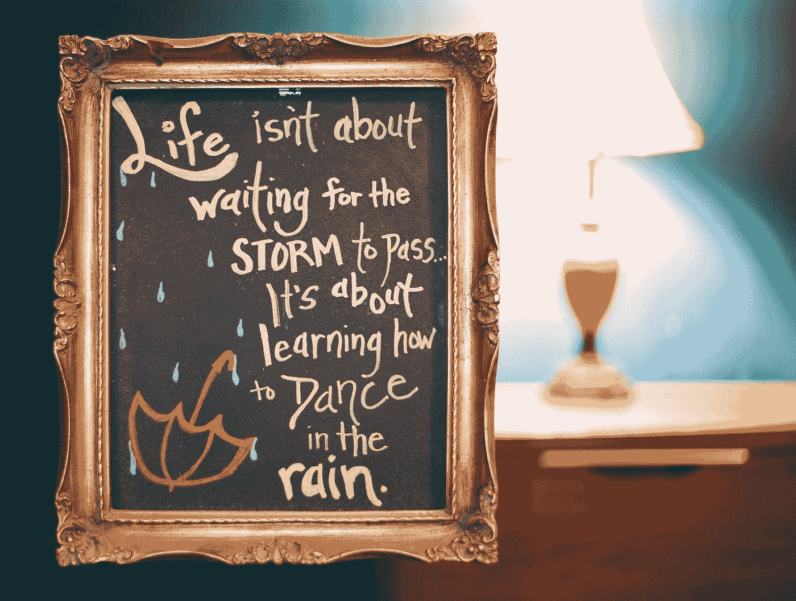

# 使用 Vue 3 和 JavaScript 创建当天报价应用程序

> 原文：<https://javascript.plainenglish.io/create-a-quote-of-the-day-app-with-vue-3-and-javascript-69c9792c764e?source=collection_archive---------10----------------------->



Photo by [Anthony Garand](https://unsplash.com/@garand?utm_source=medium&utm_medium=referral) on [Unsplash](https://unsplash.com?utm_source=medium&utm_medium=referral)

React 是一个易于使用的 JavaScript 框架，允许我们创建前端应用程序。

在本文中，我们将了解如何使用 React 和 JavaScript 创建当天的报价应用程序。

# 创建项目

我们可以使用创建反应应用程序来创建反应项目。

要安装它，我们运行:

```
npx create-react-app quote-of-the-day
```

与 NPM 一起创建我们的反应项目。

# 创建当天报价应用程序

为了创建该应用的报价，我们写道:

```
import React, { useEffect, useState } from "react";export default function App() {
  const [quoteOfTheDay, setQuoteOfTheDay] = useState("");
  const [quotes, setQuotes] = useState([]); const getQuotes = async () => {
    const res = await fetch(`https://type.fit/api/quotes`);
    const quotes = await res.json();
    setQuotes(quotes);
  }; const getRandomQuote = () => {
    const index = Math.floor(Math.random() * quotes.length);
    setQuoteOfTheDay(quotes[index].text);
  }; useEffect(() => {
    getQuotes();
  }, []); return (
    <div className="App">
      <button onClick={getRandomQuote}>get quote</button>
      <p>{quoteOfTheDay}</p>
    </div>
  );
}
```

我们有`quoteOfTheDay`弦状态和用`useState`钩创造的`quotes`日。

然后我们添加`getQuotes`函数，该函数向 API 发出 GET 请求，以获取一个报价列表。

我们打电话给`res.json`用 JSON 的话来回报承诺。

然后我们调用`setQuotes`来设置`quotes`状态。

`getRandomQuote`函数用`Math.random`和`Math.floor`得到一个随机索引，将十进制数四舍五入到最接近的整数。

然后我们调用`setQuoteOfTheDay`将引号设置为字符串`text`属性。

我们有`useEffect`回调来调用`getQuotes`来获取报价。

第二个参数是一个空数组，所以它只在`App`挂载时运行。

然后我们返回 JSX，按钮`onClick`道具设置为`getRandomQuote`。

点击按钮，运行`getRandomQuote`。

在这下面，我们展示了`quoteOfTheDay`。

# 结论

因此，我们可以使用 reaction 和 JavaScript 轻松创建当天的报价应用程序。我希望你觉得这篇文章很有帮助。谢谢你的阅读。

[*更多内容参见*](http://plainenglish.io/)