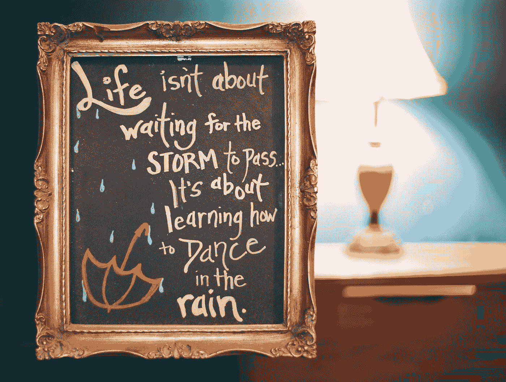

# 用 Vue 3 和 JavaScript 创建一个每日报价应用程序

> 原文：<https://javascript.plainenglish.io/create-a-quote-of-the-day-app-with-vue-3-and-javascript-cf73403ef063?source=collection_archive---------13----------------------->



Photo by [Anthony Garand](https://unsplash.com/@garand?utm_source=medium&utm_medium=referral) on [Unsplash](https://unsplash.com?utm_source=medium&utm_medium=referral)

Vue 3 是易于使用的 Vue JavaScript 框架的最新版本，让我们可以创建前端应用程序。

在本文中，我们将看看如何用 Vue 3 和 JavaScript 创建一个每日报价应用程序。

# 创建项目

我们可以用 Vue CLI 创建 Vue 项目。

要安装它，我们运行:

```
npm install -g @vue/cli
```

与 NPM 或:

```
yarn global add @vue/cli
```

用纱线。

然后我们运行:

```
vue create quote-of-the-day-app
```

并选择所有默认选项来创建项目。

# 创建每日报价应用程序

我们可以通过编写以下内容来创建我们的每日报价应用程序:

```
<template>
  <button @click="getRandomQuote">get quote</button>
  <p>{{ quoteOfTheDay }}</p>
</template><script>
export default {
  name: "App",
  data() {
    return {
      quotes: [],
      quoteOfTheDay: "",
    };
  }, methods: {
    async getQuotes() {
      const res = await fetch(`https://type.fit/api/quotes`);
      const quotes = await res.json();
      this.quotes = quotes;
    },
    getRandomQuote() {
      const index = Math.floor(Math.random() * this.quotes.length);
      const quoteOfTheDay = this.quotes[index];
      this.quoteOfTheDay = quoteOfTheDay.text;
    },
  },
  async beforeMount() {
    await this.getQuotes();
    this.getRandomQuote();
  },
};
</script>
```

在组件对象中，我们用`data`方法返回一个具有`quotes`和`qyoteOfTheDay`反应属性的对象。

`quotes`有一系列的报价。

`quoteOfTheDay`从`quotes`数组中随机选择报价。

在`methods`属性中，我们有`getQuotes`方法，它调用`fetch`从 URL 中获取报价。

然后我们调用`res.json()`从响应中获取 JSON。

每行返回一个承诺，所以我们需要添加`await`来等待每行返回结果。

然后我们将`quotes` JSON 数组赋给 thre `this.quotes` reactive 属性。

`getRandomQuotes`随机生成`quotes`数组的索引。

然后我们设置`quoteOfTheDay`得到路线。

然后我们可以通过`text`属性来获取报价文本。

在`beforeMount`钩子中，我们运行`getQuotes`方法和`getRandomQuote`方法来获取报价。

`beforeMount`在组件挂载时运行，所以我们将在组件加载时得到报价。

在模板中，我们有一个按钮来获取带有`getRandomQuote`的报价，并在`p`元素中显示结果。

# 结论

我们可以用 Vue 3 和 JavaScript 轻松创建一个每日报价应用程序。

*在* [***获取更多内容***](https://plainenglish.io/)