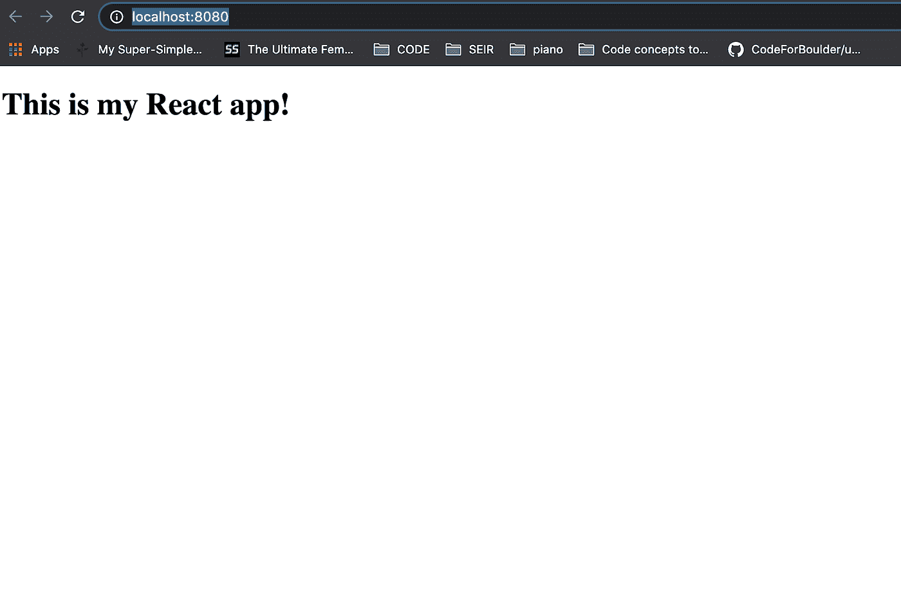

# 在 2021 年从头开始创建一个 React 应用程序

> 原文：<https://javascript.plainenglish.io/create-a-react-app-from-scratch-in-2021-8e9948602e9c?source=collection_archive---------0----------------------->


Photo by [Joan Gamell](https://unsplash.com/@gamell?utm_source=unsplash&utm_medium=referral&utm_content=creditCopyText) on [Unsplash](https://unsplash.com/?utm_source=unsplash&utm_medium=referral&utm_content=creditCopyText)

## 通过学习 create-react-app 在幕后做什么，成为一名更好的程序员。

您已经参与了几个(或者可能很多)React 项目，但是可能只是通过使用 create-react-app 开始了自己的项目。

Create-react-app 对于那些只想*接触一些 react 代码*而不想经历用 Webpack 和 Babel 配置项目的麻烦的初学者来说是非常棒的。

但是你现在更强大了。你是*拥有*反应…现在是时候从头开始创建你的项目了。相当于从零开始制造你的汽车引擎。

不要害怕。你能行的。

## **创建项目目录**

首先，创建一个新目录并放入 cd。

```
mkdir my-app-from-scratch && cd my-app-from-scratch
```

接下来，让我们用 npm 初始化应用程序，以管理我们所有的依赖项。

```
npm init -y
```

太好了！现在您已经设置好了 package.json 文件。

## **安装依赖关系**

接下来，让我们安装这个应用程序需要的所有依赖项。运行这个命令，然后继续下面的内容，对我们刚刚安装的*进行分解。*

```
npm i webpack babel-loader @babel/preset-react @babel/core babel-preset-react html-webpack-plugin webpack-dev-server css-loader style-loader @babel/plugin-proposal-class-properties webpack-cli -D && npm i react react-dom -S
```

我们刚刚安装的内容:

*   Webpack :把我们所有的文件捆绑成一个文件
*   *babel-loader* :与 Webpack 一起工作，将 ES6+转换成旧浏览器支持的 ES5
*   *@babel/preset-react* :将巴别支援扩展到 JSX
*   *html-webpack-plugin* :“简化 html 文件的创建以服务于您的 webpack 包”-https://web pack . js . org/plugins/HTML-web pack-plugin/
*   *webpack-dev-server:* 允许你使用 webpack 和一个提供实时重载的开发服务器。
*   *webpack-CLI*:“web pack CLI 为开发人员提供了一组灵活的命令，以提高设置自定义 web pack 项目的速度。”-https://www . NPM js . com/package/web pack-CLI
*   *css-loader:* 允许 Webpack 将 css 文件转换成 JavaScript 字符串。
*   样式加载器:将 JavaScript 字符串插入 HTML dom。
*   *@ babel/plugin-proposal-class-properties:*"此插件转换静态类属性以及用属性初始值设定项语法声明的属性"-https://www . npmjs . com/package/@ babel/plugin-proposal-class-properties
*   *react:* JavaScript 库
*   *react-dom:* "充当 React-https://www . npmjs . com/package/React-dom 的 DOM 和服务器呈现器的入口点

## **添加 src 目录和 index.js 文件**

```
mkdir src && cd src && touch index.js
```

## **添加文件 src/index.html**

仍然在 src 目录中，在终端中键入以下命令:

```
touch index.html
```

您的文件树当前应该如下所示:

```
my-app-from-scratch/
┣ node_modules/
┣ src/
 ┣ index.html
 ┗ index.js
┣ package-lock.json
┗ package.json
```

太好了！

## 现在让我们**添加一些启动代码**

在 src/index.html 中添加以下代码:

```
<!doctype html><**html** lang=”en”>
<**head**>
 <**meta** charset=”utf-8">
 <**title**>My React App from Scratch</**title**>
</**head**>
<**body**>
 <**div** id=”app”></**div**>
</**body**>
</**html**>
```

在 src/index.js 中添加以下代码:

```
import ReactDOM from ‘react-dom’;
import React from ‘react’;const App = () => {
 return <**h1**>This is my React app!</**h1**>;
 }ReactDOM.render(<**App** />, document.getElementById(‘app’));
```

## **配置 Webpack &巴别塔**

太棒了。现在是时候装配我们的 Webpack 和 Babel 配置文件了。这些文件允许我们定制 Webpack & Babel 来处理我们项目中的 JSX 和 CSS 之类的东西。

在根目录中，在您的终端中键入以下内容:

```
touch .babelrc && touch webpack.config.js
```

您的文件树应该如下所示:

```
my-app-from-scratch/
┣ node_modules/
┣ src/
 ┣ index.html
 ┗ index.js
┣ .babelrc
┣ package-lock.json
┣ package.json
┗ webpack.config.js
```

在 webpack.config.js 中添加以下代码:

```
const HtmlWebPackPlugin = require(“html-webpack-plugin”);
const htmlPlugin = new HtmlWebPackPlugin({
 template: “./src/index.html”,
 filename: “./index.html”
});module.exports = {mode: ‘development’,
  module: {
    rules: [{
   test: /\.js$/,
   exclude: /node_modules/,
   use: {
     loader: “babel-loader”
   }
 },
  {
   test: /\.css$/,
   use: [“style-loader”, “css-loader”]
  }
]},
 plugins: [htmlPlugin]
};
```

在...里面。babelrc 添加这段代码:

```
{
 “presets”: [“@babel/preset-react”],
 “plugins”: [“@babel/plugin-proposal-class-properties”]
}
```

## **将“开始”脚本添加到 package.json**

在 package.json 内部，用脚本添加以下代码。

```
"start": "webpack serve --config webpack.config.js"
```

您的 package.json 文件应该如下所示:

```
{
 “name”: “my-app-from-scratch “,
 “version”: “1.0.0”,
 “description”: “”,
 “main”: “webpack.config.js”,
 “scripts”: {
   “test”: “echo \”Error: no test specified\” && exit 1",
   "start": "webpack serve --config webpack.config.js"
},
 “keywords”: [],
 “author”: “”,
 “license”: “ISC”, “devDependencies”: {
 “@babel/preset-react”: “⁷.12.13”,
 “babel-core”: “⁶.26.3”,
 “babel-loader”: “⁸.2.2”,
 “babel-preset-react”: “⁶.24.1”,
 “css-loader”: “⁵.0.2”,
 “html-webpack-plugin”: “⁵.1.0”,
 “style-loader”: “².0.0”,
 “webpack”: “⁵.22.0”,
 “webpack-cli”: “⁴.5.0”,
 “webpack-dev-server”: “³.11.2”
 },
 “dependencies”: {
 “react”: “¹⁷.0.1”,
 “react-dom”: “¹⁷.0.1”
 }
}
```

## **测试查看你的应用在浏览器中运行**

现在是时候让我们的真相时刻看到我们所有的努力工作了！

在根目录终端中，运行

```
npm run start
```

你应该在浏览器中看到你的应用在 [http://localhost:8080/](http://localhost:8080/) 上运行。



干得好！您完全从零开始制作了一个 React 应用程序！

**资源:**

[](https://webpack.js.org/) [## 网络包

### webpack 是一个模块捆绑器。它的主要目的是捆绑 JavaScript 文件以便在浏览器中使用，但它也…

webpack.js.org](https://webpack.js.org/) [](https://babeljs.io/) [## 下一代 JavaScript 的编译器

### 我们是一小群志愿者，他们利用业余时间维护这个项目，由社区资助。如果…

babeljs.io](https://babeljs.io/) 

## 进一步阅读

[](/5-tools-practices-to-help-you-develop-faster-in-react-b884c1b20fc2) [## 帮助您在 React 中更快开发的 5 个工具和实践

### React 工具、技巧和最佳实践将帮助您更快地构建应用

javascript.plainenglish.io](/5-tools-practices-to-help-you-develop-faster-in-react-b884c1b20fc2) [](https://bit.cloud/blog/theming-react-apps-with-styled-components-and-bit-l7epurug) [## 使用风格化组件和位对 React 应用程序进行主题化

### 作为 UI 开发人员，我们经常希望将表示与交互分开，这样我们就可以应用相同的 CSS…

比特云](https://bit.cloud/blog/theming-react-apps-with-styled-components-and-bit-l7epurug) [](https://bit.cloud/blog/how-to-create-a-composable-react-app-with-bit-l7ejpfhc) [## 如何用 Bit 创建一个可组合的 React App

### 在本指南中，您将学习如何使用 Bit 构建和部署一个成熟的可组合 React 应用程序。建立一个…

比特云](https://bit.cloud/blog/how-to-create-a-composable-react-app-with-bit-l7ejpfhc) [](/5-tips-to-scale-up-your-react-apps-8fb68319062e) [## 扩展 React 应用的 5 个技巧

### 1.将 Bit 用于可组合设计 2。设计令牌 3。网络请求的定制钩子 4。客户端与服务器状态 5。一个…

javascript.plainenglish.io](/5-tips-to-scale-up-your-react-apps-8fb68319062e) 

*更多内容请看*[***plain English . io***](https://plainenglish.io/)*。报名参加我们的* [***免费周报***](http://newsletter.plainenglish.io/) *。关注我们关于*[***Twitter***](https://twitter.com/inPlainEngHQ)[***LinkedIn***](https://www.linkedin.com/company/inplainenglish/)*[***YouTube***](https://www.youtube.com/channel/UCtipWUghju290NWcn8jhyAw)*[***不和***](https://discord.gg/GtDtUAvyhW) *。对增长黑客感兴趣？检查* [***电路***](https://circuit.ooo/) *。***