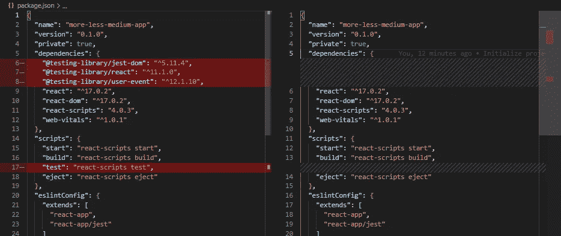
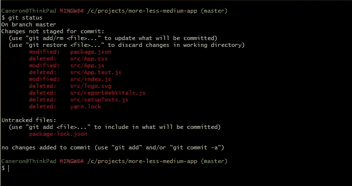
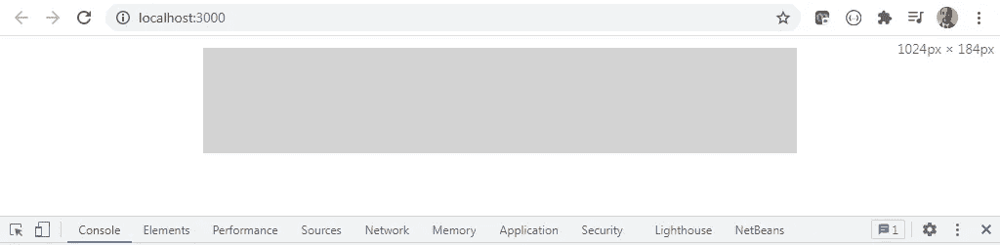
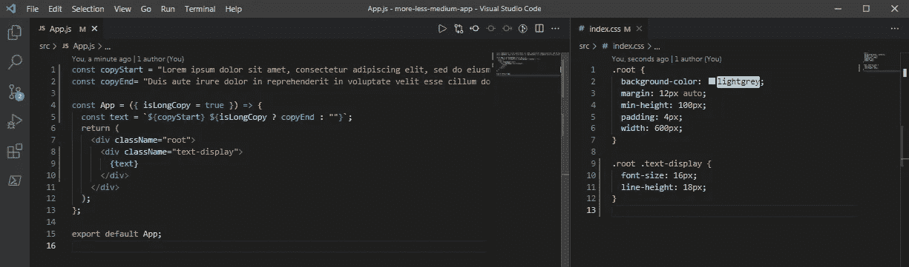
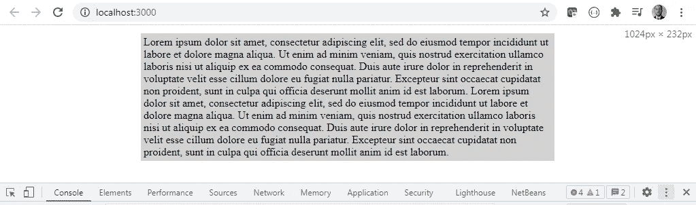
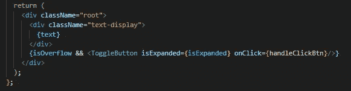
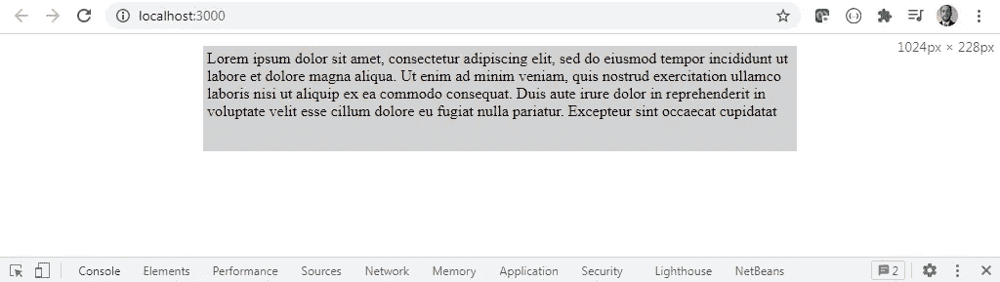
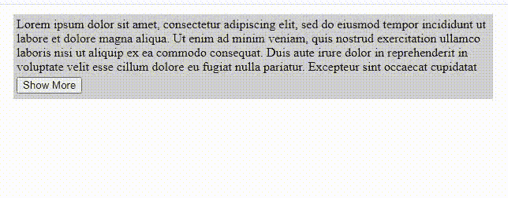

# 为更多/更少文本过渡创建一个 React 组件

> 原文：<https://javascript.plainenglish.io/create-a-react-component-for-more-less-text-transition-b8896f098773?source=collection_archive---------0----------------------->

许多网络应用程序的一个共同特点是让用户体验一下内容，然后允许他们切换查看更多内容。在这篇文章中，我们将看到如何创建一个平滑的显示更多/更少的文本切换过渡效果。


Photo by [Michael Discenza](https://unsplash.com/@mdisc?utm_source=medium&utm_medium=referral) on [Unsplash](https://unsplash.com?utm_source=medium&utm_medium=referral)

# 先决条件

希望您对 Javascript、React 和 CSS 有基本的了解。要按照本文构建组件，您需要在机器上安装以下应用程序。版本是我运行的当前版本，但不一定需要匹配。

```
git v2.30.2
node v12.19.0
npm v8.1.2
create-react-app v4.0.3
```

我们也应该清楚为什么我们要把我们的转换建立在高度之上。使用`max-height`属性可以创建类似的效果，其中最大高度被设置为某个值，而**不应该**被设置。这有一个关键问题:为了给出一致的过渡速度，您需要设置一个不太高的高度，以便效果不会被过分强调。要做到这一点，同时足够高而不会导致滚动条出现在文本显示区域，通常会导致大量的手挥舞，以最大高度的神奇数字结束，最终成为没有人，包括你自己，想要触摸或改变的代码。

为了正确地应用`transition` CSS，你可以注意使用属性值`auto`，因此为了使用 height，我们需要确定显示我们想要显示的所有文本所需的高度。

为了避免`max-height`过渡，这篇文章将介绍基于`height`的过渡，以及如何设置相应的高度。

# 创建应用程序

虽然您可以在现有的应用程序中构建这个组件，但是对于本文来说，我们将使用 create-react-app npm 包生成一个新的应用程序。为此，运行命令`create-react-app more-leass-medium-app`。在整篇文章中，应用程序的名称将是 **more-less-medium-app** 。

## 应用清理

当应用程序生成时，它会添加许多我们不会使用的额外内容，因此我们可以在开始构建之前删除并清理应用程序。首先，在 **package.json** 中，所有与测试相关的命令和依赖项都可以删除，因为我们不打算在本文中进行测试。



现在，在 **src/App.js** 文件中，整个文件可以替换为下面的代码片段。

```
const App = () => {
  return (
    <div className="root">
    </div>
  );
};
export default App;
```

有几个文件是不需要的。都可以删除: **yarn.lock** **App.css** ， **logo.svg** ， **reportWebVitals.js** ， **App.test.js** ， **setupTests.js** 。删除所有这些文件后，您可以删除旧的节点模块，重新安装应用程序，然后使用以下命令检查所有更改:

```
rm -rfv node_modules
npm install --verbose
git status
```

您应该会在文件中看到以下更改。



运行`git add . && git commit -m "cleanup app"`准备并提交我们刚刚做的所有更改，开始创建组件。

# 构建组件

现在我们可以开始构建包含我们组件的应用程序了。我们要做的第一步是为根容器设置 CSS。我们将使用 **src/index.css** 文件，它可以完全替换为以下代码片段。

```
.root {
  background-color: lightgray;
  margin: 12px auto;
  min-height: 100px;
  padding: 4px;
  width: 600px;
}
```

一旦添加了 CSS，您就可以通过在终端中运行`npm run start`来启动应用程序。您的默认浏览器应该在端口 3000 上对本地主机开放。如果没有自动打开，可以直接导航到 [http://localhost:3000](http://localhost:3000.) 。您应该会看到类似于以下屏幕帽的内容。



在确认基本根容器 CSS 按预期工作后，我们应该提交我们的更改。简单的消息就像，`git commit -am "add basic styles"`。

一旦提交了更改，我们就可以开始添加文本了。为此，我们可以使用一个 **lorem ipsum** 生成器:[https://www.lipsum.com/](https://www.lipsum.com/)。我们应该获取足够的 lorem ipsum 来创建覆盖页面上大约 10 行的副本。



通过这些代码更改，localhost 应该会更新，您的显示将如下所示。



这里是提交更改的另一个好地方。另一个简单的消息也应该在这里起作用:`git commit -am "add lorem ipsum copy"`。

现在让我们在文本下面添加一个切换按钮，我们最终将使用它来显示更多或更少的文本。我们可以直接在 **src/App.js** 文件的顶部添加切换按钮。切换按钮代码将类似于下面的代码片段。

```
const ToggleButton ({ isExpanded, onClick }) => {
  return (
    <button className="btn-toggle" onClick={onClick}>
      {isExpanded ? "Show Less" : "Show More"}
    </button>
  );
};
```

切换按钮样式非常简单，可以添加到 **src/index.css** 中。

```
.root .btn-toggle {
  margin-top: 4px;
}
```

在实现新代码之前，我们可以用另一个简单的消息`git commit -am "add toggle button"`提交对 **App.js** 和 **index.css** 的更改。

现在让我们将切换按钮添加到现有的根容器中。为此，首先将`useState`从 react 导入到组件中。这个钩子将用于跟踪几个状态。现在，我们将添加两个州旗，`isExpanded`和`isOverflow`。我们还想添加一个点击处理函数，当它被调用时切换`isExpanded`标志。用下面的代码片段添加状态和处理程序。

```
const App = ({ isLongCopy = true }) => {
  const text = `${copyStart} ${isLongCopy ? copyEnd : ""}`;
  // new state variables
  const [isExpanded, setIsExpanded] = useState(false);
  const [isOverflow, setIsOverflow] = useState(false); const handleClickBtn = () => {
    setIsExpanded((prev) => !prev);
  };
  ...
```

现在将 **ToggleButton** 组件添加到 return 中。根据`isOverflow`标志，动态渲染组件。我们还将`isExpanded`标志和点击处理函数作为道具传递到组件中。return 语句应该类似于下面的屏幕 cap。



当标志默认为 false 时，您在应用程序中看不到任何变化。如果您想看到按钮，您可以将默认值更改为 true，但是应该在验证它出现后将其重置为 false。一旦添加了所有这些更改，我们应该用命令`git commit -am “add dynamic toggle component"`提交它们。

设置好动态切换后，我们现在要将其功能连接到组件的其余部分。为此，首先我们要将`useEffect`添加到 react 的导入中。然后我们要确保我们的`text`变量是 **App** 组件函数的第一行。然后我们要设置一个`useEffect`来监听`text`变量。现在，`useEffect`函数可以看起来像下面的代码片段。

```
useEffect(() => {
  console.info("TODO - implement text useEffect");
}, [text]);
```

**TODO** 实现将是添加到组件的最后一部分。尽管我们只做了一些小的更改，但让我们用一条简单的消息`git commit -am "add use effect"`再次提交这些更改。

现在，我们可以在 CSS 中设置文本显示区域样式，并添加内联样式来设置文本显示区域的高度。对于 CSS，添加以下代码片段。

```
.root .text-display {
  font-size: 16px;
  line-height: 18px;
  overflow: hidden;
  transition: height 0.5 ease-in-out;
}
```

`font-size`和`line-height`属性是专门设置的，以便在折叠时，最多显示四行文本，其余的隐藏起来。`overflow: hidden`属性实际上隐藏了前四行。使用`height`的`transition`属性已经在文章的顶部解释过了。但要重申的是，当切换展开/折叠值时，它给我们一种清晰一致的感觉。现在我们用这段代码创建一个当前高度状态变量。

```
const [heightCurr, setHeightCurr] = useState(72);
```

我们使用值 72，这是我们想要使用的默认高度值，它将与上面 CSS 中设置的`line-height`值一起工作，以便隐藏任何穿过第四行文本的文本。创建状态后，使用以下代码片段的内联样式设置当前高度状态。

```
<div className="text-display" style={{ height: `${heightCurr}px` }}>
```

经过这些更改，当我们刷新应用程序并显示长副本时，现在应该在 localhost 上呈现以下内容。



此时，您可以提交您的更改:`git commit -am "setup initial height and display styling"`。

## 创建切换效果

现在，我们可以设置逻辑来确定是否需要显示展开/折叠按钮，并显示有限和全文版本。第一步是添加两个状态来跟踪高度:`heightMax`和`heightMin`。

```
const [heightMax, setHeightMax] = useState(72);
const [heightMin, setHeightMin] = useState(72);
```

将“最大高度”和“最小高度”的初始值设定为“最大”，与默认的当前高度值相同。下一步是点击切换按钮，在最小和最大高度之间切换。当单击切换按钮且文本当前展开时，将当前高度设置为折叠文本的最小值。否则，将当前高度设置为最大以扩展文本。您可以在当前高度设置器函数中使用三元语句来实现这一点。

```
const hendleClickBtn = () => {
  setHeightCurr(isExpanded ? heightMin : heightMax);
  setIsExpanded((prev) => !prev);
};
```

此时，我们不会在应用程序中看到任何明显的变化，但是您可以提交我们所做的更改:`git commit -am "add state and toggle effect for min/max height"`。

启用切换效果的最后一步是更新监听`text`变量变化的`useEffect`。在`useEffect`内，我们将执行以下步骤

*   查询页面中的`.text-display`类元素
*   确定元件的`clientHeight`和`scrollHeight`值
*   当这些高度不同时，更新元件状态

对组件状态的更新首先将`isOverflow`标志切换为真。然后`scrollHeight`被设置为最大高度状态，并且`clientHeight`被设置为当前高度和最小高度。这是那个函数更新后的代码片段。

```
useEffect(() => {
  const element = document.querySelector(".text-display");
  const clientHeight = element?.clientHeight || 72;
  const scrollHeight= element?.scrollHeight || 72;
  if (scrollHeight > clientHeight) {
    setIsOverflow(true);
    setHeightMax(scrollHeight);
    setHeightMin(clientHeight);
    setHeightCurr(clientHeight);
  }
}, [text]);
```

请注意，当获取元素的高度时，如果在尝试查找元素或确定元素的高度时发生了一些问题，我们使用带有逻辑 OR 的可选链接来设置默认值。此时，刷新本地主机将有一个功能正常、可切换的文本显示区域。这是运行中的组件。



## 结论

就是这样。我们现在有了一个功能组件，可以根据文本显示区域的高度切换和转换显示更多或更少的文本。要查看代码，您可以使用完成的项目[来检查我的存储库。](https://github.com/cameronDz/more-less-medium-app)

一旦构建好这个组件，您也可以自己添加一些增强功能。传文当道具是个不错的。你还可以添加一些效果，让它在折叠时更平滑/更闪亮(显示更少)，比如添加`text-overflow`和`line-clamp`属性，或者使用`-webkit-mask-image`属性添加`linear-gradient`。

希望你从这篇文章中获得了乐趣。祝你好运，并快乐编码。

*更多内容请看*[***plain English . io***](http://plainenglish.io)